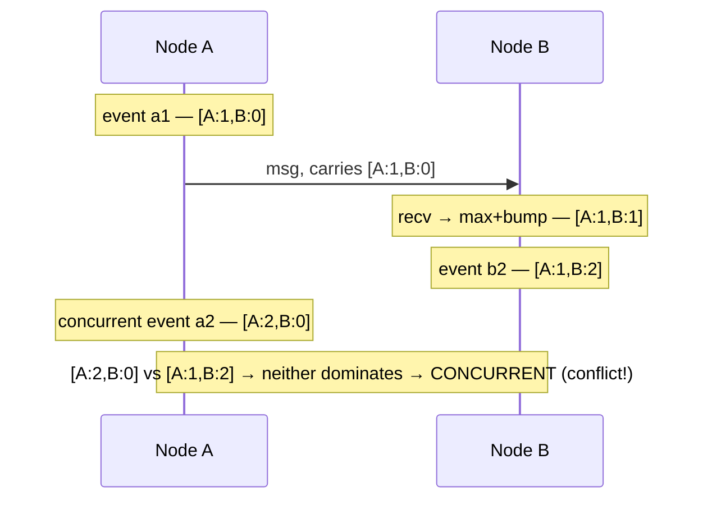

# Logical clocks: happens-before, Lamport & vector clocks

> Purpose: without a trustworthy global clock, how do you tell which event happened first?
> Logical clocks answer this by ordering events using **causality** (who could have
> influenced whom) instead of wall-clock time. They're the foundation for reasoning about
> "order" in a distributed system.

## Top-down: where you already meet this
Two replicas both update the same record; later you must decide which write "wins." Comparing
their timestamps is tempting — and wrong, because [node clocks drift](../fundamentals/why-distributed-is-hard.md)
and a "later" timestamp may be from a *clock that's ahead*, not an event that's newer. Logical
clocks give a principled answer to "what happened before what" without trusting wall clocks.

## Problem
Wall-clock timestamps can't order events across machines: clocks drift, get corrected
backwards by NTP, and have limited resolution. Yet ordering is everywhere — "which write is
newer?", "did the cause come before the effect?". We need an ordering that reflects *actual
influence*, not unreliable clocks.

## Core concepts

**Happens-before (→) — the only order that's real.** Event A *happens-before* B if A could
have *caused* B. Just three rules:
1. same node, A before B → A → B;
2. a **send** happens-before its matching **receive**;
3. transitivity.
If neither A → B nor B → A, the events are **concurrent** — genuinely independent, with no
"true" order. This is the key insight: in a distributed system, *some events simply have no
order*, and pretending otherwise is the bug.

**Lamport clocks — a counter that respects causality.** Each node keeps an integer; rules:
tick before each event; piggyback your counter on every message; on receive, set
`counter = max(local, received) + 1`. Guarantee: **if A → B then `L(A) < L(B)`.** Enough to
build a *consistent total order* (break ties by node id). The catch — it's **one-directional**:
`L(A) < L(B)` does *not* prove A → B (they might be concurrent). Lamport clocks *order* events
but can't *detect* concurrency.

**Vector clocks — when you must detect concurrency.** Each node keeps a **vector** of counters,
one per node. On send, increment your own entry and attach the whole vector; on receive, take
the element-wise max then bump your own. Now compare vectors: `V(A) < V(B)` ⇒ A → B; if neither
dominates, they're **concurrent** — *provably*. The cost is size (one entry per node), but you
gain the ability to **detect conflicts** — exactly what an [eventually-consistent store](../replication/eventual-consistency-crdts.md)
needs to know two writes clashed.



**The one-line summary:** Lamport = *order* events with a single counter; vector = *also detect*
which events are concurrent, at the cost of a per-node vector.

## Essential terminology

| Term | Meaning |
| --- | --- |
| **Happens-before (→)** | A could have causally influenced B. |
| **Concurrent** | Neither event happens-before the other; no real order. |
| **Causality** | The relation of cause potentially preceding effect. |
| **Lamport clock** | A single counter giving `A→B ⇒ L(A)<L(B)` (orders, can't detect concurrency). |
| **Vector clock** | Per-node counters that *detect* concurrency (and thus conflicts). |
| **Total order** | A single agreed sequence over all events (Lamport + tie-break). |

## Example
Why vector clocks catch a conflict that timestamps miss — two replicas edit a shopping cart:
```
Replica X: add "milk"   → version [X:1, Y:0]
Replica Y: add "bread"  → version [X:0, Y:1]      (didn't see X's write yet)

Sync: compare [X:1,Y:0] vs [X:0,Y:1] → neither dominates → CONCURRENT.
  → the system KNOWS these are conflicting, independent edits, not one overwriting the other.
  → correct resolution: merge → cart = {milk, bread}   (this is how Dynamo/Cassandra avoid
    silently losing a write — see eventual consistency & CRDTs).
```
A naive "last write by timestamp" would have **dropped one item**. Vector clocks turn "which is
newer?" into the honest answer "neither — they conflict, go merge them." Implement both in the
[logical-clocks lab](../../3-practice/lab-logical-clocks.md).

## Trade-offs
- ✅ **Lamport:** tiny (one integer), gives a usable total order — great for tie-breaking & sequencing.
- ✅ **Vector:** *detects* concurrency/conflicts — essential for [eventual consistency](../replication/eventual-consistency-crdts.md).
- ⚠️ **Vector clocks grow with the number of nodes** (a per-node entry); long-lived systems need
  pruning/version-vector tricks.
- ⚠️ Neither uses real time — they capture *causal* order, not "how long ago," which is usually
  what you actually want anyway.

## Real-world examples
- **Amazon Dynamo & Riak** use vector clocks to detect conflicting writes and hand them to the app
  to merge.
- **Cassandra** leans on (wall-clock) timestamps with last-write-wins — a deliberate, simpler
  trade-off that *can* silently lose concurrent writes (the thing vector clocks prevent).
- **Git** is a logical-clock system in spirit: commits form a happens-before DAG; a "merge" is
  resolving concurrent branches.

## References
- Lamport (1978) — *Time, Clocks, and the Ordering of Events in a Distributed System* (a founding paper)
- *Designing Data-Intensive Applications* (Kleppmann) — Ch. 5 (version vectors), Ch. 9 (ordering)
- Leads to [eventual consistency & CRDTs](../replication/eventual-consistency-crdts.md)
