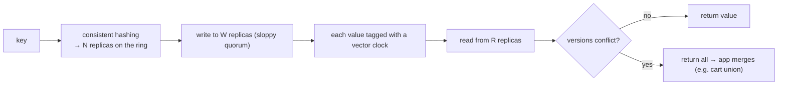

# Amazon Dynamo — quorums, vector clocks & eventual consistency

> Dynamo (the 2007 paper behind DynamoDB, Cassandra, and Riak) is the canonical example of an
> **[AP](../../system-design/1-knowledge/fundamentals/cap-theorem.md)** system: it chooses
> *always-on* availability over strong consistency, and it's built almost entirely from the
> Part 1 theory — [quorums](../1-knowledge/replication/quorums-and-replication.md),
> [vector clocks](../1-knowledge/time-order/logical-clocks.md), and
> [eventual consistency](../1-knowledge/replication/eventual-consistency-crdts.md).

## The system & what it teaches
Amazon needed a key-value store where **a write must never be rejected** — a shopping cart that
refuses "add item" loses money. Dynamo's purpose is **extreme availability**, even during
network partitions and node failures. It's the best single illustration of *why* the
leaderless/quorum/CRDT toolkit exists, so it's the case study to read after the replication docs.

## Requirements
- **Always writable** ("add to cart" can't fail), even during partitions.
- **Incremental scalability** — add nodes without downtime.
- **No single point of failure** — fully decentralized, leaderless.
- Strong consistency is **explicitly sacrificed** for the above.

## How it works
A few Part 1 ideas, combined:

- **Placement:** [consistent hashing](../../system-design/1-knowledge/building-blocks/consistent-hashing.md)
  maps each key to N replicas around a ring — add/remove nodes with minimal reshuffling.
- **Reads/writes:** tunable [quorums](../1-knowledge/replication/quorums-and-replication.md) (N, R,
  W). Dynamo favors **W=1-ish** availability and uses a **sloppy quorum + hinted handoff**: if a
  target replica is down, write to a substitute and hand off later — so writes essentially never
  fail.
- **Conflict detection:** every version carries a [vector clock](../1-knowledge/time-order/logical-clocks.md).
  On read, if versions are causally ordered, return the newest; if **concurrent**, return *all
  siblings* and let the application merge.

## The theory in action
- **[Quorums](../1-knowledge/replication/quorums-and-replication.md) (R+W tuning)** = the
  availability/consistency dial; Dynamo turns it toward availability.
- **[Vector clocks](../1-knowledge/time-order/logical-clocks.md)** = honest conflict detection, so
  concurrent cart edits aren't silently lost — they're surfaced and merged (the
  [CRDT-style](../1-knowledge/replication/eventual-consistency-crdts.md) union).
- **Read repair + Merkle-tree anti-entropy** = background convergence, delivering
  [eventual consistency](../1-knowledge/replication/eventual-consistency-crdts.md).
- It deliberately accepts the [CAP](../../system-design/1-knowledge/fundamentals/cap-theorem.md)
  trade: during a partition, every side keeps serving and reconciles later.

## Trade-offs & lessons
- ✅ **Never says no to a write;** survives partitions and node loss; scales horizontally.
- ✅ Showed the industry you can build a serious store from quorums + vector clocks + gossip — no
  [consensus](../1-knowledge/consensus/consensus-and-raft.md) leader needed.
- ⚠️ **The application must handle conflicts** (merge siblings) — pushed onto developers; later
  systems (Cassandra) simplified to [last-write-wins](../1-knowledge/replication/eventual-consistency-crdts.md),
  trading correctness for ease.
- ⚠️ **No strong consistency / transactions** — wrong for "sell the last ticket once"; that needs
  [consensus](../1-knowledge/consensus/consensus-and-raft.md) (see [Spanner](./spanner.md)).

## References
- DeCandia et al. — [*Dynamo: Amazon's Highly Available Key-value Store*](https://www.allthingsdistributed.com/files/amazon-dynamo-sosp2007.pdf) (2007)
- Theory: [quorums](../1-knowledge/replication/quorums-and-replication.md) · [vector clocks](../1-knowledge/time-order/logical-clocks.md) · [eventual consistency & CRDTs](../1-knowledge/replication/eventual-consistency-crdts.md)
- Contrast: [Raft/etcd](./raft-etcd.md) (CP) and [Spanner](./spanner.md) (strong, global)
