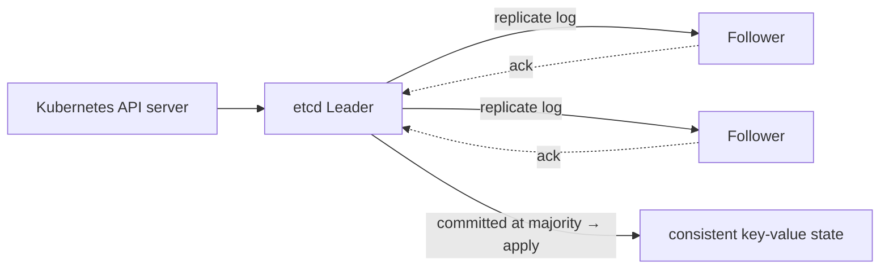

# Raft in etcd — the consensus that runs Kubernetes

> etcd is the strongly-consistent key-value store that holds **all of Kubernetes' state**. It's
> the clearest production example of [consensus](../1-knowledge/consensus/consensus-and-raft.md):
> a [Raft](../1-knowledge/consensus/consensus-and-raft.md) cluster choosing one leader and one
> ordered log so the whole system has a single source of truth — the
> **[CP](../../system-design/1-knowledge/fundamentals/cap-theorem.md)** counterpart to
> [Dynamo](./dynamo.md).

## The system & what it teaches
[Kubernetes](../../devops-infrastructure/1-knowledge/containers/kubernetes.md) constantly asks
"what is the *true* desired state of the cluster?" — and a wrong or split answer would be
catastrophic (two schedulers, conflicting decisions). etcd's purpose is to be the **one place
that's always correct**, even through node failures. It shows consensus doing exactly its job:
turning several machines into one trustworthy one.

## Requirements
- **Strong consistency (linearizable reads/writes)** — every client sees the same, latest state.
- **No split-brain** — exactly one leader, one log order, ever.
- **Tolerate node failures** — survive a minority going down.
- Modest write volume (cluster metadata), so consensus's coordination cost is acceptable.

## How it works
etcd runs [Raft](../1-knowledge/consensus/consensus-and-raft.md) over a small odd-sized cluster
(typically 3 or 5):

- **One leader** handles writes; followers replicate its [log](../1-knowledge/consensus/consensus-and-raft.md).
- A write **commits once a majority (quorum) persists it** — so it survives any future leader.
- If the leader dies, a **new term** election picks another within a timeout; a minority partition
  **can't elect one and stops serving writes** (preserving consistency over availability).

## The theory in action
- **[Consensus / Raft](../1-knowledge/consensus/consensus-and-raft.md)** = the whole point: agree
  on the ordered log of state changes.
- **[State-machine replication](../1-knowledge/consensus/consensus-and-raft.md)** = every etcd node
  applies the same log → identical copies of the cluster state.
- **[Quorum/majority](../1-knowledge/consensus/consensus-and-raft.md)** = why 3 nodes tolerate 1
  failure and 5 tolerate 2 (2f+1), and why losing quorum halts writes — the
  [FLP-respecting](../1-knowledge/fundamentals/failure-models.md) "safe always, live when healthy."
- It's the deliberate [CAP](../../system-design/1-knowledge/fundamentals/cap-theorem.md) **CP**
  choice: during a partition the minority sacrifices availability to never serve stale/forked state.

## Trade-offs & lessons
- ✅ **One always-correct source of truth** — exactly what an orchestrator needs; no split-brain ever.
- ✅ Survives minority failures transparently with automatic leader election.
- ⚠️ **Writes need a majority round-trip** → higher latency, and **losing quorum stops the cluster**
  (3-node etcd dies if 2 nodes are lost) — the price of strong consistency.
- ⚠️ **Not for high write throughput or huge data** — consensus suits *important, lower-volume*
  state (metadata, leadership, locks), not bulk user data; that's the
  [quorum/eventual](./dynamo.md) world.

## References
- [etcd documentation](https://etcd.io/docs/) · [Raft (raft.github.io)](https://raft.github.io/)
- Theory: [consensus & Raft](../1-knowledge/consensus/consensus-and-raft.md) · [failure models / FLP](../1-knowledge/fundamentals/failure-models.md)
- Used by: [Kubernetes](../../devops-infrastructure/1-knowledge/containers/kubernetes.md); contrast with [Dynamo](./dynamo.md) (AP) & [Spanner](./spanner.md)
