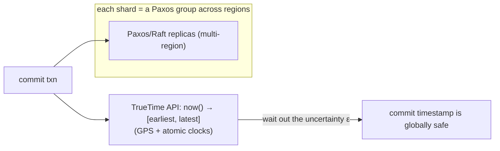

# Google Spanner — TrueTime & external consistency

> Spanner is Google's globally-distributed SQL database that does something long thought
> impossible: **strong consistency and distributed transactions across the entire planet**. Its
> trick is to attack the one problem the whole area is built around — [no global
> clock](../1-knowledge/fundamentals/why-distributed-is-hard.md) — by engineering a clock you
> *can* (almost) trust: **TrueTime**.

## The system & what it teaches
[Dynamo](./dynamo.md) gave up consistency for availability; [etcd](./raft-etcd.md) gave up
availability for consistency but only at small scale. Spanner's purpose: **both strong
consistency *and* global scale** — transactions spanning continents that still behave as if run
one-at-a-time. It teaches that the "no global clock" limitation isn't absolute if you're willing
to *measure and bound* clock uncertainty with special hardware.

## Requirements
- **External consistency (linearizability)** globally — if txn A commits before B starts, every
  client sees A before B, worldwide.
- **Distributed ACID transactions** across rows in different regions.
- **High availability** despite failures.
- Effectively: beat the [no-global-clock](../1-knowledge/fundamentals/why-distributed-is-hard.md)
  problem rather than route around it.

## How it works
Two ingredients — consensus for *order*, TrueTime for *time*:

- **Data is sharded;** each shard is replicated by [Paxos](../1-knowledge/consensus/consensus-and-raft.md)
  (a [consensus](../1-knowledge/consensus/consensus-and-raft.md) group) across regions —
  strong consistency per shard.
- **Cross-shard transactions** use [2PC](../1-knowledge/consensus/atomic-commit-2pc.md) layered
  *over* those Paxos groups — so no single participant can [block](../1-knowledge/consensus/atomic-commit-2pc.md)
  (each is itself fault-tolerant).
- **TrueTime** is the novelty: instead of a single timestamp, `now()` returns an **interval
  `[earliest, latest]`** with a guaranteed bound ε (a few ms), backed by **GPS + atomic clocks** in
  every datacenter. The clock admits its own uncertainty.

## The theory in action
- **TrueTime turns clock uncertainty from invisible to *bounded*.** To make a transaction's
  timestamp globally meaningful, Spanner does a **"commit wait"**: after picking a commit time, it
  *waits out the uncertainty ε* before releasing locks — guaranteeing that no later transaction
  anywhere can get an earlier timestamp. It pays a few ms of latency to buy
  [external consistency](../1-knowledge/time-order/logical-clocks.md). This is the direct,
  hardware-assisted assault on the [no-global-clock](../1-knowledge/fundamentals/why-distributed-is-hard.md)
  problem.
- **[Consensus](../1-knowledge/consensus/consensus-and-raft.md) (Paxos)** per shard provides the
  ordered, fault-tolerant log; **[2PC](../1-knowledge/consensus/atomic-commit-2pc.md)** stitches
  shards into one atomic transaction — and works because each participant is consensus-replicated,
  curing 2PC's [blocking](../1-knowledge/consensus/atomic-commit-2pc.md) weakness.

## Trade-offs & lessons
- ✅ **The "impossible" combo:** global strong consistency + ACID transactions + high availability.
- ✅ Proved clock uncertainty can be *engineered down and bounded*, not just feared — a landmark idea.
- ⚠️ **Needs special hardware** (GPS/atomic clocks) — feasible for Google; open-source heirs
  (CockroachDB, YugabyteDB) approximate TrueTime with NTP + larger uncertainty/retries.
- ⚠️ **Commit-wait latency:** transactions pay the ε bound — strong global consistency literally
  costs milliseconds of waiting.

## References
- Corbett et al. — [*Spanner: Google's Globally-Distributed Database*](https://research.google/pubs/pub39966/) (2012)
- Theory: [no global clock](../1-knowledge/fundamentals/why-distributed-is-hard.md) · [consensus](../1-knowledge/consensus/consensus-and-raft.md) · [2PC](../1-knowledge/consensus/atomic-commit-2pc.md)
- The spectrum: [Dynamo](./dynamo.md) (AP) ↔ [etcd/Raft](./raft-etcd.md) (CP, small) ↔ Spanner (strong, global)
