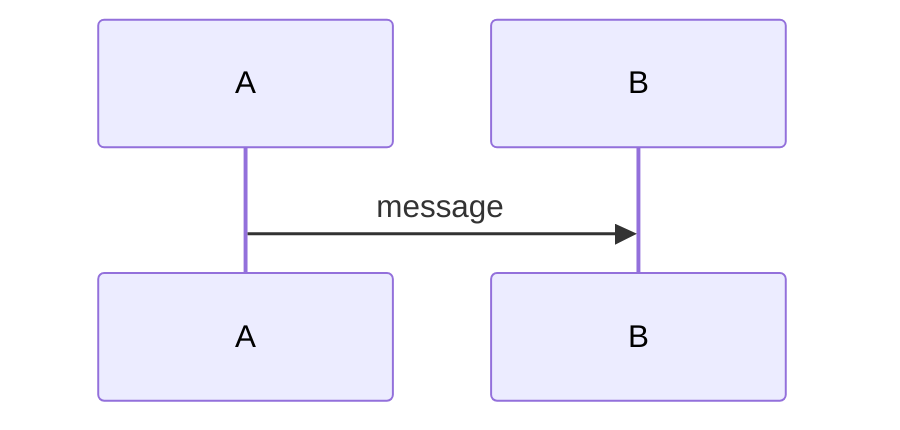

# <Topic Title>

> One-sentence summary of what this topic is about.

## Top-down: where you already meet this
Start from something the reader already does or has seen (a system that "agrees," a
replica that's stale) and pull the thread down to *this* theory. Why does it matter?

## Problem
What fundamental difficulty does this address? Why is it hard?

## Core concepts
The key ideas, models, and algorithms. Add a diagram where it helps:

## Essential terminology
Define the words a beginner needs before they can read anything else on this topic.

| Term | Meaning |
| --- | --- |
| ... | ... |

## Example
A concrete, minimal example — a trace, a worked run of the algorithm, a small proof
sketch — that makes the concept click.

## Trade-offs
- ✅ What it guarantees / when it works
- ⚠️ Its costs and impossibility limits
- When it applies / when it doesn't

## Real-world examples
How real systems (etcd, Dynamo, Spanner, ZooKeeper, Cassandra…) apply this.

## References
- [Link](https://example.com)
