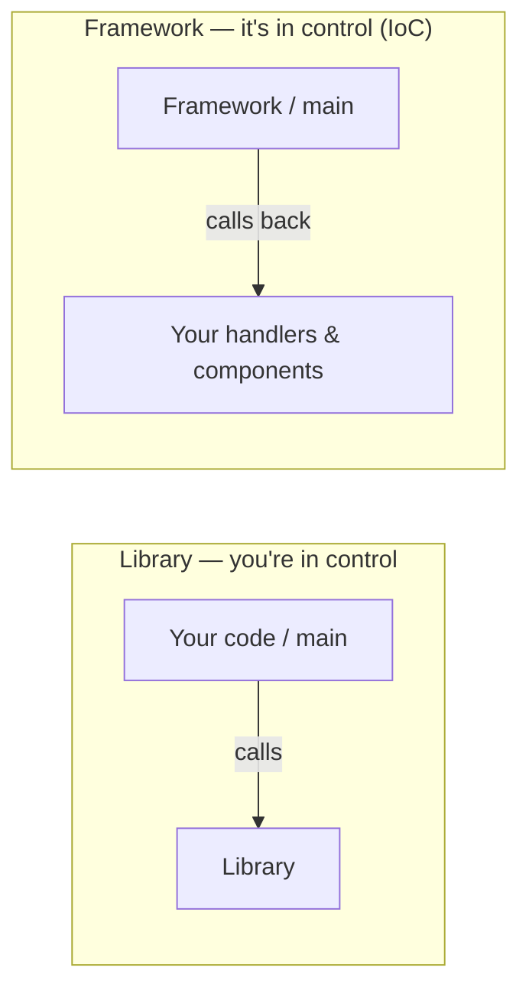

# Library vs. Framework

> A **library** is code *you* call; a **framework** is code that calls *you*. That inversion —
> who's in charge of the control flow — is the whole distinction, and it shapes how you build on
> top of either.

## Top-down: where you already meet this
You `import requests` and call `requests.get(...)` whenever *you* decide — that's a library. You
write a Django view or a React component and *something else* decides when to invoke it (a request
arrives, state changes) — that's a framework. You've used both today; this names why they feel
different.

## Problem
"What should I build on?" is a constant decision, and "library vs. framework" is muddled by loose
usage. The real, useful difference isn't size or popularity — it's **who owns the control flow**,
because that determines how much structure you inherit, how much freedom you keep, and how locked-in
you become.

## Core concepts
- **Library** — a toolbox of functions/classes. *You* write the `main`, *you* decide when to call
  it. You stay in control; the library is a dependency you reach for. (`requests`, `lodash`,
  `numpy`.)
- **Framework** — a skeleton of an application with the control flow already written. *It* owns
  `main` and the lifecycle; you fill in the blanks (handlers, components, callbacks) that it calls
  at the right moments. (Django, Spring, React, Rails.)

The defining idea is **Inversion of Control (IoC)** — the *"Hollywood Principle: don't call us,
we'll call you."* With a library you call in; with a framework, it calls back into your code. This
is the same IoC behind [dependency injection](../../../architecture-patterns/1-knowledge/architectural-styles/dependency-injection.md)
in [Architecture & Patterns](../../../architecture-patterns/) — a framework is IoC at application scale.



### The trade-off: freedom vs. leverage
A framework gives you huge leverage — routing, lifecycle, conventions, structure for free — in
exchange for **freedom and lock-in**: you build *its* way, and leaving is expensive. A library gives
you freedom and composability but leaves the architecture (and the wiring) to you. Frameworks shine
when your problem fits a well-trodden shape (a CRUD web app); libraries shine when it doesn't, or
when you want to assemble your own stack.

## Essential terminology
| Term | Meaning |
| --- | --- |
| **Library** | Reusable code *you* call into; you own control flow |
| **Framework** | Application skeleton that calls *your* code; it owns control flow |
| **Inversion of Control (IoC)** | The framework, not your code, drives execution ("don't call us, we'll call you") |
| **Convention over configuration** | Frameworks assume sensible defaults so you write less setup (Rails) |
| **Lifecycle hooks** | The points a framework calls your code (`componentDidMount`, `@app.route`, middleware) |
| **SDK** | A vendor's library (+tools) for using their service |

## Example
Library — you orchestrate; you decide when to call:

```python
import requests                       # a library
data = requests.get(url).json()       # YOU call it, when YOU choose
```

Framework — you register a handler; **it** decides when to call you:

```python
from flask import Flask
app = Flask(__name__)

@app.route("/orders")                  # you fill in a blank...
def orders():
    return "ok"

app.run()                              # ...the framework owns the loop & calls orders() per request
```

You never call `orders()` — Flask does, when a request matches. That callback registration is the
[Observer/Template-Method](../../../architecture-patterns/1-knowledge/design-patterns/behavioral-patterns.md)
shape, and it's exactly how the [plugin architecture](../../../architecture-patterns/2-case-studies/plugin-architecture.md)
case study works.

## Trade-offs
- ✅ **Framework**: massive head start, structure & conventions, less boilerplate, batteries
  included — ⚠️ opinionated, learning curve, lock-in, fights you when your needs diverge.
- ✅ **Library**: freedom, composability, easy to swap, learn just what you use — ⚠️ you build and
  maintain the architecture/wiring yourself; "assemble-your-own-framework" sprawl.
- Real systems mix both: a framework for the app shell + many libraries inside it. The judgment is
  *how much control to cede* — which echoes [YAGNI/KISS](../../../architecture-patterns/1-knowledge/fundamentals/core-design-principles.md):
  don't adopt a heavy framework for a problem a few libraries solve.

## Real-world examples
- **Frameworks**: Django/Rails/Spring (web), React/Angular (UI), pytest (tests — it calls your test
  functions), Kubernetes operators.
- **Libraries**: requests, lodash, NumPy, SQLAlchemy (arguably a framework-y library).
- **The blurry middle**: Flask and Express call themselves "micro-frameworks" — small enough to feel
  library-like; React is "just a library" yet inverts control like a framework. The IoC test settles
  it: *does it call your code?*

## References
- Martin Fowler — [InversionOfControl](https://martinfowler.com/bliki/InversionOfControl.html)
- [Dependency injection & IoC](../../../architecture-patterns/1-knowledge/architectural-styles/dependency-injection.md) · [What makes a language](../fundamentals/what-makes-a-language.md)
