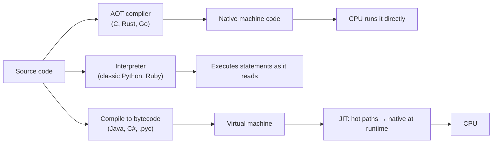

# Compilation & Execution

> How does your source text actually *run*? The answer — compiled to machine code, interpreted
> line by line, or compiled to bytecode for a VM (often JIT-compiled) — explains a language's
> speed, its startup time, and **when your errors show up**.

## Top-down: where you already meet this
You've hit "it compiled but crashed at runtime" (C, Java) and also "it ran fine until line 200
threw a `NameError` it could've caught earlier" (Python, JS). You've noticed Go binaries start
instantly while the JVM takes a second to "warm up." Those experiences are the execution model
showing through — and it's a real axis when choosing a language.

## Problem
The same program can be turned into running behavior in very different ways, and the choice has
big consequences: raw speed, startup latency, portability, binary size, and — most visible
day to day — **how early mistakes are caught** (compile time vs. runtime). You can't reason about
performance or error-handling without knowing where your language sits.

## Core concepts


- **Ahead-of-time (AOT) compiled** — translated to native machine code *before* running (C, C++,
  Rust, Go). Fastest execution, instant startup, no runtime needed; but a build step and
  platform-specific binaries.
- **Interpreted** — a program (the interpreter) reads and executes your source directly (classic
  Python, Ruby, shell). Flexible and portable, fast edit-run loop; slower, errors surface only when
  a line actually runs.
- **Bytecode + virtual machine** — compiled to portable *bytecode* that a VM executes (Java→JVM,
  C#→CLR, Python→`.pyc`). "Compile once, run anywhere there's a VM."
- **JIT (just-in-time)** — the VM compiles *hot* bytecode to native code *while running*, getting
  near-native speed after warm-up (JVM HotSpot, V8 for JavaScript, PyPy).

In practice the lines blur: Python *compiles* to bytecode then interprets it; JS is JIT-compiled by
V8. The useful mental model is the **spectrum from "all work before running" (AOT) to "all work
while running" (pure interpret)**, with VMs/JIT in between.

## Essential terminology
| Term | Meaning |
| --- | --- |
| **Compile time vs. runtime** | Before execution vs. during — *when* an error or check happens |
| **AOT / JIT** | Compile before running / compile during running (hot paths) |
| **Bytecode** | Portable intermediate instructions for a VM, not the CPU |
| **VM / runtime** | Program that executes bytecode and manages memory/GC (JVM, CLR, CPython, V8, Node) |
| **Toolchain** | Compiler/interpreter + linker + build tools that turn source into something runnable |
| **Transpile** | Compile source→source (TypeScript→JS, modern JS→older JS) |

## Example
*When* an obvious bug is caught depends entirely on the model:

```go
// Go (AOT compiled): won't even build
func main() { x := undefinedVar }   // compile error: undefined: undefinedVar
```
```python
# Python (interpreted): builds nothing, runs until it hits the line
def main():
    if False:
        print(undefined_var)   # never raises — that branch never runs
main()                          # exits cleanly! the bug ships
```

The compiler catches the Go bug before anyone runs it; Python only errors if execution *reaches*
the name. This is the same trade-off the [type system](../language-design/type-systems.md) axis
makes — static checks shift error-discovery earlier (see [lab: strong vs. weak typing](../../3-practice/lab-strong-vs-weak-typing.md)).

## Trade-offs
- ✅ **AOT/native**: top speed, instant startup, self-contained binaries, errors caught at build —
  ⚠️ build step, slower edit-run loop, platform-specific output.
- ✅ **Interpreted**: fastest iteration, dynamic & portable, no build — ⚠️ slower, runtime-only
  error discovery, ship the source + interpreter.
- ✅ **VM + JIT**: portable *and* eventually fast — ⚠️ warm-up cost, memory overhead, ship a runtime.

## Real-world examples
- **Go** chose AOT native binaries for fast, dependency-free deploys (a single static binary in a
  container — see [containers](../../../devops-infrastructure/1-knowledge/containers/containers.md)).
- **Java/JVM** powers long-running servers where JIT warm-up is amortized over hours of uptime.
- **V8** makes JavaScript fast enough for browsers and [Node.js](../../../system-design/1-knowledge/communication/rest.md) via JIT.
- **AOT compilation of Java/.NET** (GraalVM, Native AOT) is rising specifically to kill VM startup
  latency for serverless/cold-start workloads.

## References
- Crafting Interpreters — Bob Nystrom ([craftinginterpreters.com](https://craftinginterpreters.com/))
- [What makes a language](./what-makes-a-language.md) · [Type systems](../language-design/type-systems.md) · [Memory management](../language-design/memory-management.md)
