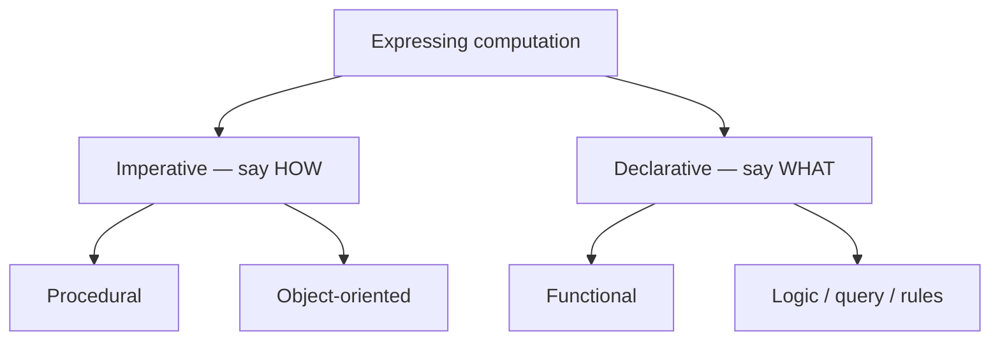

# Programming Paradigms

> A paradigm is a *way of thinking* about computation — describe the **steps** (imperative), model
> **objects** (OO), compose **functions** (functional), or state the **rules** and let the machine
> solve them (declarative). Most modern languages mix several.

## Top-down: where you already meet this
You already switch paradigms without naming it. A `for` loop mutating a counter — imperative. A
class with methods — object-oriented. A `map`/`filter` chain with no mutation — functional. A SQL
query or a regex — declarative. Knowing the paradigms lets you pick the *clearest* tool for each
piece instead of forcing everything into one style.

## Problem
"How should I structure this computation?" has more than one good answer, and languages bias you
toward one. If you only know the imperative style, functional code looks alien and OO gets
over-applied; you fight the language instead of using its grain. Understanding paradigms lets you
read any codebase and write in the style that fits the problem and the language's idioms.

## Core concepts
| Paradigm | You write… | Key idea | State |
| --- | --- | --- | --- |
| **Imperative / procedural** | A sequence of statements that change state | *How* to do it, step by step | Mutable, explicit |
| **Object-oriented** | Objects bundling data + behavior, sending messages | Model the domain as interacting entities | Encapsulated in objects |
| **Functional** | Pure functions, composed; data transformed not mutated | *What* the result is, via function composition | Immutable, avoided |
| **Declarative** | A description of the desired result | State *what*, not *how*; engine figures out how | Hidden from you |

The deepest split is **imperative ("how") vs. declarative ("what")**; OO and functional are the
two dominant ways to organize larger programs.



### Functional's two big ideas
Worth singling out because they're spreading into every language:
- **Pure functions** — output depends only on input, no side effects. Easy to test, cache, and
  parallelize (no shared mutable state — relevant to [concurrency](../language-design/concurrency-models.md)).
- **Immutability** — don't mutate data, produce new data. Removes a whole class of bugs.

These connect to [composition over inheritance](../../../architecture-patterns/1-knowledge/fundamentals/core-design-principles.md):
functional code composes small functions the way OO composes objects.

## Essential terminology
| Term | Meaning | Example |
| --- | --- | --- |
| **Side effect** | Anything a function does besides return a value (mutate, print, I/O) | `print(x)` · `items.append(3)` · writing a file — it changes the world outside |
| **Pure function** | Same input → same output, no side effects | `def square(x): return x * x` — `square(3)` is *always* 9, touches nothing else |
| **Immutability** | Values can't be changed after creation; "modify" = create new | `t = (1, 2); t[0] = 9` → `TypeError`; do `t2 = (9,) + t[1:]` instead |
| **First-class functions** | Functions can be passed, returned, stored like any value (enables FP) | `f = str.upper; f("hi") → "HI"`; `sorted(words, key=len)` passes a function |
| **Multi-paradigm** | A language supporting several styles | Python: a `for` loop, a `map()`, *and* a `class` all coexist in one file |
| **Declarative** | You specify the result; the system decides the steps | `SELECT … WHERE` (SQL) · regex `\d+` · HTML `<table>` — no "how" |

## Example
**One task — "sum the even numbers 1–10" (answer: 30) — in all four paradigms.** The result is
identical; what *changes* is how you express it.

**Imperative** — spell out each step and mutate an accumulator (*how*):
```python
total = 0
for n in range(1, 11):
    if n % 2 == 0:
        total += n            # step → test → update state
# total == 30
```

**Object-oriented** — bundle the data with the behavior that acts on it; call a method:
```python
class Numbers:
    def __init__(self, items):
        self._items = list(items)
    def sum_evens(self):                       # the rule lives *on* the object
        return sum(n for n in self._items if n % 2 == 0)

Numbers(range(1, 11)).sum_evens()              # 30
```

**Functional** — compose transformations, no mutation, no explicit loop (*what*):
```python
total = sum(filter(lambda n: n % 2 == 0, range(1, 11)))   # "sum of (the evens)" == 30
```

**Declarative** — state the desired result; the engine decides *how* to compute it (here, SQL):
```sql
SELECT SUM(n) FROM numbers WHERE n % 2 = 0;    -- you never write a loop or an accumulator
```

All four give 30. Imperative and OO describe **how**; functional and declarative describe **what**.
Run the first three on one problem in [lab: one problem, three paradigms](../../3-practice/lab-paradigms.md).

## Trade-offs
- ✅ **Imperative/procedural**: direct, fast, maps to hardware — great for low-level/performance.
- ✅ **OO**: models complex domains, encapsulates state — see [Architecture & Patterns](../../../architecture-patterns/1-knowledge/fundamentals/solid-principles.md).
- ✅ **Functional**: testable, concurrency-friendly, fewer state bugs — ⚠️ can be unintuitive and
  allocate more; pure I/O needs escape hatches.
- ✅ **Declarative**: extremely concise (SQL!) — ⚠️ you lose control over *how*, and performance
  becomes the engine's problem.
- No paradigm wins everywhere. **Multi-paradigm pragmatism** — imperative loops where clearest, FP
  pipelines where they read better, OO for domain modeling — is the modern norm.

## Real-world examples
- **SQL, HTML/CSS, regex, Terraform** — declarative; you describe the goal.
- **React** — pushed UI toward functional/declarative ("UI as a function of state").
- **Java/C#** added lambdas & streams; **Python/JS** are thoroughly multi-paradigm; **Haskell/Elixir**
  are functional-first.

## References
- Robert Floyd — *The Paradigms of Programming* (1978 Turing lecture)
- [What makes a language](./what-makes-a-language.md) · [Type systems](../language-design/type-systems.md) · [Core design principles](../../../architecture-patterns/1-knowledge/fundamentals/core-design-principles.md)
