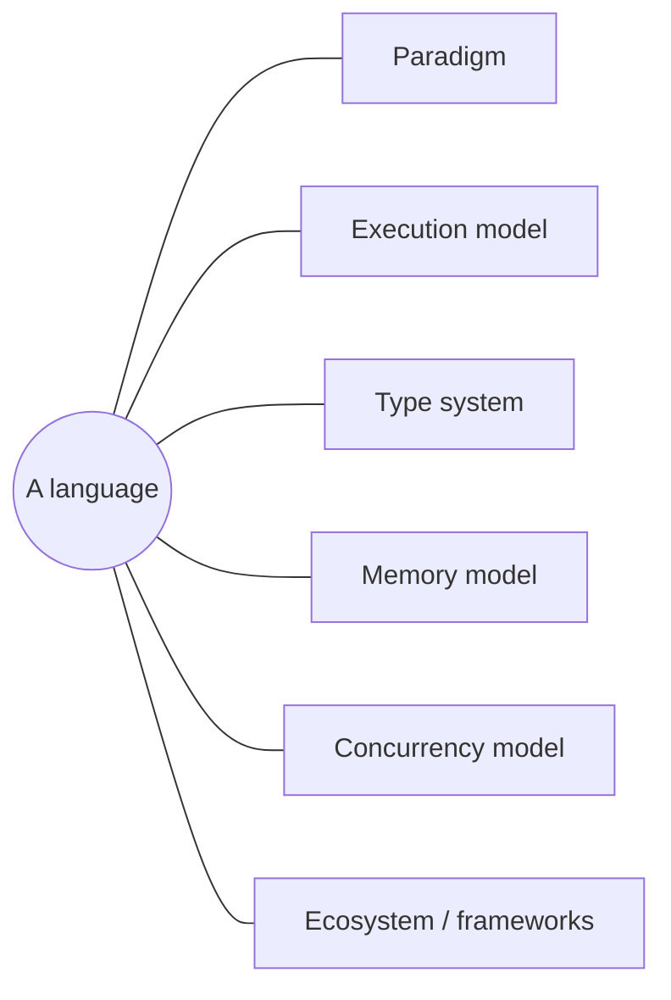

# What Makes a Programming Language

> Languages aren't just different syntax for the same thing — they make different **choices** on
> a handful of axes (paradigm, types, memory, concurrency, execution). Learn the axes once and
> every new language becomes "which choices did *this* one make?"

## Top-down: where you already meet this
You've learned a second language and felt either "this is just the first one with curly braces"
or "this thinks completely differently." The difference is whether the two made the *same* choices
on the deep axes or different ones. Python→Ruby is mostly syntax; Python→Rust or Python→Haskell is
a different worldview. This area is about those axes — so your third, fourth, and tenth language
take days, not months.

## Problem
There are thousands of languages and you can't (and shouldn't) learn them as thousands of
unrelated skills. Tutorials teach *syntax*, which is the shallowest and most interchangeable part.
What actually transfers — and what decides whether a language fits a job — is the small set of
**design dimensions** every language has to take a position on. Knowing them turns "learning a
language" into "mapping a language onto axes I already understand."

**Make it concrete.** "Sum a list of numbers" in three languages — almost identical *logic*, yet
the axes leak through every line:

```python
# Python — types inferred & dynamic, garbage-collected, interpreted
nums = [1, 2, 3]
print(sum(nums))                            # no type declared, no memory freed by you, runs top-down
```
```rust
// Rust — static types, ownership instead of a GC, compiled ahead of time
let nums = vec![1, 2, 3];
println!("{}", nums.iter().sum::<i32>());   // the type i32 is required; `nums` is freed at scope end
```
```go
// Go — static types, garbage-collected, compiled to one native binary
nums := []int{1, 2, 3}
total := 0
for _, n := range nums { total += n }       // explicit loop; the runtime frees memory; ships as a static binary
```

You didn't need to *know* these languages to feel the differences — typed or not, who frees memory,
compiled or interpreted. **Those differences are exactly the axes below.**

## Core concepts — the axes a language is defined by
| Axis | The question | Covered in |
| --- | --- | --- |
| **Paradigm** | How do you express computation — steps, objects, functions, rules? | [Programming paradigms](./programming-paradigms.md) |
| **Execution model** | Compiled, interpreted, or VM/JIT? When do errors surface? | [Compilation & execution](./compilation-and-execution.md) |
| **Type system** | Static or dynamic? Strong or weak? How much does the compiler check? | [Type systems](../language-design/type-systems.md) |
| **Memory management** | Manual, garbage-collected, or ownership? | [Memory management](../language-design/memory-management.md) |
| **Concurrency model** | Threads & locks, async/await, goroutines, actors? | [Concurrency models](../language-design/concurrency-models.md) |

Plus the *ecosystem* layer — standard library, package manager, and
[frameworks](../frameworks/library-vs-framework.md) — which often matters as much as the language
itself in practice.



A language is essentially a **point in this space**, chosen to optimize something: Python for
programmer speed, Rust for safety-without-GC, Go for simple concurrency, JavaScript for "runs
everywhere." There's no "best" — only **fit for a goal and its trade-offs**.

## Essential terminology
| Term | Meaning |
| --- | --- |
| **Syntax** | The surface grammar (the *least* transferable, most superficial difference) |
| **Semantics** | What programs *mean* / do — the part the axes actually govern |
| **Idiom** | The natural way to express something *in this language* ("Pythonic", "idiomatic Go") |
| **Paradigm** | A style/model of structuring computation (imperative, OO, functional, …) |
| **Ecosystem** | Stdlib + package manager + community libraries/frameworks around the language |

## Example
The same idea — "double every number in a list" — across paradigms shows that syntax is the small
part; the *model* is what differs:

```python
nums = [1, 2, 3]
out = []
for n in nums:            # imperative: describe the steps
    out.append(n * 2)

out = [n * 2 for n in nums]        # functional-ish: describe the transformation
out = list(map(lambda n: n * 2, nums))
```

Move to Haskell (`map (*2) nums`) or Rust (`nums.iter().map(|n| n*2)`) and the *shape* is the
same — because the paradigm choice (functional mapping) transferred, even though the syntax didn't.

## Trade-offs
- ✅ Thinking in axes makes new languages fast to learn, makes language *choice* a rational
  decision, and explains *why* a language feels the way it does.
- ⚠️ Axes are a model, not a rigid taxonomy — most modern languages are **multi-paradigm** and sit
  *between* extremes (Python is dynamically typed but supports gradual typing; C++ is manual memory
  but offers RAII/smart pointers). Treat positions as tendencies, not boxes.

## Real-world examples
- **Language choice in industry** is axis-driven: Rust for systems where a GC pause is
  unacceptable; Go for network services needing cheap concurrency; Python for data/ML where
  developer velocity wins; TypeScript to add a type axis onto JavaScript.
- **"Polyglot" teams** pick per service along these axes rather than standardizing on one language.

## References
- *Seven Languages in Seven Weeks* — Bruce Tate (learning by contrasting axes)
- [Programming paradigms](./programming-paradigms.md) · [Compilation & execution](./compilation-and-execution.md) · [Library vs. framework](../frameworks/library-vs-framework.md)
