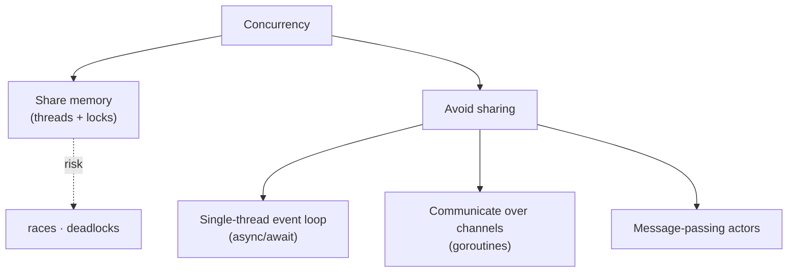

# Concurrency Models

> How a language lets you do **more than one thing at a time** — OS threads & locks, an async
> event loop, lightweight goroutines with channels, or actors. The model shapes how you write
> concurrent code and which bugs you'll fight.

## Top-down: where you already meet this
You've used `async`/`await` so a web request doesn't block the page; you've spawned threads and
then hit a race condition; you've heard "Go makes concurrency easy" and "Node is single-threaded
but non-blocking." Those are four different *language-level* answers to the same question — and
this doc is about choosing and reasoning about them.

> 🔗 This is the **language abstraction** layer. The OS mechanics underneath — threads,
> scheduling, context switches — live in [Operating Systems](../../../operating-systems/); the
> *distributed* coordination across machines lives in [Distributed Systems](../../../distributed-systems/).
> Here we care about what the *language* hands you.

## Problem
Concurrency is needed for two distinct reasons: **responsiveness** (don't freeze while waiting on
I/O) and **throughput/parallelism** (use all CPU cores). The hard part is **shared mutable state**:
when two flows touch the same data, you get race conditions, deadlocks, and Heisenbugs. Each model
is a different strategy for managing — or avoiding — that shared state.

## Core concepts
| Model | Unit | How it handles shared state | Languages |
| --- | --- | --- | --- |
| **Threads & locks** | OS thread | Shared memory + **locks/mutexes** you manage | Java, C++, C#, Python* |
| **Async / event loop** | Task/coroutine on **one** thread | No sharing within the loop — cooperative, non-blocking I/O | JavaScript/Node, Python asyncio |
| **CSP (goroutines + channels)** | Lightweight green thread | *"Don't share memory; communicate"* — pass data over channels | Go, (Clojure core.async) |
| **Actors** | Actor with private state + mailbox | No shared state at all — only async messages | Erlang/Elixir, Akka |



### The key distinctions
- **Concurrency ≠ parallelism.** Concurrency is *structuring* independent tasks; parallelism is
  *running* them simultaneously on multiple cores. An async event loop gives concurrency on **one**
  core (great for I/O-bound work); true parallelism needs threads/processes across cores.
- **Threads & locks** are the most general and the most dangerous — *you* prevent races, and locks
  bring deadlocks. Powerful, but error-prone at scale.
- **Async/event loop** sidesteps races by running tasks cooperatively on one thread: a task runs
  until it `await`s I/O, then yields. Brilliant for many concurrent I/O waits (web servers);
  useless for CPU-bound work (one task hogs the loop).
- **CSP & actors** avoid shared state by design — pass messages instead of sharing memory — which
  removes most race conditions structurally. This is also the bridge to
  [event-driven](../../../system-design/1-knowledge/patterns/event-driven.md) and
  [message-queue](../../../system-design/1-knowledge/building-blocks/message-queues.md) thinking at
  the system level.

> *Python footnote: the **GIL** (Global Interpreter Lock) lets only one thread run Python bytecode
> at a time, so threads help I/O-bound work but **not** CPU parallelism — for that you use
> `multiprocessing`. A clean example of a language's runtime shaping its concurrency story.

## Essential terminology
| Term | Meaning |
| --- | --- |
| **Concurrency vs. parallelism** | Dealing with many things at once vs. doing many at once (multi-core) |
| **Race condition** | Outcome depends on unpredictable timing of concurrent access to shared state |
| **Deadlock** | Two+ flows each waiting on a lock the other holds — stuck forever |
| **Mutex / lock** | Guards shared data so only one flow accesses it at a time |
| **Event loop** | Single thread that runs ready tasks and dispatches I/O completions (async) |
| **Coroutine** | A function that can suspend (`await`) and resume — cooperative scheduling |
| **Channel (CSP)** | A typed pipe goroutines use to pass data instead of sharing it |
| **Actor** | An isolated unit with private state communicating only via messages |
| **GIL** | Global Interpreter Lock — serializes Python bytecode execution |

## Example
Same I/O-bound job — blocking threads vs. a cooperative event loop (Python):

```python
# Async: one thread, tasks yield at `await` — high concurrency for I/O waits
import asyncio
async def fetch(i):
    await asyncio.sleep(1)        # "I/O": yields the loop to others
    return i
async def main():
    return await asyncio.gather(*(fetch(i) for i in range(100)))  # ~1s total, one thread
asyncio.run(main())
```

100 "requests" finish in ~1 second on a single thread, because each yields while waiting. Compare
threads vs. asyncio vs. processes hands-on in [lab: concurrency models](../../3-practice/lab-concurrency-models.md),
and see CSP in the [Go case study](../../2-case-studies/go-concurrency.md), the event loop in the
[JavaScript case study](../../2-case-studies/javascript-event-loop.md).

## Trade-offs
- ✅ **Threads**: real parallelism, general-purpose — ⚠️ races/deadlocks, you manage all locking.
- ✅ **Async**: massive I/O concurrency cheaply, no locks within the loop — ⚠️ one core only;
  a blocking/CPU-heavy call stalls everything; "async all the way" coloring.
- ✅ **CSP/actors**: races designed out, scales to many lightweight units — ⚠️ message-passing
  overhead, different mental model, can still deadlock on channels.
- Pick by workload: **async** for I/O-bound servers, **threads/processes** for CPU-bound parallel
  work, **CSP/actors** for highly concurrent systems where you want safety by construction.

## Real-world examples
- **Node.js** scales tens of thousands of connections on a single-threaded event loop — see the
  [JS case study](../../2-case-studies/javascript-event-loop.md).
- **Go** powers Docker/Kubernetes; goroutines + channels make massively-concurrent network services
  approachable — see the [Go case study](../../2-case-studies/go-concurrency.md).
- **WhatsApp** handled millions of connections per server on **Erlang's actor model**.

## References
- Tony Hoare — *Communicating Sequential Processes* (CSP, 1978)
- [Operating Systems — concurrency](../../../operating-systems/) · [Go concurrency case study](../../2-case-studies/go-concurrency.md) · [JS event loop case study](../../2-case-studies/javascript-event-loop.md)
