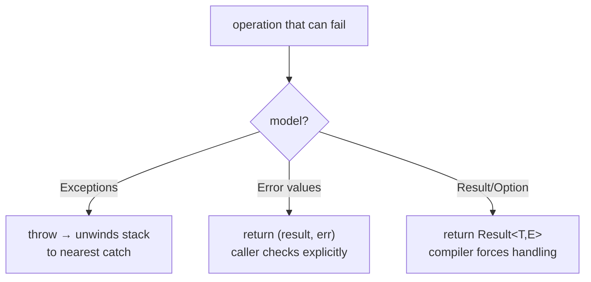

# Error Handling

> Code fails — files vanish, networks drop, input is garbage. A language's **error-handling model**
> decides how you *signal* a failure and how much it *forces the caller to deal with it*. The 4th
> deep design choice, alongside [types](./type-systems.md), [memory](./memory-management.md), and
> [concurrency](./concurrency-models.md).

## Top-down: where you already meet this
You've written `try { ... } catch (e) { ... }` in Python or Java. You've also seen Go's
`if err != nil { return err }` on what feels like every other line, and Rust's tidy `let f =
File::open(path)?;`. Those aren't just syntax differences — they're three fundamentally different
*philosophies* about what an error **is**: an exception that hijacks control flow, or an ordinary
value you pass around.

## Problem
Some operations can't deliver what they promise: open a missing file, parse `"abc"` as a number,
divide by zero. The function must tell its caller "this failed," and the caller must decide whether
to recover, retry, or give up. The hard part is making failure **impossible to ignore silently** —
the classic bug is a failure that's swallowed and surfaces, corrupted, three layers away. The model
trades off three things: how much boilerplate you write, whether the *compiler* forces you to handle
errors, and whether failure is visible in a function's signature.

## Core concepts — three families
**1. Exceptions — out-of-band control flow.** `throw` an error and it **unwinds the stack**,
jumping past every caller until a matching `catch`. The happy path stays clean (no error code on
every line), but the control flow is *invisible*: any call might throw, and you can't tell from the
signature.
- **Unchecked** (Python, C#, JavaScript, Java `RuntimeException`): nothing forces you to catch — easy
  to write, easy to forget, errors escape to the top and crash.
- **Checked** (Java's `throws`): the compiler forces callers to handle or declare them. Safe in
  theory; in practice widely disliked for the boilerplate, so people swallow them with empty catches.

**2. Error values — failure is a return value.** The function returns the error *as data*, and you
check it explicitly. C uses return codes + `errno`; Go returns a `(result, err)` pair by convention.
No hidden control flow — but the discipline rests on *you* remembering to check (`_ = err` silently
drops it).

**3. Result / Option types — errors in the type system.** The return type itself encodes
success-or-failure: Rust `Result<T, E>`, Haskell `Either`, Scala `Try`. You **cannot reach the value
without acknowledging the error** — the compiler won't let you — yet the `?` operator propagates it
in one character, so it stays concise. This is the same idea as null-safety's
[`Option`](./type-systems.md) applied to failure.



**Recoverable vs. unrecoverable.** Cutting across all three: a missing file is *expected* (recover),
but an index-out-of-bounds is a *bug* (shouldn't happen). Most languages separate these — Rust
`panic!`, Go `panic`, Python `assert` — reserving the loud, crash-the-program path for programmer
errors, not normal failures.

**Cleanup must run regardless.** However an error leaves a function, resources (files, locks) must be
released. Languages answer this with `finally` (Java/Python), `defer` (Go), or
[RAII destructors](./memory-management.md) (Rust/C++) that run automatically as the scope unwinds.

## Essential terminology
| Term | Meaning |
| --- | --- |
| **Exception** | An error object that unwinds the stack until caught |
| **Checked / unchecked** | Compiler *forces* you to handle it / it doesn't |
| **Stack unwinding** | Aborting nested calls back to the handler, running cleanup on the way |
| **Error value** | A failure returned as ordinary data, checked explicitly (Go, C) |
| **Result / Option** | A type encoding success-or-failure the compiler makes you open |
| **Propagation (`?`)** | Passing an error up to the caller instead of handling it here |
| **Panic / fatal** | The unrecoverable path, reserved for bugs not expected failures |

## Example
The same task — parse a string to an int — in all three models:

```python
# Exceptions (Python): clean happy path, but nothing forces the caller to catch
def parse(s):
    return int(s)              # raises ValueError on "abc" — invisible in the signature
try:    n = parse("abc")
except ValueError:  n = 0      # easy to forget this entirely
```
```go
// Error values (Go): explicit, visible, impossible to miss the err — but verbose
n, err := strconv.Atoi("abc")
if err != nil {                // skip this check and you use a garbage n
    return err
}
```
```rust
// Result (Rust): compiler refuses to give you the int without handling failure; `?` propagates
let n: i32 = "abc".parse()?;   // on error, returns Err to the caller in one character
```
Three worldviews: Python keeps the line clean but trusts you to catch; Go makes failure loud but
wordy; Rust makes the compiler the enforcer while staying terse.

## Trade-offs
- ✅ **Exceptions**: uncluttered happy path, errors auto-propagate without manual plumbing — ⚠️ control
  flow is invisible, unchecked ones are silently ignorable, and they're easy to overuse for ordinary
  control flow (slow + surprising).
- ✅ **Error values**: dead simple, no hidden jumps, failure is in the signature — ⚠️ boilerplate on
  every call and *nothing* stops you dropping an error (Go's most-criticized trait).
- ✅ **Result/Option**: the compiler guarantees no failure is ignored, and it's visible in the type —
  ⚠️ needs a type system rich enough to express it, and a `?`-style operator or it gets unbearable.
- Rule of thumb: use the unrecoverable path (panic/assert) **only** for bugs; expected failures should
  use the language's normal recoverable model so callers can react.

## Real-world examples
- **Go** deliberately rejected exceptions for explicit `error` values so that failure handling is
  always visible in the code — a defining (and divisive) language decision.
- **Rust's `Result` + `?`** is widely cited as making robust error handling ergonomic enough that
  people actually do it; **Java's checked exceptions** are the cautionary tale of forcing handling so
  aggressively that developers route around it.

## References
- [Type systems](./type-systems.md) (Option/null-safety is the same idea) · [Memory management](./memory-management.md) (RAII cleanup) · [Concurrency models](./concurrency-models.md) (errors across threads)
- Andrew Gallant — *Error Handling in Rust*; Rob Pike — *Errors are values* (Go blog)
