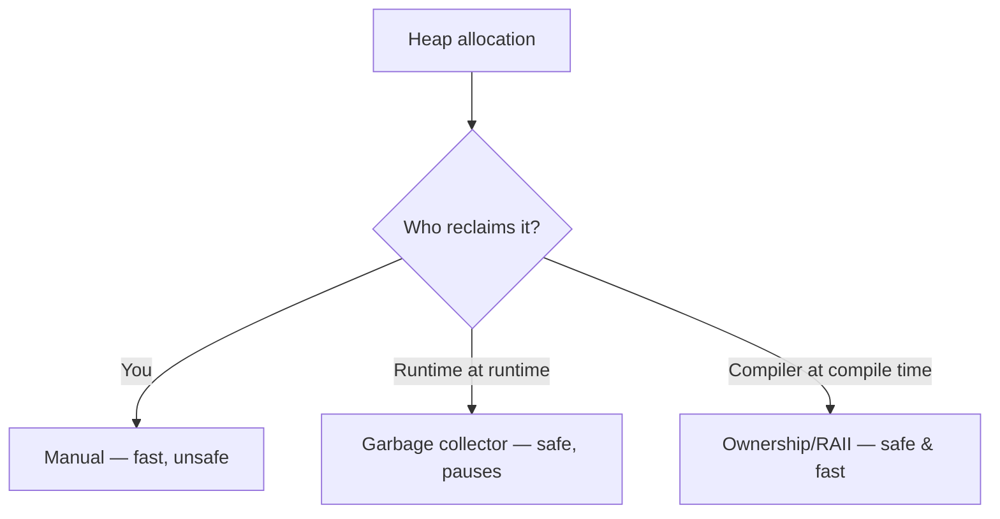

# Memory Management

> Every program borrows memory and must give it back. *Who* decides when — you (manual), a runtime
> (garbage collection), or the compiler via rules (ownership) — is a defining language axis that
> trades **safety, speed, and predictability** against each other.

## Top-down: where you already meet this
You've probably never `free()`d memory in Python or JavaScript — a garbage collector does it
silently. You may have hit a C segfault from using freed memory, or a mysterious latency spike in a
Java service (a GC pause). And you've heard Rust "has no garbage collector but is memory-safe."
Those three experiences *are* the three strategies on this axis.

## Problem
Memory is finite. Allocate and never release → a **leak** that eventually crashes you. Release too
early and keep using it → a **use-after-free**, a crash or security hole. Getting this right by hand
is error-prone (decades of C/C++ CVEs are memory bugs); getting it automatic costs either
performance or predictability. How a language resolves this tension shapes its whole feel.

## Core concepts
First, *where* memory lives:
- **Stack** — fast, automatic, scoped to a function call (local variables). Freed when the function
  returns. Not the hard part.
- **Heap** — flexible, lives as long as needed, must be reclaimed somehow. **This** is what
  "memory management" is about.

Three strategies for reclaiming the heap:

| Strategy | Who frees memory | Languages | You get |
| --- | --- | --- | --- |
| **Manual** | You (`malloc`/`free`, `new`/`delete`) | C, C++ | Max control & speed; max footguns (leaks, use-after-free) |
| **Garbage collection (GC)** | A runtime that finds & frees unreachable objects | Java, Python, Go, JS, C# | Safety & convenience; pauses & overhead |
| **Ownership / RAII** | The **compiler**, via rules checked at compile time | Rust, C++ (RAII/smart ptrs) | Safety *and* speed; a learning curve |



### Garbage collection, briefly
GC automatically frees objects nothing references anymore. Two common mechanisms:
- **Reference counting** (CPython): each object counts references; hits zero → freed immediately.
  Simple and prompt, but **can't free reference cycles** (A↔B) without a backup collector.
- **Tracing GC** (JVM, Go, V8): periodically traces from "roots" to find reachable objects; frees
  the rest. Handles cycles, but introduces **GC pauses** — the latency spikes that matter for
  real-time and low-latency services.

### Ownership — safety without a GC
Rust's model: every value has one **owner**; when the owner goes out of scope the value is freed —
decided **at compile time**, so there's no runtime collector and no pauses, yet no leaks or
use-after-free. The cost is a stricter compiler (the "borrow checker") you must satisfy. See the
[Rust case study](../../2-case-studies/rust-ownership.md).

## Essential terminology
| Term | Meaning |
| --- | --- |
| **Stack / heap** | Auto, scoped memory / manually-lived, must-be-reclaimed memory |
| **Memory leak** | Memory allocated but never freed; grows until crash |
| **Use-after-free / dangling pointer** | Using memory after it's freed — crash or vulnerability |
| **Garbage collection** | Runtime reclaiming of unreachable objects |
| **Reference counting** | GC by counting references; frees at zero (misses cycles) |
| **GC pause (stop-the-world)** | Latency while the collector runs |
| **Ownership / borrow checker** | Compile-time rules (Rust) that free memory deterministically, safely |
| **RAII** | "Resource Acquisition Is Initialization" — tie resource lifetime to scope (C++) |

## Example
Observe Python's reference counting and a cycle a tracing pass must clean up:

```python
import sys, gc
a = []
print(sys.getrefcount(a))      # 2  (the var + getrefcount's own arg)
b = a
print(sys.getrefcount(a))      # 3  (now two references)

# a reference cycle refcounting alone can't free:
x = {}; y = {}
x["y"] = y; y["x"] = x         # x ↔ y reference each other
del x, y                       # refcounts never hit 0 → only the cyclic GC reclaims them
print(gc.collect())            # >0: the tracing collector frees the cycle
```

Run and extend this in [lab: reference counting & cycles](../../3-practice/lab-memory-refcounting.md).

## Trade-offs
- ✅ **Manual**: deterministic, zero runtime overhead, full control — ⚠️ the dominant source of
  crashes & security bugs in C/C++; huge cognitive burden.
- ✅ **GC**: safe, productive, no thinking about frees — ⚠️ pauses (bad for low-latency), higher
  memory use, less predictable timing.
- ✅ **Ownership/RAII**: safe *and* no GC pauses, predictable — ⚠️ steeper learning curve, more
  upfront thought to satisfy the compiler.
- The choice maps to the goal: GC for most apps (productivity), ownership/manual where pauses or
  footprint are unacceptable (systems, embedded, game engines, low-latency trading).

## Real-world examples
- **Discord** famously rewrote a latency-sensitive service from **Go to Rust** specifically to
  escape GC pauses — the ownership-vs-GC trade-off in production.
- **Low-latency / HFT / game engines** avoid GC languages (or carefully pool memory) for predictable
  frame times.
- **Most web/business apps** happily use GC languages (Java, Go, Python, C#) — productivity wins.

## References
- The Garbage Collection Handbook — Jones, Hosking, Moss
- [Rust case study — ownership](../../2-case-studies/rust-ownership.md) · [Type systems](./type-systems.md) · [Compilation & execution](../fundamentals/compilation-and-execution.md)
