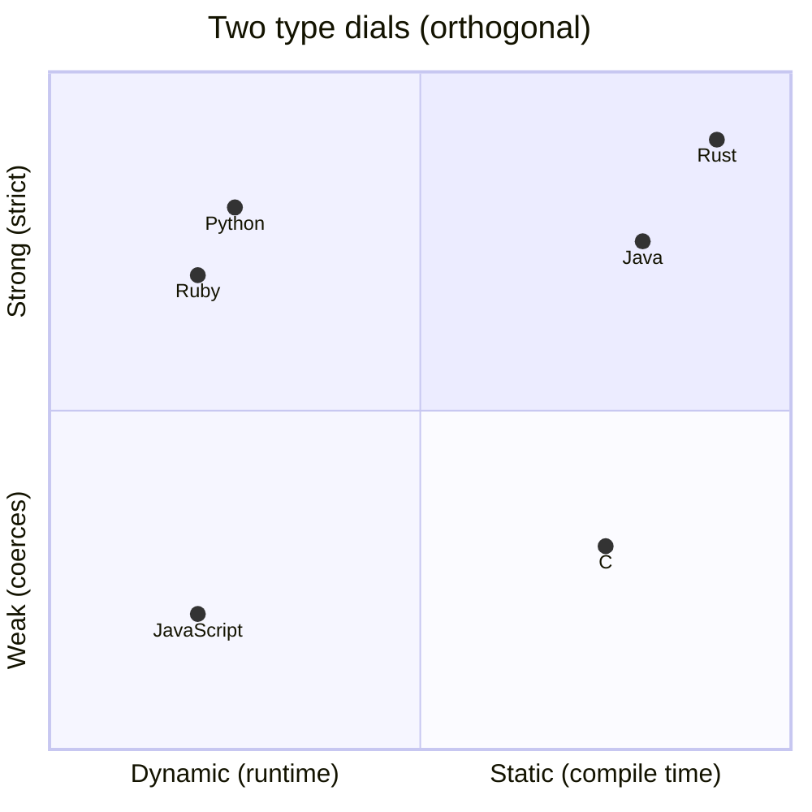

# Type Systems

> A type system is the language's promise about **what kind of value lives where** — and how much
> it checks that promise *for you, before you run*. Two near-independent dials: **static vs.
> dynamic** (when checked) and **strong vs. weak** (how strictly).

## Top-down: where you already meet this
You've seen a compiler reject `int x = "hello"` before the program ran (static), and you've seen
Python happily store anything in any variable until it blows up at runtime (dynamic). You've also
seen JavaScript turn `"5" - 1` into `4` and `"5" + 1` into `"51"` (weak), where Python refuses to
add a string and an int (strong). Those are the two type-system dials in action.

## Problem
Every value has a *kind* (number, string, list, user). Bugs happen when code treats a value as the
wrong kind. The type system decides **how much of that class of bug the language prevents, and
when** — which trades off against how much you have to write and how flexible the code is. It's one
of the most consequential axes when picking a language and a constant source of "static vs. dynamic"
debate.

## Core concepts — two independent dials
**1. Static vs. dynamic — *when* are types checked?** Concretely, a typo like calling
`.toUpperCase()` on a number:
```java
// Java (static): caught at COMPILE time — the program won't even build
int n = 5;
n.toUpperCase();          // ❌ compile error: int has no method toUpperCase
```
```python
# Python (dynamic): builds & starts fine — blows up only WHEN that line runs
n = 5
n.upper()                 # 💥 AttributeError at runtime — and only if execution reaches here
```
- **Static** (C, Java, Rust, Go, TypeScript): types are known and checked **at compile time**.
  Type errors caught before running; enables tooling (autocomplete, refactoring) and speed.
- **Dynamic** (Python, JavaScript, Ruby): types travel with *values* and are checked **at runtime**.
  Less to write, more flexible; type errors surface only when the line executes (ties to
  [interpreted execution](../fundamentals/compilation-and-execution.md)).

**2. Strong vs. weak — *how strictly* are types enforced?**
- **Strong** (Python, Rust, Java): few implicit conversions; mixing incompatible types errors
  rather than silently coercing.
- **Weak** (C, JavaScript): the language silently coerces types to make an operation "work,"
  which can hide bugs.

These are orthogonal — Python is **dynamic + strong**; JavaScript is **dynamic + weak**; Java is
**static + (fairly) strong**; C is **static + weak**.



### Type inference and gradual typing — the middle ground
Modern languages soften the static/dynamic divide:
- **Type inference** — the compiler *figures out* types so you don't annotate everything (Rust's
  `let x = 5`, Go's `:=`, TypeScript). You get static safety without the verbosity.
- **Gradual typing** — add optional static types to a dynamic language: Python type hints +
  `mypy`, TypeScript over JavaScript. Opt into checking where it pays off.
- **Generics** — write code parameterized over types (`List<T>`) so it's both reusable *and*
  type-safe.
- **Null safety** — types that encode "might be absent" (Rust `Option`, Kotlin `?`) to kill the
  billion-dollar null-pointer bug.

## Essential terminology
| Term | Meaning |
| --- | --- |
| **Static / dynamic typing** | Types checked at compile time / at runtime |
| **Strong / weak typing** | Strict about types / silently coerces between them |
| **Type inference** | Compiler deduces types you didn't write |
| **Gradual typing** | Optional static types layered onto a dynamic language |
| **Generics (parametric polymorphism)** | Code parameterized over types, kept type-safe |
| **Type coercion** | Implicit conversion of a value to another type |

## Example
Strong (Python) refuses; weak (JavaScript) coerces — the *same* expression, different worldview:

```python
"5" + 1      # ❌ TypeError: can only concatenate str to str   — bug surfaced
```
```javascript
"5" + 1      // "51"  (number coerced to string)
"5" - 1      // 4     (string coerced to number) — silent, easy to misuse
```

Weak typing made both "work," hiding a likely bug. See it live in
[lab: strong vs. weak typing](../../3-practice/lab-strong-vs-weak-typing.md).

## Trade-offs
- ✅ **Static + strong**: catch errors before running, safe large-scale refactors, powerful
  tooling, runtime speed — ⚠️ more to write, can feel rigid, slower iteration.
- ✅ **Dynamic + strong** (Python): flexible and fast to write, still rejects nonsense at runtime —
  ⚠️ type bugs found late, in production if untested.
- ⚠️ **Weak typing**: convenient coercions, but a notorious bug source — most teams add linters /
  `"use strict"` / TypeScript precisely to claw back strictness.
- The industry trend is **clear**: dynamic languages are adding gradual types (mypy, TypeScript)
  because large codebases want the safety without abandoning the flexibility.

## Real-world examples
- **TypeScript** exists entirely to bolt a static type axis onto JavaScript — now dominant in large
  front-end codebases.
- **Python type hints + mypy** are standard in big Python codebases; **Rust's** type system (with
  ownership) prevents whole bug classes at compile time — see the [Rust case study](../../2-case-studies/rust-ownership.md).

## References
- Benjamin Pierce — *Types and Programming Languages* (the formal reference)
- [Compilation & execution](../fundamentals/compilation-and-execution.md) · [Memory management](./memory-management.md) · [Programming paradigms](../fundamentals/programming-paradigms.md)
