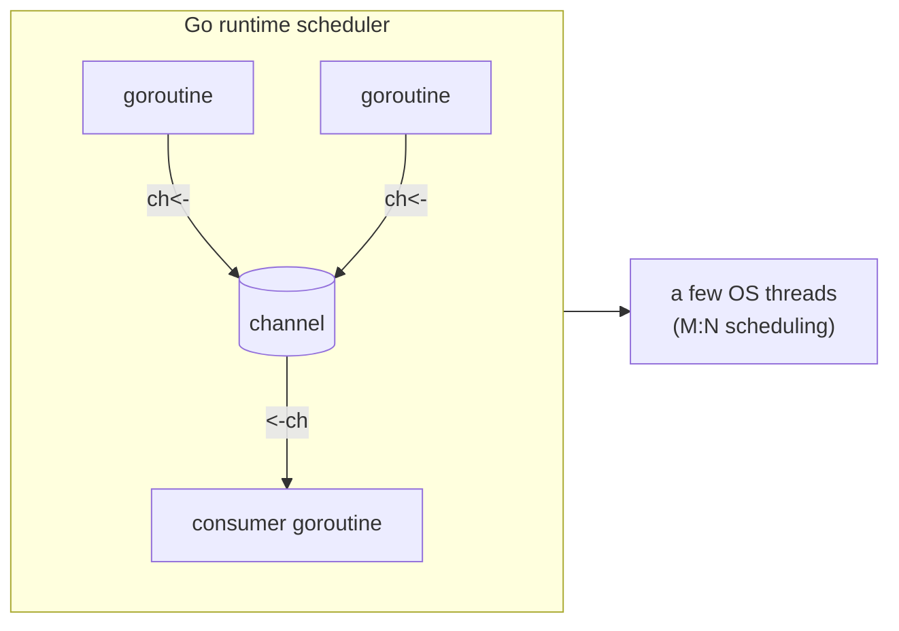

# Case Study: Go — Concurrency via Goroutines & Channels

> How Go made highly-concurrent network services *approachable* by choosing
> [CSP](../1-knowledge/language-design/concurrency-models.md) — "don't communicate by sharing
> memory; share memory by communicating" — over the usual threads-and-locks minefield.

## The scenario
You're building the kind of software Go was designed for: a network service handling tens of
thousands of simultaneous connections (an API gateway, a container orchestrator, a proxy). The
classic [threads + locks](../1-knowledge/language-design/concurrency-models.md) approach makes this
painful — OS threads are heavy (MBs of stack each), and coordinating shared state with mutexes
breeds race conditions and deadlocks. Go's bet: give developers a concurrency model that's cheap
*and* hard to get wrong.

## Requirements
1. **Cheap concurrency** — spawn hundreds of thousands of concurrent tasks without exhausting RAM.
2. **Avoid shared-state bugs** — make races structurally unlikely, not just "be careful."
3. **Simple mental model** — concurrency a working engineer can reason about, not a PhD topic.

## How it works — goroutines, channels, the scheduler
**Goroutines** are lightweight green threads managed by Go's runtime, not the OS. They start at ~2 KB
of stack (vs. MBs for an OS thread) and the runtime multiplexes many goroutines onto a few OS
threads. Starting one is just `go f()`:

```go
func main() {
    for i := 0; i < 100000; i++ {
        go work(i)          // 100k concurrent goroutines — fine; 100k OS threads — would die
    }
}
```

**Channels** are typed pipes goroutines use to *pass* values rather than *share* them. The receiving
goroutine owns the data — so there's nothing to race over:

```go
ch := make(chan int)
go func() { ch <- compute() }()   // producer sends
result := <-ch                    // consumer receives (blocks until ready)
```



**The scheduler** does **M:N scheduling** — M goroutines across N OS threads — and when a goroutine
blocks on I/O, the runtime parks it and runs another on that thread. You get massive I/O concurrency
*and* real multi-core parallelism, without managing any of it.

## Deep dives — the theory in action
- **CSP in practice (Req 2):** Go's motto — *"share memory by communicating"* — is
  [Hoare's CSP](../1-knowledge/language-design/concurrency-models.md). Passing data over channels
  means one goroutine owns it at a time, so most race conditions never arise by construction. (Go
  still *has* mutexes for when shared state is genuinely simpler — it's pragmatic, not dogmatic, and
  ships a race detector for the rest.)
- **`select`** lets a goroutine wait on multiple channels at once — the building block for timeouts,
  fan-in/fan-out, and cancellation (`context`).
- **Cheapness changes design (Req 1):** because goroutines are nearly free, the idiomatic style is
  "one goroutine per connection/request" — a model that's disastrous with OS threads but natural
  here.
- **Simplicity was a language *value* (Req 3):** Go deliberately omits features to keep concurrency
  (and the language) small and teachable — the same philosophy as its fast
  [AOT-compiled](../1-knowledge/fundamentals/compilation-and-execution.md) single-binary deploys.

## Trade-offs & failure modes
- ✅ Concurrency that's cheap, fast, and approachable; great fit for network services; real
  parallelism + huge I/O concurrency with almost no ceremony.
- ⚠️ Not magic: you can still **deadlock** (all goroutines blocked on channels), **leak goroutines**
  (one blocked forever on a channel nobody sends to), and hit races if you *do* share memory.
- ⚠️ Channels aren't always the right tool — overusing them where a simple mutex or direct call
  would do is a common Go anti-pattern.

## Real systems
- **Docker & Kubernetes** are written in Go — the container ecosystem ([containers](../../devops-infrastructure/1-knowledge/containers/containers.md),
  [Kubernetes](../../devops-infrastructure/1-knowledge/containers/kubernetes.md)) runs on goroutines.
- **gRPC servers, proxies (Traefik, Caddy), and CLI tooling** lean on Go's concurrency + single-binary
  deploys.

## References
- [Concurrency models](../1-knowledge/language-design/concurrency-models.md) · [Compilation & execution](../1-knowledge/fundamentals/compilation-and-execution.md)
- Rob Pike — [Concurrency is not Parallelism](https://go.dev/blog/waza-talk); [Effective Go: Concurrency](https://go.dev/doc/effective_go#concurrency)
