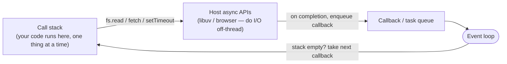

# Case Study: JavaScript — The Single-Threaded Event Loop

> How JavaScript handles thousands of concurrent operations on **one thread** with no locks — by
> never blocking: it offloads I/O and runs your callbacks from a queue. The
> [async/event-loop](../1-knowledge/language-design/concurrency-models.md) model, made concrete.

## The scenario
JavaScript began life in the browser, where blocking is catastrophic: if your code stalls for 200 ms
waiting on the network, the entire page freezes — no clicks, no scrolling. The language therefore
has **one** thread for your code and can't afford to wait. Node.js later took the *same* model to
the server to handle tens of thousands of simultaneous connections cheaply. How does one thread do
so much at once?

## Requirements
1. **Never block the one thread** on I/O (network, disk, timers).
2. Handle **many concurrent I/O operations** with no threads or locks to manage.
3. Keep a **simple programming model** for the developer.

## How it works — call stack, async APIs, callback queue, the loop
JavaScript's runtime (V8 + the host: browser or Node) has four pieces working together:



1. Your synchronous code runs on the **call stack**, one operation at a time.
2. When you call an async API (`fetch`, `fs.readFile`, `setTimeout`), the work is handed to the
   **host** (the browser, or Node's libuv thread pool) and your thread **immediately moves on** — it
   does *not* wait.
3. When that I/O finishes, its **callback** is placed on the **queue**.
4. The **event loop** does one job forever: *when the call stack is empty, take the next callback
   off the queue and run it.*

So the single thread is never idle waiting — it kicks off I/O and processes completions as they
arrive. Concurrency without parallelism, exactly as described in the
[concurrency-models doc](../1-knowledge/language-design/concurrency-models.md).

```javascript
console.log("1");
setTimeout(() => console.log("3"), 0);   // handed to host, callback queued
Promise.resolve().then(() => console.log("2"));   // microtask — runs before timers
console.log("end");
// prints: 1, end, 2, 3  — not 1,2,3,end
```

The order surprises people: synchronous code first (`1`, `end`), then queued callbacks — and
**microtasks (Promises) jump ahead of macrotasks (timers)**. See it run in
[lab: concurrency models](../3-practice/lab-concurrency-models.md).

## Deep dives — the theory in action
- **`async`/`await` is sugar over this (Req 3):** Promises + `await` let you *write* sequential-looking
  code that actually yields the thread at each `await` while the loop runs other work. The simple
  model (Req 3) hides the queue machinery.
- **The fatal flaw — CPU-bound work:** because there's one thread, a long synchronous computation
  (a big loop, sync crypto) **blocks the entire loop** — every other request stalls. The model is
  built for **I/O-bound** workloads; for CPU-bound work you must offload to **Worker threads** or
  separate processes. This is the precise trade-off in the
  [concurrency models](../1-knowledge/language-design/concurrency-models.md) table.
- **No locks, no data races (Req 2):** since only one piece of your code runs at a time, there's no
  shared-memory concurrency *within* the loop — a whole class of bugs simply doesn't exist (the
  same safety CSP/actors achieve, but by single-threading instead of message-passing).
- **Scaling out:** to use multiple cores, Node runs **multiple processes** (cluster / PM2 / one per
  container) behind a [load balancer](../../system-design/1-knowledge/building-blocks/load-balancers.md)
  rather than threads — process-level parallelism over shared-memory threading.

## Trade-offs & failure modes
- ✅ Enormous I/O concurrency on minimal resources; no thread/lock complexity; great for API
  gateways, real-time apps, and I/O-heavy services.
- ⚠️ One CPU-bound or accidentally-synchronous call freezes everything ("don't block the event
  loop"); a single uncaught error can take down the process.
- ⚠️ "Async all the way" — a sync function deep in the stack can't cleanly call async code;
  callback/Promise discipline is required.

## Real systems
- **Node.js** powers high-concurrency backends (Netflix, PayPal, Uber dashboards) precisely because
  the event loop handles many slow I/O waits cheaply.
- **The browser** itself: every UI you've used relies on not blocking the loop to stay responsive.

## References
- [Concurrency models](../1-knowledge/language-design/concurrency-models.md) · [Compilation & execution (V8/JIT)](../1-knowledge/fundamentals/compilation-and-execution.md)
- Philip Roberts — [What the heck is the event loop anyway?](https://www.youtube.com/watch?v=8aGhZQkoFbQ) (the canonical talk)
