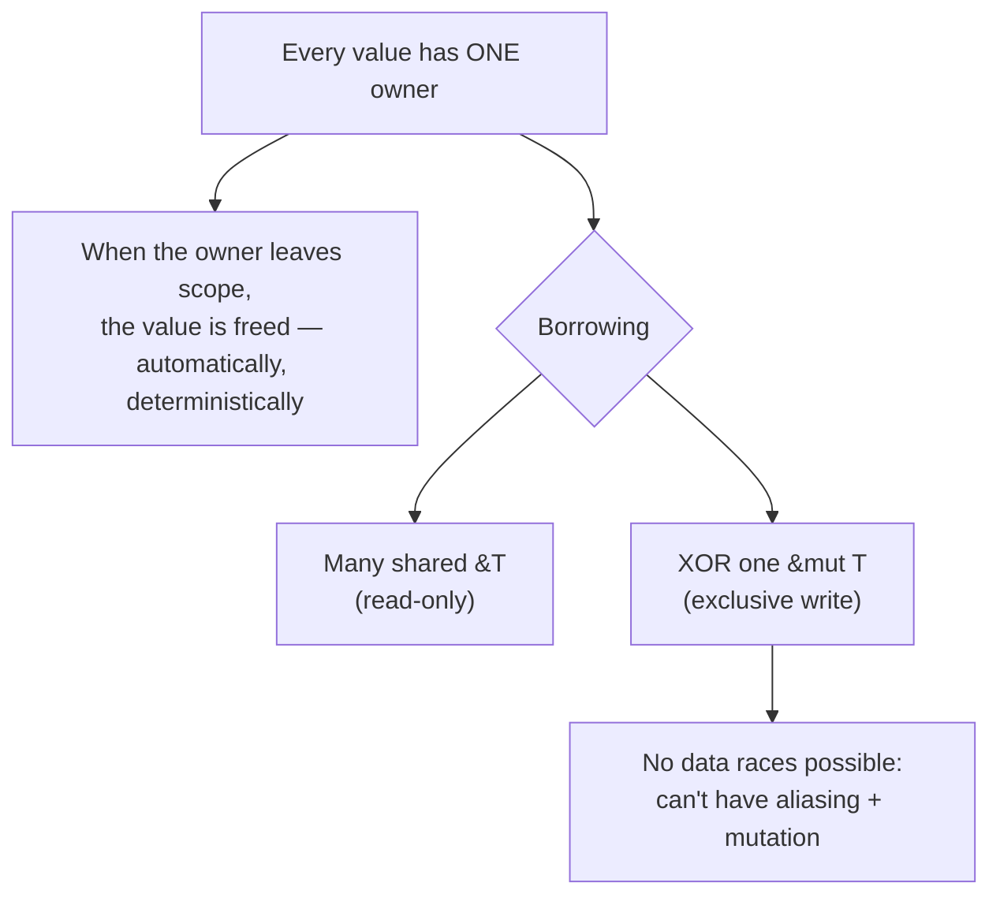

# Case Study: Rust — Memory Safety Without a Garbage Collector

> How Rust gets the safety of a [garbage-collected](../1-knowledge/language-design/memory-management.md)
> language *and* the speed/predictability of manual C — by moving the whole problem to **compile
> time** with ownership and borrowing.

## The scenario
You're writing software where both failure modes are unacceptable: you can't afford C's
memory-corruption bugs (use-after-free, data races — decades of security CVEs), **and** you can't
afford a garbage collector's pauses or overhead (a network proxy, a game engine, an OS kernel, a
database). Historically you had to pick one. Rust's premise: you shouldn't have to.

## Requirements
1. **No memory-safety bugs** — no use-after-free, no double-free, no buffer overflows.
2. **No data races** — safe concurrency, checked, not hoped for.
3. **No garbage collector** — deterministic frees, no runtime pauses, C-comparable speed.
4. Catch all of the above **at compile time**, not in production.

## How it works — ownership, borrowing, lifetimes
Rust's model rests on three compile-time rules enforced by the **borrow checker**:



**1 — Ownership.** Each value has exactly one owner (a variable). When the owner goes out of scope,
the value's memory is freed right there — no GC, no manual `free`. Assigning or passing a value
*moves* ownership; the old binding can't be used anymore:

```rust
let s = String::from("hi");
let t = s;                 // ownership MOVES to t
println!("{}", s);         // ❌ compile error: value borrowed after move
```

**2 — Borrowing.** Instead of moving, you lend a reference. The rule the compiler enforces:
**either many immutable borrows `&T`, or exactly one mutable borrow `&mut T` — never both.** That
single rule makes data races *structurally impossible*: you can't have two threads mutate the same
data, because you can't even have two mutable references.

**3 — Lifetimes.** The compiler tracks how long each reference must remain valid and rejects any
reference that could outlive the data it points to — killing dangling pointers before the program
runs.

## Deep dives — the theory in action
- **Requirement 3 met for free:** because frees are tied to scope at *compile time*, there's no
  runtime collector and no pauses — yet no leaks. This is the [RAII/ownership](../1-knowledge/language-design/memory-management.md)
  strategy taken to its logical end.
- **"Fearless concurrency":** the same borrow rules that manage memory also prevent
  [data races](../1-knowledge/language-design/concurrency-models.md). The compiler won't let you
  share mutable state unsafely across threads — concurrency bugs become *compile errors*.
- **The cost is real and upfront:** satisfying the borrow checker is the famous Rust learning
  curve. The bargain is "argue with the compiler now, instead of debugging corruption in
  production." It leans hard on a powerful [static type system](../1-knowledge/language-design/type-systems.md)
  (`Option`/`Result` instead of null/exceptions).
- **`unsafe` escape hatch:** low-level code that the checker can't prove safe is wrapped in
  `unsafe` blocks — small, auditable islands rather than the whole program.

## Trade-offs & failure modes
- ✅ Memory- and thread-safe with C-level speed and no GC pauses; bugs caught at build time;
  excellent for systems, embedded, and latency-critical services.
- ⚠️ Steep learning curve; slower initial development; fighting the borrow checker; longer compile
  times.
- ⚠️ Not a fit for everything — for most business/web apps a [GC language](../1-knowledge/language-design/memory-management.md)
  trades a little speed for much faster development, and that's the right call.

## Real systems
- **Discord** rewrote a latency-sensitive "Read States" service from Go to Rust to eliminate GC
  pauses — the textbook ownership-vs-GC win.
- **Linux kernel** now accepts Rust for drivers; **Firefox** (Servo/Stylo), **Cloudflare**, and
  **AWS** (Firecracker) use Rust where safety + performance both matter.

## References
- [Memory management](../1-knowledge/language-design/memory-management.md) · [Type systems](../1-knowledge/language-design/type-systems.md) · [Concurrency models](../1-knowledge/language-design/concurrency-models.md)
- *The Rust Programming Language* ("the book") — [doc.rust-lang.org/book](https://doc.rust-lang.org/book/)
