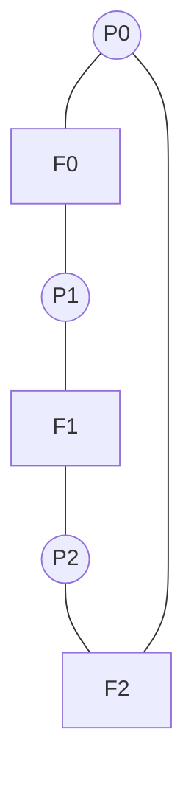

# Classic Synchronization Problems

> A handful of canonical puzzles — producer/consumer, readers/writers, dining philosophers
> — that capture the recurring patterns of concurrency. Solve these and you have templates
> for most real synchronization.

## Problem
Real concurrency bugs are endless variations on a few archetypes. Rather than reinvent
solutions per program, OS courses distilled the patterns into standard problems with known
correct solutions using [locks, semaphores, and condition
variables](./locks-semaphores.md). Recognizing which archetype your problem is tells you
the solution.

## Core concepts

### 1. Producer–Consumer (bounded buffer)
Producers add items to a fixed-size buffer; consumers remove them. Must block producers
when **full** and consumers when **empty**, with no [races](./race-conditions.md) on the
buffer. The clean solution uses **two counting semaphores + a mutex**:

```c
sem_t empty;  sem_init(&empty, 0, N);   // free slots, starts at N
sem_t full;   sem_init(&full,  0, 0);   // filled slots, starts at 0
pthread_mutex_t m;

producer: sem_wait(&empty); lock(&m); enqueue(x); unlock(&m); sem_post(&full);
consumer: sem_wait(&full);  lock(&m); x=dequeue(); unlock(&m); sem_post(&empty);
```

`empty`/`full` provide backpressure; the mutex protects the buffer. This is the heart of
[thread pools](../../3-practice/project-thread-pool.md), queues, and pipelines.


### 2. Readers–Writers
Many threads read shared data; writers need exclusive access. Allow **concurrent readers**
but a writer must be alone. The tension is **fairness**: a *reader-preference* solution can
**starve writers** (readers keep arriving); a *writer-preference* one can starve readers.
Real systems use **read-write locks** (`pthread_rwlock`) with a fairness policy. This models
caches, databases, and any read-mostly structure.

### 3. Dining Philosophers
Five philosophers, five forks; each needs both neighboring forks to eat. If all grab their
left fork at once → everyone holds one, waits for the other → **deadlock** (a perfect
circular wait). Standard fixes (all from [deadlock](./deadlock.md)):
- **Resource ordering** — number forks; always pick up the lower-numbered first (breaks
  circular wait). Equivalently, one philosopher is "left-handed."
- **Limit diners** — a semaphore lets at most 4 sit at once (breaks hold-and-wait at scale).
- **Atomic both-or-neither** — only pick up forks if both are free (a monitor).



### 4. Sleeping Barber
A barber sleeps when no customers; customers wake the barber or leave if the waiting room
is full. Models a **server with a bounded request queue** — connection backlogs, thread
pools rejecting work when saturated.

## Example
Why producer/consumer needs a `while`, not `if`, with condition variables (the CV variant):

```c
// consumer
lock(&m);
while (count == 0)                 // WHILE: recheck after wakeup
    cond_wait(&not_empty, &m);     // another consumer may have taken the item
item = buf[--count];
cond_signal(&not_full);
unlock(&m);
```

With `if`, two consumers woken for one item both proceed → underflow. Always re-check the
predicate in a loop.

## Common tools
| Tool | What it is | Use it for |
| --- | --- | --- |
| `sem_t` + `pthread_mutex` | Semaphore + mutex | bounded-buffer / producer-consumer |
| `pthread_rwlock` | Read-write lock | readers-writers, read-mostly data |
| Go channels / `sync.Cond` | Higher-level primitives | producer-consumer without manual semaphores |
| TSan / Helgrind | Checkers | verifying your solution is race/deadlock-free |

## Trade-offs
- ✅ These templates are battle-tested — match your problem to one and reuse the solution.
- ⚠️ Each has a **fairness vs throughput** dial (reader vs writer preference; how many
  diners) — the "correct" choice depends on the workload.
- ⚠️ Naive solutions deadlock (philosophers) or starve (readers-writers) — the subtlety is
  in the corners, not the happy path.

## Real-world examples
- **Producer-consumer** — every [thread pool](../../3-practice/project-thread-pool.md),
  message queue, and log pipeline.
- **Readers-writers** — database buffer pools, in-memory caches, config that's read often
  and updated rarely.
- **Dining philosophers** — the canonical teaching case for
  [deadlock](./deadlock.md) and lock ordering;
  [build it here](../../3-practice/project-dining-philosophers.md).

## References
- *The Little Book of Semaphores* — Allen Downey (free)
- OSTEP — "Condition Variables," "Semaphores," "Common Concurrency Problems"
