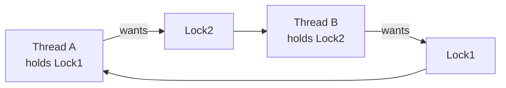

# Deadlock — Prevention, Avoidance, Detection

> **Deadlock** is when a set of threads each hold a resource and wait for one another in a
> cycle, so none can ever proceed. There are four ways to deal with it: prevent, avoid,
> detect-and-recover, or ignore.

## Problem
Once you use multiple [locks](./locks-semaphores.md), threads can get stuck waiting on
each other forever. Thread A holds lock 1 and wants lock 2; thread B holds lock 2 and
wants lock 1. Neither will release what it has, so both block permanently — the program
hangs with no error. Deadlock is silent, timing-dependent, and easy to introduce.

## Core concepts

**The four Coffman conditions** — *all four* must hold for deadlock; break any one and
deadlock is impossible:
1. **Mutual exclusion** — resources can't be shared.
2. **Hold and wait** — a thread holds one resource while waiting for another.
3. **No preemption** — resources can't be forcibly taken back.
4. **Circular wait** — a cycle of threads each waiting on the next.



**Four strategies:**

| Strategy | Idea | Cost |
| --- | --- | --- |
| **Prevention** | Statically break a Coffman condition | Restrictive but robust |
| **Avoidance** | Dynamically refuse unsafe allocations (Banker's algorithm) | Needs to know max needs; rarely practical |
| **Detection + recovery** | Let it happen, find cycles, recover | Recovery is disruptive (kill/rollback) |
| **Ignore (ostrich)** | Pretend it won't happen | What most OSes/apps actually do |

**Prevention in practice = break circular wait** via a **global lock ordering**: always
acquire locks in the same agreed order. If everyone takes Lock1 before Lock2, the cycle
above can't form. This is the standard, simplest real-world fix. Other tactics: take all
locks at once (break hold-and-wait), or use `trylock` + back off (break no-preemption).

**Avoidance — the Banker's algorithm.** Treat allocation like a bank granting loans: only
grant a request if the system stays in a **safe state** (some ordering of completions
exists). Elegant but needs each process's maximum claim up front, so it's mostly academic.

**Detection.** Build a *resource-allocation graph* (or wait-for graph) and look for a
**cycle**; a cycle = deadlock. Databases do this: they detect lock cycles and **abort a
victim** transaction to break it.

**Livelock & starvation** are cousins: in **livelock** threads keep changing state in
response to each other but make no progress (two people stepping aside in a hallway);
**starvation** is one thread perpetually denied a resource. Deadlock = stuck; livelock =
busy but stuck.

## Example
A deadlock and the lock-ordering fix:

```c
// DEADLOCK: transfer(a→b) and transfer(b→a) run concurrently
void transfer(Acct *from, Acct *to, int amt) {
    lock(&from->m);          // A locks acct1; B locks acct2
    lock(&to->m);            // A waits for acct2; B waits for acct1 → deadlock
    ...
}

// FIX: always lock the lower-address account first (a global order)
void transfer(Acct *from, Acct *to, int amt) {
    Acct *first = from < to ? from : to, *second = from < to ? to : from;
    lock(&first->m); lock(&second->m);   // no cycle possible
    ...
}
```

This is the dining-philosophers fix in disguise — see
[classic problems](./classic-problems.md).

## Common tools
| Tool | What it is | Use it for |
| --- | --- | --- |
| **Helgrind / DRD** (Valgrind) | Lock-order checker | flagging inconsistent acquisition order |
| **ThreadSanitizer** | Deadlock + race detector | runtime detection in tests |
| `gdb` `thread apply all bt` | Debugger | seeing every thread's stack to spot the cycle |
| DB `pg_locks` / `SHOW ENGINE INNODB STATUS` | Lock inspectors | diagnosing transaction deadlocks |

## Trade-offs
- ✅ A consistent lock order makes deadlock structurally impossible — cheap and effective.
- ⚠️ Prevention restricts design (forced ordering, coarse locking → less parallelism).
- ⚠️ Detection/recovery means killing work (aborted transactions, killed processes).
- The "ostrich algorithm" is rational when deadlocks are rare and the cost of prevention is
  high — but it bites under load.

## Real-world examples
- **Databases (PostgreSQL, InnoDB)** — detect lock cycles and abort a victim transaction;
  apps must retry.
- **The Linux kernel** — enforces documented lock ordering; `lockdep` validates it at runtime.
- **Mars Pathfinder** — priority inversion (a starvation cousin) caused watchdog resets.

## References
- OSTEP — "Common Concurrency Problems"
- [Linux lockdep](https://docs.kernel.org/locking/lockdep-design.html)
- Coffman et al. (1971), "System Deadlocks"
