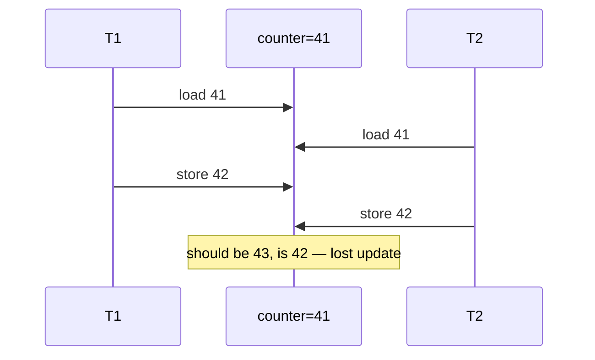

# Race Conditions & Critical Sections

> A **race condition** is when the result depends on the unpredictable timing of
> concurrent accesses to shared state. A **critical section** is the code that touches
> that shared state and must run with mutual exclusion.

## Problem
When [threads share memory](../processes-scheduling/threads.md) (or processes share
[memory/IPC](../processes-scheduling/ipc.md)), operations that *look* atomic in source
code aren't atomic on the CPU. A simple `counter++` is three steps — load, add, store —
and a [context switch](../processes-scheduling/context-switching.md) can land between them.
Two threads interleaving those steps lose updates, corrupt data structures, or crash —
and it happens **nondeterministically**, so the bug hides until production.

## Core concepts

**The anatomy of a race.** `counter++` compiles to:

```
load  r1 ← counter      # both threads read 41
add   r1 ← r1 + 1       # both compute 42
store counter ← r1      # both write 42  → one increment LOST
```

If the scheduler interleaves two threads between the load and store, an update vanishes.
The final value depends on timing — a race.



**Critical section.** The region of code accessing shared state. The fix is to enforce
**mutual exclusion**: at most one thread inside the critical section at a time, via a
[lock/mutex/semaphore](./locks-semaphores.md).

**Four properties a correct solution needs:**
1. **Mutual exclusion** — only one thread in the critical section.
2. **Progress** — if no one's inside, a waiter gets in (no needless blocking).
3. **Bounded waiting** — no starvation; everyone eventually enters.
4. **Performance** — low overhead in the common, uncontended case.

**Atomicity, ordering, visibility.** Three things go wrong concurrently: operations aren't
**atomic** (interrupted mid-way); the CPU/compiler **reorder** instructions; and a write
by one core may not be **visible** to another without a memory barrier. Memory models and
`atomic` types address ordering/visibility; locks address atomicity of regions.

**TOCTOU** — a time-of-check-to-time-of-use race is the security-relevant cousin: check a
file's permissions, then use it — an attacker swaps the file in between. Common in
filesystem and privilege code.

## Example
A check-then-act race (lost in a bank transfer):

```c
// THREAD-UNSAFE: two withdrawals can both pass the check
if (balance >= amount) {     // check
    balance -= amount;       // act  — another thread may have withdrawn between these
}
// Both threads see balance=100, both withdraw 100 → balance = -100.
// Fix: hold a lock around the check AND the act (make it one critical section).
```

The race only appears under the right timing — it may pass tests a thousand times, then
corrupt data once under load.

## Common tools
| Tool | What it is | Use it for |
| --- | --- | --- |
| **ThreadSanitizer** (`-fsanitize=thread`) | Runtime race detector | catching data races during tests |
| **Helgrind / DRD** (Valgrind) | Race & lock-order checkers | finding races and deadlock risk |
| `std::atomic` / `stdatomic.h` | Atomic types | lock-free counters, flags with defined ordering |
| **Go `-race`** | Built-in race detector | instrumented test runs |

## Trade-offs
- ✅ Recognizing critical sections lets you make concurrent code correct.
- ⚠️ Locking the critical section adds overhead and risks
  [deadlock](./deadlock.md)/contention; lock too much and you serialize everything
  (losing parallelism); lock too little and you race.
- ⚠️ Races are **nondeterministic** — they pass tests and fail in production; reproduction
  is hard without sanitizers.

## Real-world examples
- **Therac-25 (1980s)** — a race in radiation-therapy software contributed to lethal
  overdoses; a textbook safety-critical concurrency failure.
- **`counter++` in metrics code** — a perennial source of slightly-wrong counters; fixed
  with atomics.
- **TOCTOU in setuid programs** — classic local privilege-escalation vector.

## References
- OSTEP — "Concurrency: An Introduction," "Locks"
- [ThreadSanitizer](https://github.com/google/sanitizers/wiki/ThreadSanitizerCppManual)
