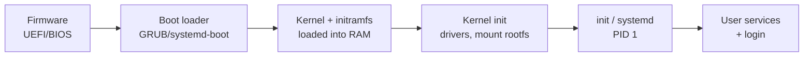

# The Boot Process

> How a computer goes from powered-off silicon to a running OS with a login prompt — a
> chain of ever-more-capable loaders, each bringing up enough of the machine to start
> the next stage.

## Problem
At power-on the CPU has no OS in memory, no file system, no drivers — just instructions
baked into firmware. Getting from there to a fully running kernel with user processes is
a **bootstrapping** problem ("pull yourself up by your bootstraps"): each stage must
initialize enough hardware to find and load the next, larger stage.

## Core concepts



**1. Firmware (UEFI / legacy BIOS).** Runs from ROM at a fixed address. Does
power-on self-test (POST), initializes RAM and basic devices, then finds a boot device.
UEFI reads a partition (the EFI System Partition) and runs a boot loader file; legacy
BIOS loads the 512-byte **MBR** boot sector.

**2. Boot loader (GRUB, systemd-boot, U-Boot).** Knows how to read the file system,
presents a menu, loads the **kernel image** and an **initramfs** into RAM, passes a
command line, and jumps to the kernel entry point.

**3. Kernel initialization.** Decompresses itself, sets up
[virtual memory](../memory/virtual-memory.md), the
[interrupt tables](./interrupts-and-traps.md), and the scheduler; detects CPUs and
devices; loads drivers. The **initramfs** is a temporary root file system in RAM holding
just the drivers needed to mount the *real* root filesystem (e.g. the disk/RAID/LVM
driver) — solving the chicken-and-egg of "you need a driver to read the disk that holds
the driver."

**4. `init` (PID 1).** The kernel mounts the real root FS and starts the first user
process — `systemd` on most Linux, `init` classically. **Everything else is its
descendant.** It starts services (network, logging, display manager) and reaches a login
prompt. On Android it's `init` → Zygote; on macOS it's `launchd`.

## Example
Inspect your own boot chain on Linux:

```bash
systemd-analyze              # total boot time, split firmware → loader → kernel → userspace
systemd-analyze blame        # which services took longest
ls /boot                     # vmlinuz-* (kernel) + initramfs-*
cat /proc/cmdline            # the kernel command line the loader passed
dmesg | head                 # the kernel's own boot log
```

## Common tools
| Tool | What it is | Use it for |
| --- | --- | --- |
| **GRUB2** | Boot loader | menu, loading kernel + initramfs, dual-boot |
| **systemd** | init system (PID 1) | starting/ordering services, the modern default |
| **dracut** / `mkinitcpio` | initramfs builders | packaging early-boot drivers |
| `systemd-analyze` | Boot profiler | finding slow boot stages |
| **U-Boot** | Embedded boot loader | bringing up routers, dev boards, phones |

## Trade-offs
- ✅ Staged design keeps firmware tiny and lets the same kernel boot on wildly different
  hardware (the loader + initramfs adapt).
- ⚠️ More stages = more places to misconfigure (wrong root UUID, missing initramfs driver →
  "unable to mount root fs" panic).
- **Secure Boot** trades flexibility for integrity: each stage cryptographically verifies
  the next, blocking boot-level malware (bootkits) but complicating custom kernels.

## Real-world examples
- **systemd** parallelizes service startup with dependency ordering, cutting boot time.
- **Secure Boot + measured boot (TPM)** — used for full-disk-encryption attestation and
  to stop persistent firmware/bootkit malware.
- **Fast boot on phones** — Android's A/B partitions and Zygote pre-fork the app runtime.

## References
- *Linux From Scratch* — bootstrapping in detail
- [systemd bootup(7)](https://www.freedesktop.org/software/systemd/man/bootup.html)
- [UEFI specification overview](https://uefi.org/)
