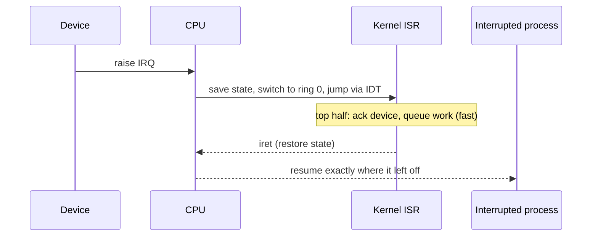

# Interrupts, Traps & Exceptions

> The mechanisms by which control transfers into the kernel asynchronously
> (**interrupts** from hardware) or synchronously (**traps/exceptions** from the running
> instruction). They're how the OS regains the CPU and reacts to events.

## Problem
The kernel isn't a daemon polling in a loop — once it hands the CPU to a user program,
how does it ever get control back? And how does it respond the instant a key is pressed,
a packet arrives, a timer fires, or an instruction faults? The answer is a
hardware-driven jump into kernel code: the interrupt/trap mechanism.

## Core concepts

Three kinds of "go to the kernel now" events, often grouped as **exceptions**:

| Type | Source | Timing | Examples |
| --- | --- | --- | --- |
| **Interrupt** (IRQ) | External hardware | Asynchronous (any time) | timer tick, NIC packet, disk done, keypress |
| **Trap** | Deliberate instruction | Synchronous | [system call](./system-calls.md), `int3` breakpoint |
| **Fault/Exception** | Current instruction errs | Synchronous | [page fault](../memory/paging.md), divide-by-zero, invalid opcode |

**The Interrupt Descriptor Table (IDT)** maps each vector number to a handler. On an
event the CPU: saves minimal state, switches to ring 0 + the kernel stack, and jumps to
the registered **interrupt service routine (ISR)**.



**Top half / bottom half.** ISRs must be *fast* (interrupts may be disabled while one
runs). Linux splits the work: the **top half** does the minimum (acknowledge the device,
stash data) and schedules a **bottom half** (softirq / tasklet / workqueue) to do the
heavy lifting later with interrupts enabled.

**The timer interrupt is special** — a periodic tick (or modern *tickless* one-shot
timer) guarantees the kernel regains the CPU, enabling **preemptive**
[scheduling](../processes-scheduling/cpu-scheduling.md). Without it, a CPU-bound program
in an infinite loop would own the core forever.

**Interrupts vs polling.** Interrupts are efficient when events are rare (don't waste CPU
checking), but under a flood (e.g. millions of packets/sec) the interrupt *storm* itself
becomes the bottleneck — so high-rate drivers switch to polling (Linux **NAPI**).

## Example
A page fault is a CPU exception turned into useful work:

```
1. Process reads address 0x7ff...  →  page not present in page table
2. CPU raises #PF (page fault), traps to kernel with the faulting address in CR2
3. Kernel fault handler: is this a valid mapping?
     - lazily-allocated page  → allocate a frame, fix the page table, retry instruction
     - file-backed (mmap)     → read the page from disk, map it, retry
     - genuinely invalid      → SIGSEGV → kill process
```

The faulting instruction simply *re-runs* and now succeeds — the program never knew.

## Trade-offs
- ✅ Instant, CPU-cheap reaction to events; enables preemption and demand paging.
- ⚠️ Each interrupt costs a context save/restore and pollutes caches; **interrupt storms**
  can livelock a system → mitigated by interrupt coalescing and polling (NAPI/DPDK).
- ⚠️ ISRs run with constraints (often can't sleep), making interrupt-context code tricky.

## Real-world examples
- **Linux NAPI** — NICs switch from interrupt-per-packet to polling under high load.
- **Tickless kernels (`NO_HZ`)** — stop the periodic timer on idle cores to save power.
- **MSI-X** — modern PCIe devices deliver many interrupt vectors so each queue/CPU can
  be serviced independently (key for multi-queue NICs and NVMe).

## References
- OSTEP — "Interrupts," "Mechanism: Limited Direct Execution"
- [Linux interrupt handling](https://www.kernel.org/doc/html/latest/core-api/genericirq.html)
- *Understanding the Linux Kernel* — Bovet & Cesati
