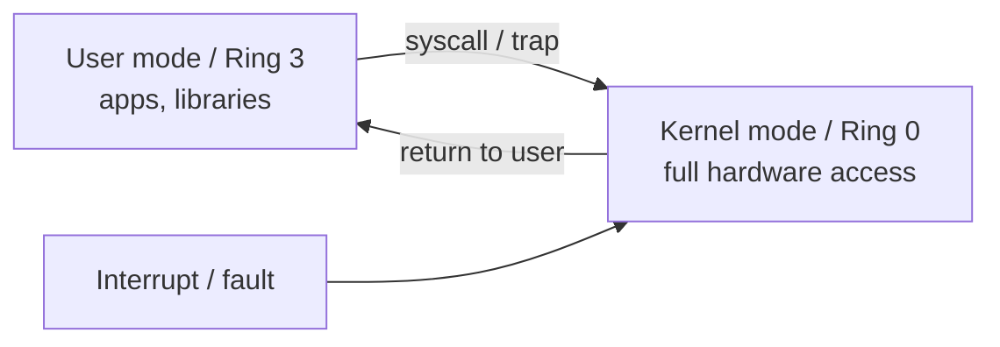

# Kernel vs User Space & Privilege Rings

> The CPU runs in two privilege levels: the trusted **kernel** can touch hardware and
> all memory; untrusted **user** programs cannot, and must ask the kernel for anything
> privileged. This hardware-enforced boundary is the foundation of OS protection.

## Problem
If any program could execute privileged instructions — reprogram the MMU, talk to the
disk controller, disable interrupts, read another process's RAM — a single bug or
malicious app could take down the machine or steal everyone's data. We need a boundary
the hardware itself enforces, not one that depends on programs behaving.

## Core concepts

**Privilege rings.** x86 CPUs have rings 0–3; in practice OSes use just two:
- **Ring 0 — kernel mode (supervisor):** can run any instruction, access any memory,
  control devices and the MMU.
- **Ring 3 — user mode:** restricted. Privileged instructions *trap* (fault) instead of
  executing. Memory access is limited to the process's own mapped pages.

A status bit in the CPU records the current mode. The MMU marks kernel pages as
"supervisor only" so user code can't even read them.



**Crossing the boundary** happens only through controlled gates:
- **System calls** — a deliberate request from user code (see [system calls](./system-calls.md)).
- **Interrupts** — hardware needs attention.
- **Exceptions/traps** — the program faulted (page fault, divide-by-zero) — see
  [interrupts & traps](./interrupts-and-traps.md).

On entry the CPU switches to ring 0, saves the user state, and jumps to a fixed,
kernel-defined handler — user code never chooses *where* in the kernel to jump.

**Why two stacks:** each thread has a user stack and a separate kernel stack, so kernel
work can't be corrupted by (or leak into) user data.

## Example
A user program tries `cli` (disable interrupts), a ring-0-only instruction:

```
user code:  cli            ; attempt to disable interrupts
CPU:        privileged op in ring 3  →  #GP general-protection fault
kernel:     trap handler runs → delivers SIGSEGV → process killed
```

The same protection stops a process from reading kernel memory or another process's
pages: the MMU raises a [page fault](../memory/paging.md) and the kernel kills it.

## Trade-offs
- ✅ Hardware-enforced isolation: a crashing app can't take the kernel down with it.
- ⚠️ Every crossing (syscall, interrupt) costs hundreds of cycles — mode switch, register
  save/restore, cache/TLB effects. Hot paths batch syscalls or use `io_uring`/`vDSO` to avoid them.
- ⚠️ Monolithic kernels put *lots* of code in ring 0, so a driver bug is a kernel bug —
  the motivation for [microkernels](./what-is-an-os.md).

## Real-world examples
- **vDSO** — Linux maps a few "syscalls" (like `gettimeofday`) into user space so common
  calls skip the kernel crossing entirely.
- **Meltdown/Spectre (2018)** — CPU bugs that let user code read kernel memory across the
  ring boundary; the fix (KPTI) fully separates kernel and user page tables, adding syscall cost.
- **WebAssembly / eBPF** — software sandboxes that add *another* isolation layer inside user space.

## References
- OSTEP — "Limited Direct Execution"
- Intel SDM Vol. 3 — protection rings
- [Meltdown & Spectre](https://meltdownattack.com/)
