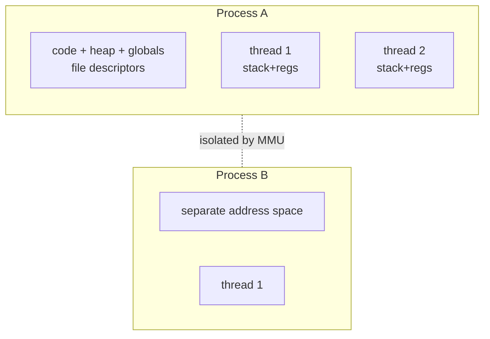

# Process vs Thread

> A **process** is a running program with its own private address space and resources;
> a **thread** is a unit of execution *within* a process. Threads in one process share
> memory; processes don't.

## Problem
We need two different kinds of "running thing." Sometimes we want strong **isolation** —
a crash or compromise in one shouldn't touch the other (browser tabs, separate services).
Sometimes we want cheap **cooperation** — many flows of control sharing data with minimal
overhead (a web server handling many requests over one heap). Processes give the first;
threads give the second.

## Core concepts

**A process owns:** a private virtual [address space](../memory/virtual-memory.md)
(code, heap, stack), open file descriptors, a PID, credentials, and at least one thread.
The kernel tracks it in a [PCB / `task_struct`](../processes-scheduling/process-lifecycle.md).

**A thread owns:** just a stack, registers, a program counter, and scheduling state.
All threads in a process **share** the heap, globals, code, and file descriptors.



**Sharing is the whole difference.** Two threads can pass data by writing a shared
variable — fast, but it's why you need [locks and synchronization](../concurrency/locks-semaphores.md)
and risk [race conditions](../concurrency/race-conditions.md). Two processes must use
explicit [IPC](../processes-scheduling/ipc.md) (pipes, sockets, shared memory) — slower
but isolated.

**On Linux they're the same primitive.** `fork()` creates a process (new address space,
copy-on-write); `pthread_create` creates a thread. Both are `clone()` under the hood —
the flags decide *what gets shared* (address space, FD table, signal handlers). A thread
is just a `clone()` that shares almost everything.

| | Process | Thread |
| --- | --- | --- |
| Address space | Private | Shared with siblings |
| Creation cost | Higher (new page tables, COW) | Lower |
| Communication | IPC (pipe, socket, shm) | Shared memory directly |
| Crash blast radius | Isolated — one dies, others live | Whole process dies |
| Context switch | Costlier (TLB/page-table flush) | Cheaper (same address space) |

## Example
The classic `fork()` surprise — parent and child have **separate** memory:

```c
int x = 0;
if (fork() == 0) { x = 42; printf("child x=%d\n", x); }   // child: 42
else { wait(NULL); printf("parent x=%d\n", x); }          // parent: 0  (COW copy)
```

With threads, `x` would be shared and both would see 42 (and you'd have a data race).
`fork` returns **twice** — 0 in the child, the child's PID in the parent.

## Trade-offs
- ✅ Processes: strong fault & security isolation; one crash/exploit is contained.
- ✅ Threads: cheap creation and communication, shared caches, ideal for parallelism on
  shared data.
- ⚠️ Threads: a single bad pointer or unsynchronized write corrupts the whole process;
  debugging races is hard.
- ⚠️ Processes: IPC and context-switch overhead; duplicated memory (mitigated by COW).

## Real-world examples
- **Chrome / Firefox** — process *per site* for security & crash isolation; threads within
  each for rendering, compositing, networking.
- **Nginx / PostgreSQL** — process-based worker models for robustness.
- **JVM apps, Go runtime** — heavily threaded (Go multiplexes lightweight goroutines onto
  OS threads — see [threads & concurrency models](../processes-scheduling/threads.md)).

## References
- OSTEP — "Processes," "The Abstraction: The Process," "Threads"
- `man 2 fork`, `man 2 clone`, `man 7 pthreads`
