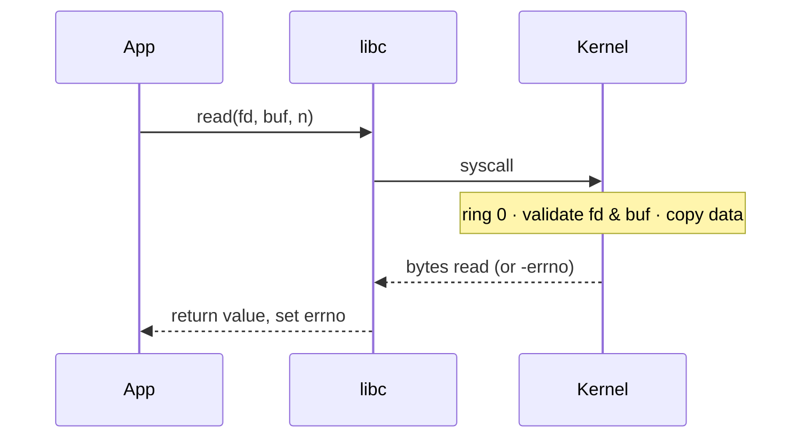

# System Calls — the OS API

> A system call is the controlled mechanism by which a user program asks the kernel to
> do something privileged on its behalf — open a file, send a packet, create a process.
> It's the only doorway from user space into the kernel.

## Problem
User code can't touch hardware ([it runs in ring 3](./kernel-user-space.md)), but it
constantly needs privileged things done: read a file, allocate memory, fork a process.
It needs a way to *call into* the kernel that is safe (the kernel picks the entry point
and validates everything) and well-defined (a stable contract programs can rely on).

## Core concepts

**The mechanism.** The program puts a **syscall number** and arguments in registers,
then executes a special instruction (`syscall` on x86-64, `svc` on ARM) that traps into
ring 0 at a fixed kernel entry point. The kernel reads the number, dispatches to the
handler via a **syscall table**, validates arguments, does the work, and returns a
result in a register. A negative value typically means an error (`errno`).



**You rarely call syscalls directly** — the C library (`libc`) wraps each one in a
function (`read()`, `open()`, `fork()`). `libc` also adds buffering: `printf` doesn't
syscall per character; it fills a user-space buffer and issues one `write()`.

**Categories of syscalls:**
| Category | Examples |
| --- | --- |
| Process control | `fork`, `execve`, `exit`, `wait`, `clone` |
| File / I/O | `open`, `read`, `write`, `close`, `lseek`, `stat` |
| Memory | `mmap`, `munmap`, `brk` |
| Communication | `pipe`, `socket`, `send`, `recv`, `shmget` |
| Signals & info | `kill`, `sigaction`, `getpid`, `gettimeofday` |

**The user/kernel copy.** Pointers from user space (like `buf`) can't be trusted, so the
kernel uses `copy_from_user`/`copy_to_user` which validate the address range — a key
defense against tricking the kernel into reading/writing arbitrary memory.

## Example
A bare `write` syscall on x86-64 Linux, no libc:

```asm
mov rax, 1          ; syscall number for write
mov rdi, 1          ; fd = 1 (stdout)
mov rsi, msg        ; buffer pointer
mov rdx, 13         ; length
syscall             ; trap into the kernel
```

In C, that's just `write(1, "hello, world\n", 13);`. Watch the real calls a program
makes with `strace ./a.out` — see the [strace lab](../../3-practice/project-strace-syscalls.md).

## Common tools
| Tool | What it is | Use it for |
| --- | --- | --- |
| `strace` / `dtruss` | Syscall tracer | seeing every syscall a process makes, with args & return |
| `ltrace` | Library-call tracer | the libc layer above syscalls |
| `man 2 <name>` | Syscall manuals | the authoritative contract (`man 2 read`) |
| `vDSO` | Kernel-mapped user page | running `gettimeofday`/`clock_gettime` without a real trap |
| `io_uring` | Async syscall ring | batching thousands of I/Os with few kernel crossings |

## Trade-offs
- ✅ Safe, stable contract: the kernel validates every request and chooses the entry point.
- ⚠️ Each call costs a mode switch (hundreds of cycles) plus cache/TLB disturbance —
  syscall-heavy workloads are throttled by this, which is why `io_uring` and batching exist.
- The syscall ABI is a near-permanent promise: Linux famously "never breaks user space."

## Real-world examples
- **Linux** has ~350 syscalls; the numbers are frozen forever for ABI stability.
- **`io_uring`** lets a database submit and reap thousands of reads/writes via shared
  ring buffers, slashing per-op syscall overhead.
- **seccomp-bpf** filters which syscalls a process may make — the sandbox behind Docker,
  Chrome, and systemd hardening.

## References
- OSTEP — "Limited Direct Execution"
- `man 2 syscalls`, [Linux syscall table](https://filippo.io/linux-syscall-table/)
- [Lord of the io_uring](https://unixism.net/loti/)
