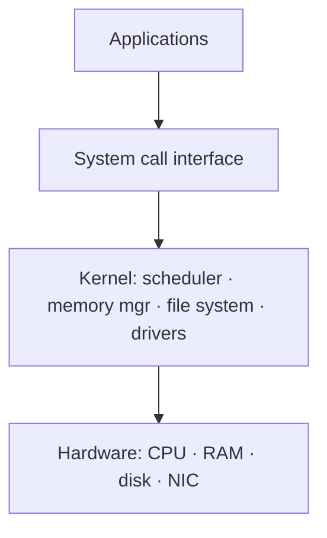

# What Is an Operating System

> The operating system is the software layer between hardware and applications: it
> manages resources and provides clean, safe abstractions so programs don't have to
> talk to raw hardware.

## Problem
Raw hardware is hostile: one CPU but many programs that want it, finite RAM that
programs would happily corrupt, dozens of incompatible disk and network controllers.
Without an OS, every program would have to drive the hardware directly, trust every
other program not to scribble on its memory, and be rewritten for every machine. The
OS exists to **multiplex** hardware among programs, **isolate** them from each other,
and **abstract** the messy details behind uniform interfaces.

## Core concepts

The OS plays three roles:

- **Referee (resource manager)** — decides who gets the CPU, how RAM is divided, who
  may touch which file or device. It arbitrates contention and enforces limits.
- **Illusionist (abstraction)** — turns one CPU into "a CPU per process" (scheduling),
  finite RAM into "a huge private address space per process" (virtual memory), and a
  spinning disk into "named files in folders" (the file system).
- **Glue (portability)** — hides device differences behind a stable API so the same
  program runs on different hardware.

**The kernel** is the always-resident core that runs in privileged mode (see
[kernel vs user space](./kernel-user-space.md)). Everything else — shells, compilers,
your apps — runs in user mode and asks the kernel for help via
[system calls](./system-calls.md).

**The four classic subsystems:** process/CPU management
([scheduling](../processes-scheduling/cpu-scheduling.md)),
[memory management](../memory/virtual-memory.md),
[file systems & storage](../storage-fs/file-systems.md), and
[I/O / device drivers](../storage-fs/io-systems.md).

## Example
When you run `./a.out`, the shell calls `fork()` then `execve()` (system calls). The
kernel: allocates a [process](./process-vs-thread.md) and a private virtual
[address space](../memory/virtual-memory.md), loads the binary, puts the process on
the [scheduler's](../processes-scheduling/cpu-scheduling.md) run queue, and returns to
user mode. Every `printf` becomes a `write()` syscall; every memory access goes through
[paging](../memory/paging.md). You never touched the hardware — the OS did, on your behalf.

## Kernel architectures
| Design | Idea | Examples |
| --- | --- | --- |
| **Monolithic** | All services (FS, drivers, net) run in one kernel address space — fast, but a bug anywhere can crash the system | Linux, BSD |
| **Microkernel** | Kernel does only IPC + scheduling + basic memory; FS/drivers run as user processes — safer, more IPC overhead | seL4, QNX, MINIX 3 |
| **Hybrid** | Monolithic core with some modularity | Windows NT, macOS (XNU) |
| **Unikernel** | App + minimal OS compiled into one image, no user/kernel split | MirageOS |

## Trade-offs
- ✅ Programs are portable, isolated, and freed from hardware details.
- ⚠️ Every abstraction costs cycles (syscalls, context switches, copies) — high-performance
  code sometimes bypasses the OS (kernel-bypass networking like DPDK, `io_uring`).
- Monolithic = fast but fragile; microkernel = robust but chattier.

## Real-world examples
- **Linux** — monolithic, runs everything from watches to supercomputers; the kernel
  is one program, drivers loaded as modules.
- **Windows NT / macOS XNU** — hybrid kernels powering most desktops.
- **seL4** — a formally *verified* microkernel used in safety-critical systems.

## References
- *Operating Systems: Three Easy Pieces* (OSTEP) — Arpaci-Dusseau (free online)
- Tanenbaum, *Modern Operating Systems*
- [The Linux Kernel documentation](https://www.kernel.org/doc/html/latest/)
