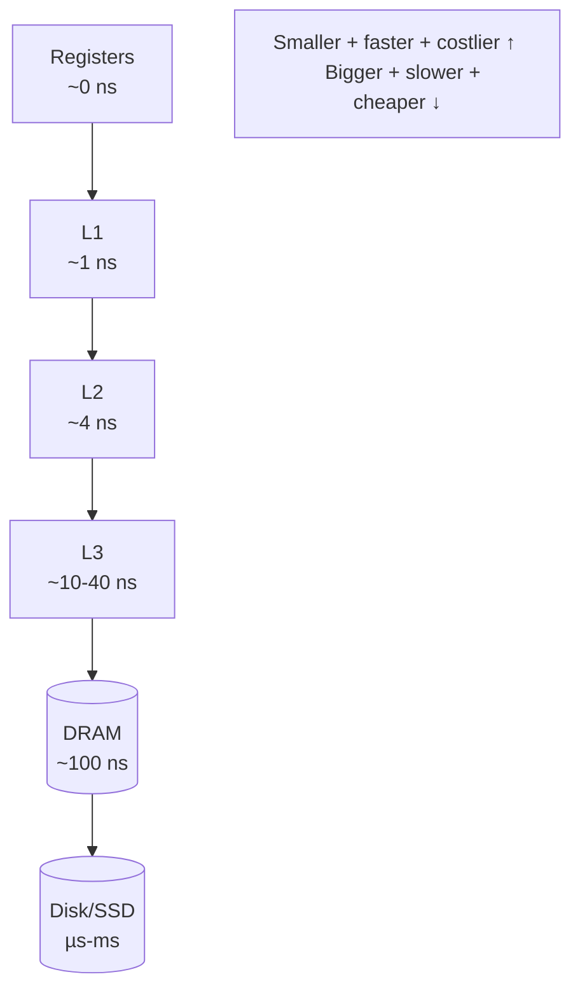

# The Memory Hierarchy & Caching

> The CPU is hundreds of times faster than RAM, so hardware stacks small, fast caches
> (L1/L2/L3) between them. Programs run fast only when their access pattern has **locality**.
> This is the "why" beneath array-vs-list performance, the [TLB](./paging.md), and the
> [page cache](./virtual-memory.md) — they're all the same trick at different levels.

## Problem
A CPU core executes an instruction in a fraction of a nanosecond, but reaching main memory
takes ~100 ns — *hundreds of wasted cycles* per access. No single memory is simultaneously
big, fast, **and** cheap: SRAM is fast but tiny and expensive; DRAM is large but slow; disk is
huge but glacial. If the CPU stalled on RAM for every load, it would run at a small fraction of
its rated speed. The fix is a **hierarchy** — a few tiny fast levels caching the slow big ones —
and it only works because real programs don't access memory randomly.

## Core concepts

**The hierarchy.** Each level caches the one below it; you trade size for speed as you climb.
Approximate latencies (the famous "numbers every programmer should know"):

| Level | Typical latency | Size |
| --- | --- | --- |
| Register | ~0 (in-core) | a few hundred bytes |
| L1 cache | ~1 ns (~4 cycles) | tens of KB |
| L2 cache | ~4 ns | hundreds of KB – few MB |
| L3 cache | ~10–40 ns | many MB, shared across cores |
| Main memory (DRAM) | ~100 ns | GBs |
| SSD | ~100 µs | TBs |
| Spinning disk | ~10 ms | TBs |

L1 → DRAM is a ~100× cliff; DRAM → disk is another ~10,000×. Performance is largely *which
level your data lives in*.



**Cache lines — memory moves in blocks, not bytes.** When you read one byte, the hardware
pulls the whole surrounding **cache line** (almost universally **64 bytes**) into cache. So the
*second* byte of that line is essentially free, but the first byte of a *different* line costs a
full miss. This single fact is why access *pattern* dominates performance.

**Locality of reference — the bet caches make.**
- **Temporal locality**: data used now is likely used again soon → keep it cached (a loop
  variable, a hot lookup table).
- **Spatial locality**: data *near* what you just used is likely used soon → prefetch the whole
  line (walking an array element by element).

A **cache hit** is served fast; a **miss** stalls the core while the next level is fetched. High
**hit ratio** = fast program, and you raise it by writing code with locality.

**Why arrays beat linked lists (the canonical payoff).** An [array](../../../algorithms-data-structures/1-knowledge/data-structures/arrays-and-strings.md)
is contiguous: walking it touches consecutive cache lines, the prefetcher sees the pattern, and
misses are rare. A [linked list](../../../algorithms-data-structures/1-knowledge/data-structures/linked-lists-stacks-queues.md)'s
nodes are scattered across the heap, so each hop risks a fresh cache miss. Same Big-O (O(n) to
traverse), wildly different real speed — Big-O counts operations; the hierarchy counts *misses*.

**It's the same idea all the way up.** Caching isn't one feature — it's *the* pattern of the
machine: the [TLB](./paging.md) caches page-table translations, the [page cache](./virtual-memory.md)
caches disk blocks in RAM, CPUs cache RAM, and CDNs cache origins. Learn it once here.

**False sharing — caching's concurrency trap.** Cache coherency works per *line*, so if two
cores write two *different* variables that happen to sit on the same 64-byte line, the line
ping-pongs between their caches and both stall — a hidden [scalability](../concurrency/race-conditions.md)
killer fixed by padding the variables apart.

## Essential terminology
| Term | Meaning |
| --- | --- |
| **Cache line** | The fixed block (≈64 B) moved between memory levels as a unit |
| **Cache hit / miss** | Data found in this level / must be fetched from a slower one |
| **Temporal locality** | Recently used data is likely reused soon |
| **Spatial locality** | Data near recently used data is likely used soon |
| **Prefetching** | Hardware guessing the next lines and loading them early |
| **False sharing** | Two cores contending on one line via *different* variables |

## Example
Your machine's real hierarchy — read it straight from the kernel (this box, an aarch64 server):

```bash
$ lscpu | grep -i cache
L1d cache:    128 KiB (2 instances)
L1i cache:    128 KiB (2 instances)
L2 cache:     2 MiB (2 instances)
L3 cache:     32 MiB (1 instance)        # shared across cores

$ cat /sys/devices/system/cpu/cpu0/cache/index0/{type,size,coherency_line_size}
Data
64K
64                                       # ← the 64-byte cache line, confirmed
```
The takeaway: a working set under ~64 KB stays in L1 (blazing); under 32 MB stays in L3 (fast);
spill past L3 and every access pays the ~100 ns DRAM tax. *Blocking* algorithms (tiling a matrix
to fit a level) exist entirely to keep the working set inside a cache.

## Common tools
| Tool | What it is | Use it for |
| --- | --- | --- |
| `lscpu`, `/sys/.../cache/` | Cache topology | sizes + line size on this machine |
| `perf stat -e cache-misses,cache-references` | CPU counters | measuring real miss rate of a program |
| `valgrind --tool=cachegrind` | Cache simulator | per-line miss attribution without hardware counters |
| `perf c2c` | Cache-to-cache analysis | hunting false sharing |

## Trade-offs
- ✅ Caching gives near-SRAM speed at near-DRAM cost *for code with locality* — automatic and
  invisible when you cooperate with it.
- ⚠️ It's invisible when you *don't*: identical Big-O code can run 10×+ apart purely on access
  pattern, and the cause doesn't show up in the source.
- ⚠️ Coherency across cores costs traffic; false sharing turns parallel code serial.
- Rule of thumb: prefer **contiguous, sequentially-scanned** data; keep hot working sets small;
  in parallel code, don't let two cores share a line.

## Real-world examples
- **Column-store databases** (ClickHouse, Parquet) lay data out by column so a scan touches only
  the needed bytes — pure spatial-locality engineering.
- **Struct-of-arrays** layouts in game/ECS engines and **cache-oblivious / blocked** algorithms
  (matrix multiply, B-trees sized to a line) are designed around exactly these numbers.

## References
- OSTEP — caching appears throughout ("Paging: Faster Translations (TLBs)")
- Ulrich Drepper — *What Every Programmer Should Know About Memory*
- [Paging & the TLB](./paging.md) · [Virtual memory & the page cache](./virtual-memory.md) · [Arrays](../../../algorithms-data-structures/1-knowledge/data-structures/arrays-and-strings.md) vs [linked lists](../../../algorithms-data-structures/1-knowledge/data-structures/linked-lists-stacks-queues.md)
