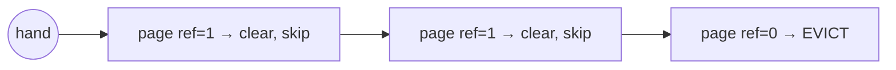

# Page Replacement Algorithms

> When physical memory is full and a new page is needed, the OS must **evict** a resident
> page. The replacement policy decides which one — and a good choice (evict what won't be
> used soon) is the difference between fast and thrashing.

## Problem
[Demand paging](./virtual-memory.md) lets the system promise more memory than RAM holds.
When a [page fault](./paging.md) needs a frame and none are free, some resident page must
go. Evict a page that's about to be used and you'll fault it right back in — wasted disk
I/O. Since the OS can't see the future, it *approximates* "the page we won't need soonest."

## Core concepts

**The goal:** minimize page faults (especially **major** faults that hit disk — orders of
magnitude slower than RAM). Policies:

| Policy | Evict… | Notes |
| --- | --- | --- |
| **OPT (Belady)** | The page used **furthest in the future** | Provably optimal, but needs the future — a *benchmark*, not implementable |
| **FIFO** | The oldest-loaded page | Simple; ignores usage; suffers **Belady's anomaly** |
| **LRU** | The **least recently used** page | Great (locality) but exact LRU needs per-access bookkeeping — too costly |
| **Clock (second-chance)** | Approximates LRU with a reference bit | The practical default |
| **LFU** | Least *frequently* used | Good for stable hot sets; slow to adapt |

**Locality** is why this works: programs reuse recently-touched pages (temporal) and nearby
ones (spatial), so "recently used" predicts "soon used." LRU exploits this; the trick is
approximating it cheaply.

**Clock algorithm** (the real-world LRU approximation): keep frames in a circle with a
hand. Each page has a hardware **reference bit** set on access. To evict, the hand advances:
if ref bit = 1, clear it and give a "second chance"; if 0, evict. Cheap (one bit) and close
to LRU.



**Belady's anomaly:** with **FIFO**, giving a process *more* frames can *increase* faults —
deeply counterintuitive. LRU and other "stack algorithms" never suffer it. A great thing to
witness in the [simulator lab](../../3-practice/project-page-replacement-sim.md).

**Working set & thrashing.** A process's **working set** is the set of pages it's actively
using. If RAM can't hold the working sets of all running processes, the system spends all
its time paging in/out — **thrashing**, where throughput collapses. The fix: give processes
enough frames, or reduce the degree of multiprogramming (or kill something — the OOM killer).

**Dirty vs clean.** Evicting a **clean** page (unchanged, also on disk) is free — just drop
it. A **dirty** page must be written out first. Policies and the page-out daemon (Linux
`kswapd`) prefer evicting clean pages and write dirty ones back proactively.

## Example
Reference string `1 2 3 4 1 2 5 1 2 3 4 5`, **3 frames** — FIFO vs LRU vs OPT faults:

```
FIFO: 9 faults   (and adding a 4th frame gives 10 — Belady's anomaly!)
LRU:  10 faults
OPT:  7  faults  (the unbeatable lower bound)
```

The exact numbers depend on the string, but the lesson holds: OPT ≤ LRU, and FIFO can
misbehave. The [simulator](../../3-practice/project-page-replacement-sim.md) lets you try
your own strings.

## Common tools
| Tool | What it is | Use it for |
| --- | --- | --- |
| `vmstat 1` | Paging stats | `si`/`so` (swap in/out) — nonzero = paging/thrashing |
| `sar -B` | Paging activity | fault & page-steal rates over time |
| `/proc/<pid>/smaps` | Per-region detail | resident vs swapped pages |
| `cgroup memory.high/max` | Reclaim pressure | bounding a group, forcing reclaim |
| `swapon --show`, `free` | Swap state | how much swap is in use |

## Trade-offs
- ✅ Lets RAM be over-committed gracefully; good policies keep hot pages resident.
- ⚠️ Any policy can be defeated by an adversarial/scanning access pattern (a big sequential
  scan evicts the hot set — "cache pollution"); mitigations exist (e.g. Linux's two-list LRU).
- ⚠️ Exact LRU is too expensive; all real systems approximate (Clock + aging).
- Under-provisioned RAM → thrashing, where *no* policy saves you.

## Real-world examples
- **Linux** uses a two-list (active/inactive) **LRU approximation** with `kswapd` reclaiming
  in the background; `vm.swappiness` tunes anonymous-vs-file eviction.
- **Database buffer pools** implement their own LRU/Clock variants (e.g. PostgreSQL's
  clock-sweep) because they know access patterns better than the OS.
- **Belady's anomaly** is reproducible in minutes in the practice simulator.

## References
- OSTEP — "Beyond Physical Memory: Policies"
- Belady (1966), the optimal algorithm & anomaly
- [Linux page reclaim](https://docs.kernel.org/admin-guide/mm/)
