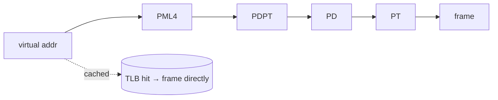

# Paging & Address Translation

> Paging divides memory into fixed-size **pages** (virtual) and **frames** (physical), and
> uses **page tables** to map one to the other. A hardware **TLB** caches translations so
> the mapping is fast.

## Problem
[Virtual memory](./virtual-memory.md) needs a flexible way to map a process's virtual
addresses onto physical RAM — without requiring large contiguous physical regions (which
cause [external fragmentation](./segmentation-fragmentation.md)) and while supporting
per-page protection. Paging is the answer: chop both spaces into uniform fixed-size blocks
so any virtual page can map to any physical frame.

## Core concepts

**Pages & frames.** A virtual address space and physical RAM are both split into
fixed-size **pages**/**frames** (typically **4 KiB**). A virtual address splits into a
**page number** + **offset**; translation replaces the page number with a frame number,
keeping the offset.

```
virtual address (4 KiB pages):  [ page number | offset (12 bits) ]
                                       │
                                 page table lookup
                                       ▼
physical address:               [ frame number | offset ]
```

**Page tables** hold the mapping plus per-page bits: **valid/present**, **R/W**, **user/
supervisor**, **dirty** (written), **accessed** (referenced). Invalid access → a
[page fault](../fundamentals/interrupts-and-traps.md).

**Multi-level page tables.** A flat table for a 64-bit space would be enormous, so tables
are a tree (x86-64 uses **4 levels**; 5 with very large memory). Only branches for
*mapped* regions exist, so a sparse address space costs little. The CPU "walks" the tree
on a miss.



**The TLB (Translation Lookaside Buffer).** Walking 4 levels on every memory access would
be ruinous, so the MMU caches recent virtual→physical translations in the TLB. A **TLB
hit** translates in ~1 cycle; a **miss** triggers a page-table walk (hardware or software)
and fills the TLB. TLB hit rate is critical to performance — this is why **locality** and
**[context switches](../processes-scheduling/context-switching.md)** (which can flush the
TLB) matter so much.

**Huge pages.** Using 2 MiB or 1 GiB pages instead of 4 KiB means each TLB entry covers
far more memory → fewer TLB misses for big workloads (databases, VMs), at the cost of
coarser granularity and possible waste.

**Protection & sharing fall out for free.** Per-page bits give fine-grained R/W/X control
(enabling **W^X** / NX no-execute defenses); mapping the same frame into two page tables
gives [shared memory](../processes-scheduling/ipc.md) and shared libraries.

## Example
Translating a virtual address with 4 KiB pages (offset = low 12 bits):

```
Virtual address  0x00003ABC
  offset      = 0xABC                (low 12 bits)
  page number = 0x3                  (rest)
Page table: page 3 → frame 9 (0x9), present, R/W
Physical address = (0x9 << 12) | 0xABC = 0x9ABC
```

Count real page faults for a program with `/usr/bin/time -v ./a.out` → "minor" (page found
in memory, just mapped) vs "major" (had to read from disk) page faults.

## Common tools
| Tool | What it is | Use it for |
| --- | --- | --- |
| `/usr/bin/time -v` | Resource stats | minor vs major page-fault counts |
| `perf stat -e dTLB-load-misses,page-faults` | HW counters | measuring TLB miss / fault rates |
| `getconf PAGE_SIZE` | Query | the system page size |
| `transparent_hugepage`, `hugetlbfs` | Huge-page controls | reducing TLB pressure for big workloads |
| `/proc/<pid>/pagemap`, `smem` | Page inspection | which pages are resident/dirty |

## Trade-offs
- ✅ No external fragmentation, fine-grained protection & sharing, demand paging, sparse
  address spaces handled cheaply.
- ⚠️ **Internal fragmentation** (a 1-byte allocation still uses a whole page) and
  page-table memory overhead.
- ⚠️ Translation cost: a TLB miss + multi-level walk is expensive; poor locality tanks
  performance.
- Page size is a trade-off: small = less waste, more TLB misses; huge = fewer misses, more waste.

## Real-world examples
- **x86-64** 4-level page tables, 4 KiB / 2 MiB / 1 GiB pages; PCID-tagged TLBs avoid full
  flushes on [context switch](../processes-scheduling/context-switching.md).
- **Databases & JVMs** enable huge pages to cut TLB misses on large heaps.
- **Meltdown mitigation (KPTI)** separates kernel/user page tables, adding TLB cost — see
  [kernel vs user space](../fundamentals/kernel-user-space.md).

## References
- OSTEP — "Paging: Introduction," "TLBs," "Advanced Page Tables"
- Intel SDM Vol. 3 — paging
