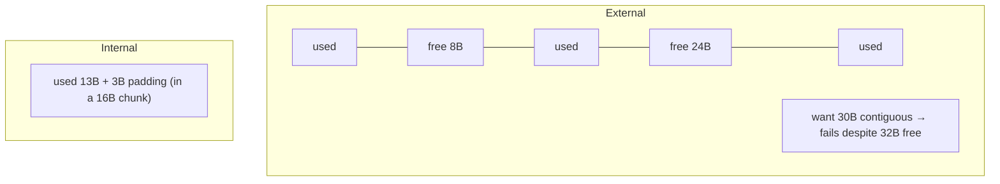

# Segmentation, Allocation & Fragmentation

> How memory gets carved up and handed out — historical **segmentation**, the **heap
> allocator** behind `malloc`, and the **fragmentation** that wastes space in both. The
> recurring enemy is space lost to the gaps between allocations.

## Problem
Programs request memory in odd, unpredictable sizes and free it in unpredictable orders.
Whatever scheme hands out memory — hardware segments, a `malloc` free list, or the kernel's
frame allocator — ends up with leftover gaps too small or too scattered to use. Managing
those gaps efficiently, with low overhead and fast allocation, is the core challenge.

## Core concepts

**Segmentation (the older model).** Divide the address space into variable-length,
logically meaningful **segments** (code, stack, heap), each with a base + limit. Natural for
protection and sharing, but variable sizes cause **external fragmentation** — free memory
exists but in pieces too small to satisfy a request. Largely superseded by
[paging](./paging.md) (fixed sizes → no external fragmentation), though x86 kept vestigial
segment registers (`fs`/`gs` are still used for thread-local storage).

**Two kinds of fragmentation:**
- **External** — free space scattered in unusable gaps between allocations (segmentation,
  heap free lists). Total free is enough, but no single hole fits.
- **Internal** — space wasted *inside* an allocation because it's rounded up to a fixed
  unit (a 1-byte request rounded to a 16-byte chunk or a 4 KiB [page](./paging.md)).



**The heap allocator (`malloc`/`free`).** Lives in user space; gets big chunks from the
kernel via `brk`/`sbrk` (extend the heap) or `mmap` (for large allocations), then sub-divides
them. It tracks free blocks in a **free list**. Two key operations:
- **Splitting** — carve a big free block to satisfy a smaller request.
- **Coalescing** — merge adjacent free blocks back together on `free` to fight external
  fragmentation.

**Placement policies** for choosing which free block:
| Policy | Picks | Trade-off |
| --- | --- | --- |
| **First fit** | First block that fits | Fast; fragments the front |
| **Best fit** | Smallest block that fits | Less waste; slow, leaves tiny slivers |
| **Worst fit** | Largest block | Keeps big blocks usable; generally poor |
| **Segregated / slab** | Per-size free lists | Fast, low fragmentation; the modern approach |

**Modern allocators** (tcmalloc, jemalloc, glibc's ptmalloc) use **size classes** and
**per-thread arenas** so threads don't contend on one lock, plus **slab allocation**
(pools of fixed-size objects) — the same idea the *kernel* uses (`kmalloc`/slab) for its own
objects. Build a small one in the [allocator lab](../../3-practice/project-allocator.md).

## Example
Why coalescing matters — without it, fragmentation kills you:

```c
char *a = malloc(16); char *b = malloc(16); char *c = malloc(16);
free(a); free(c);          // two 16B holes, but not adjacent to each other
char *big = malloc(32);    // FAILS to reuse — holes aren't contiguous → grows heap
free(b);                   // now a,b,c all free & adjacent → coalesce into 48B
                           // next malloc(32) succeeds from the merged block
```

## Common tools
| Tool | What it is | Use it for |
| --- | --- | --- |
| `valgrind` / `massif` | Leak & heap profiler | leaks, fragmentation, peak usage |
| **jemalloc / tcmalloc** | Drop-in allocators | lower fragmentation, better multithread scaling |
| `malloc_stats()`, `mallinfo2` | glibc introspection | arena/fragmentation stats |
| `MALLOC_ARENA_MAX` | glibc tuning | controlling per-thread arenas |
| `/proc/buddyinfo`, `slabtop` | Kernel allocators | physical (buddy) & slab fragmentation |

## Trade-offs
- ✅ Paging eliminates *external* fragmentation; slab/segregated allocators keep heap
  fragmentation and allocation cost low.
- ⚠️ Internal fragmentation is the price of fixed sizes (rounding); external is the price of
  variable sizes — you trade one for the other.
- ⚠️ Coalescing and best-fit reduce fragmentation but cost time; allocator design is a
  speed-vs-space balance.
- Long-running servers can suffer **fragmentation creep** — RSS grows even without leaks;
  jemalloc/tcmalloc help.

## Real-world examples
- **glibc ptmalloc / jemalloc / tcmalloc** — production allocators with per-thread arenas
  and size classes; FB/Google switch to jemalloc/tcmalloc for big multithreaded services.
- **The Linux buddy allocator + slab/SLUB** — physical-frame allocation and kernel object
  caches, the kernel's own fragmentation strategy.
- **Memory compaction** — the kernel migrates pages to assemble contiguous regions for
  [huge pages](./paging.md).

## References
- OSTEP — "Free-Space Management"
- [jemalloc design](https://jemalloc.net/), Bonwick's slab allocator paper
- `man 3 malloc`, `man 2 brk`
