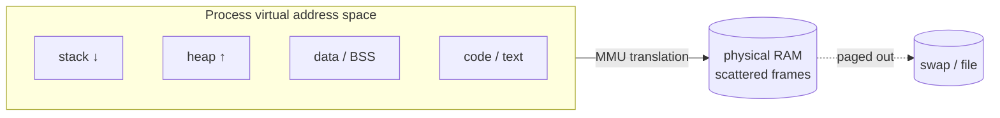

# Virtual Memory & Address Spaces

> Virtual memory gives every process the illusion of a large, private, contiguous address
> space, while the OS + hardware (MMU) transparently map it onto scarce physical RAM and
> disk. It's the foundation of isolation and efficient memory use.

## Problem
Physical RAM is finite, shared, and full of holes; programs want lots of contiguous memory
and must not be able to read or corrupt each other's. Without virtual memory, programs
would use raw physical addresses — they'd have to know how much RAM exists, avoid
overlapping each other, and could trivially scribble on the kernel or other apps. Virtual
memory solves all three: abstraction (each process sees a clean space), isolation
(processes can't name each other's memory), and over-commit (use more "memory" than RAM).

## Core concepts

**Virtual vs physical addresses.** Every address a program uses is *virtual*. The **MMU**
translates it to a *physical* address on every access, using per-process page tables (see
[paging](./paging.md)). Two processes can both use address `0x400000` — they map to
different physical frames.



**The address-space layout** (per process): **text** (code, read-only), **data/BSS**
(globals), the **heap** (grows up, `malloc`/`brk`/`mmap`), memory-mapped regions, and the
**stack** (grows down). The gap between heap and stack is unmapped — touching it faults.

**Demand paging.** Pages aren't loaded until first touched. Accessing an unmapped-but-valid
page triggers a [page fault](../fundamentals/interrupts-and-traps.md); the kernel allocates
a frame (or reads it from disk), fixes the page table, and resumes. So a program "using"
1 GB might have far less actually resident.

**Over-commit & swap.** Because of demand paging and copy-on-write, the OS can promise more
virtual memory than physical RAM. When RAM runs low it evicts pages to **swap**
(see [page replacement](./page-replacement.md)). Too little RAM → **thrashing**: constant
paging, throughput collapses.

**Copy-on-write (COW).** [`fork()`](../fundamentals/process-vs-thread.md) doesn't copy the
parent's memory; it marks shared pages read-only. The first *write* faults and copies just
that page. Forking a huge process is cheap until it writes.

**mmap.** Map a file (or anonymous memory) directly into the address space; reads/writes
become page faults that the kernel services from the file. Underpins shared libraries,
[shared-memory IPC](../processes-scheduling/ipc.md), and large-file access without `read()`.

## Example
See your own address space and demand paging in action:

```bash
cat /proc/self/maps          # every mapped region: text, heap, stack, libraries
/usr/bin/time -v ./a.out     # "Maximum resident set size" = pages actually in RAM (RSS)
                             # vs VSZ (virtual size) in `top` — VSZ ≫ RSS is normal
```

`ps` showing VSZ=2 GB but RSS=50 MB is virtual memory working: 2 GB *promised*, 50 MB
*resident*.

## Common tools
| Tool | What it is | Use it for |
| --- | --- | --- |
| `/proc/<pid>/maps`, `smem`, `pmap` | Address-space viewers | seeing regions & per-region RSS |
| `free`, `vmstat` | Memory/paging stats | RAM vs swap, `si`/`so` page in/out |
| `valgrind --tool=massif` | Heap profiler | where heap memory goes over time |
| `mmap` / `madvise` | Mapping syscalls | file mapping, `MADV_DONTNEED`, huge pages |
| `cgroup memory.max` | Memory limits | capping a process group, OOM control |

## Trade-offs
- ✅ Isolation, the illusion of abundant contiguous memory, lazy allocation, easy sharing
  (COW, mmap, shared libs).
- ⚠️ Translation overhead on every access (mitigated by the [TLB](./paging.md)).
- ⚠️ Over-commit can lead to the **OOM killer** when promises come due; **thrashing** when
  the working set exceeds RAM.
- More indirection = harder to reason about real memory use (VSZ vs RSS confusion).

## Real-world examples
- **`fork()` + COW** makes process creation cheap even for large processes (Redis uses it
  for snapshotting).
- **mmap'd databases** (LMDB, SQLite, RocksDB options) let the page cache manage I/O.
- **The Linux OOM killer** picks a victim when over-committed memory is actually demanded.

## References
- OSTEP — "The Abstraction: Address Spaces," "Beyond Physical Memory"
- `man 2 mmap`, `man 5 proc` (`/proc/<pid>/maps`)
