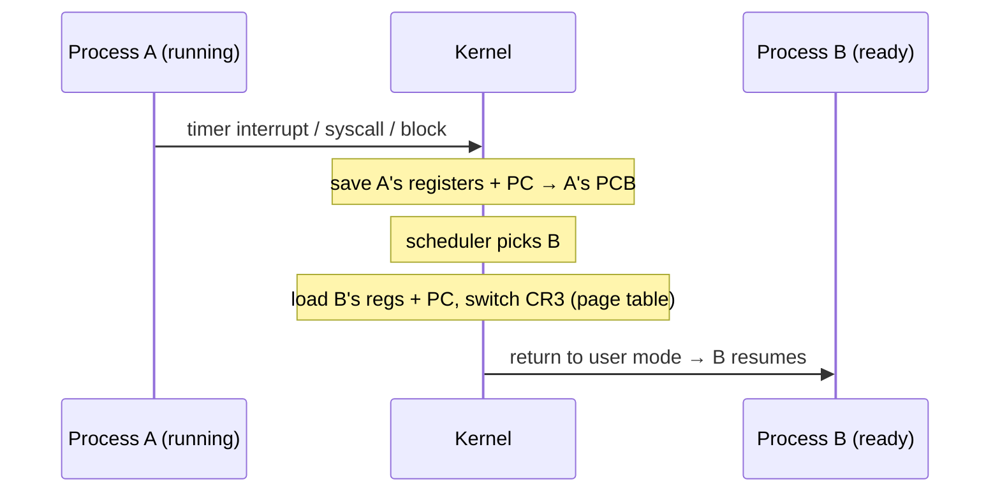

# Context Switching

> The act of saving one process/thread's CPU state and restoring another's, so a single
> CPU can be shared. It's the mechanism that turns "one core" into "many running programs."

## Problem
A CPU has one set of registers and one program counter, but the OS wants to run many
processes "at once." To pause process A and run process B without A ever noticing, the
kernel must save *everything* that defines A's execution and load B's — then later
restore A exactly. Doing this correctly is what makes
[multitasking](./cpu-scheduling.md) possible; doing it cheaply is what makes it practical.

## Core concepts

**What gets saved/restored** (into each process's [PCB](./process-lifecycle.md)):
- General-purpose registers, the **program counter**, the stack pointer, and flags.
- For a *process* switch (not just a thread): the **page-table base register** (CR3 on
  x86), which swaps the entire [virtual address space](../memory/virtual-memory.md).



**When it happens:** on a [timer interrupt](../fundamentals/interrupts-and-traps.md)
(preemption), when a process blocks on I/O or a lock, on a [syscall](../fundamentals/system-calls.md)
that sleeps, or on exit.

**Direct vs indirect cost.** The *direct* cost is the register save/restore — a few
hundred nanoseconds. The bigger, *indirect* cost is **cold caches and TLB**: process B's
data isn't in L1/L2, and switching the page table may flush the
[TLB](../memory/paging.md), so B runs slowly until they refill. This is why switching
*too often* (tiny quanta) hurts throughput even though each switch looks cheap.

**Thread switch is cheaper than process switch.** Threads in the same process share the
address space, so there's **no page-table swap and no full TLB flush** — only registers
change. (Hardware **PCIDs/ASIDs** tag TLB entries by address space so even process
switches needn't fully flush.)

**Mode switch ≠ context switch.** A syscall is a *mode* switch (user→kernel, same process)
— cheaper. A *context* switch changes *which process* runs. A syscall may or may not lead
to a context switch.

## Example
Measure context-switch cost by ping-ponging a token through a pipe between two processes:

```c
// Parent and child bounce a byte back and forth N times over two pipes.
// Each round trip forces ~2 context switches (each side blocks on read).
for (int i = 0; i < N; i++) { write(out, &b, 1); read(in, &b, 1); }
// elapsed / (2N)  ≈  cost of one context switch  (typically ~1–5 µs)
```

Pinning both to the *same* core with `taskset` isolates switch cost from cross-core effects.

## Common tools
| Tool | What it is | Use it for |
| --- | --- | --- |
| `vmstat 1` | System counters | `cs` column = context switches/sec |
| `pidstat -w` | Per-process switches | voluntary vs involuntary (preemption) switches |
| `perf stat` | HW counters | `context-switches`, `cpu-migrations`, cache misses |
| `taskset` | CPU affinity | reduce migrations / measure on one core |

## Trade-offs
- ✅ Enables time-sharing and responsiveness — the basis of multitasking.
- ⚠️ Pure overhead: cycles spent switching do no useful work; excessive switching
  (lock contention, tiny quanta, too many threads) = **high `cs`, low throughput**.
- ⚠️ Cache/TLB pollution dominates the cost and is invisible in the register-copy time.
- Mitigations: bigger quanta, CPU **affinity/pinning**, fewer threads, batching I/O
  (`io_uring`), PCID-tagged TLBs.

## Real-world examples
- **High `cs` in `vmstat`** is a classic symptom of lock contention or thread oversubscription.
- **Thread-per-request servers** can collapse under switch overhead → event loops
  (nginx, Node) or goroutines ([M:N scheduling](./threads.md)) keep OS switches low.
- **CPU pinning** in HFT/databases isolates threads on cores to avoid migration & switch jitter.

## References
- OSTEP — "Mechanism: Limited Direct Execution"
- Li et al., "Quantifying the cost of context switch"
- `man 1 pidstat`, `man 8 vmstat`
