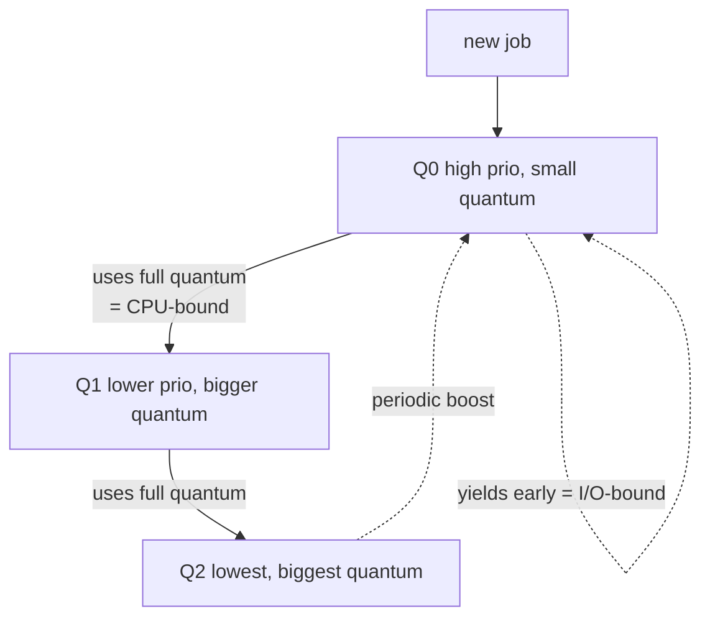

# CPU Scheduling Algorithms

> The scheduler decides **which ready process runs next, and for how long**, multiplexing
> a few CPUs among many processes to balance fairness, responsiveness, and throughput.

## Problem
There are more runnable processes than CPUs. Run the wrong one and an interactive app
feels laggy; let one hog the CPU and others starve; switch too often and you waste cycles
on overhead. The scheduler must pick well, thousands of times a second, without knowing
the future.

## Core concepts

**Metrics it trades off:**
- **Turnaround time** — submission → completion.
- **Response time** — submission → *first* run (what interactivity feels like).
- **Throughput** — jobs completed per unit time.
- **Fairness** — every process gets a share; nobody starves.

**Preemptive vs non-preemptive.** A *preemptive* scheduler can yank the CPU from a
running process (via the [timer interrupt](../fundamentals/interrupts-and-traps.md));
a *non-preemptive* one waits for the process to block or exit. Modern OSes are preemptive.

**Classic algorithms:**
| Algorithm | Idea | Strength | Weakness |
| --- | --- | --- | --- |
| **FCFS** | First-come, first-served | Simple, fair-ish | **Convoy effect**: one long job stalls everyone |
| **SJF / SRTF** | Shortest job (remaining) first | Optimal avg turnaround | Needs future knowledge; starves long jobs |
| **Round Robin** | Each gets a time **quantum**, then rotates | Great response time | Quantum too big → FCFS; too small → switch overhead |
| **Priority** | Highest priority runs | Honors importance | Starvation → fix with **aging** |
| **MLFQ** | Multiple priority queues; demote CPU hogs, boost I/O-bound | Approximates SJF *without* future knowledge | Tunable, gameable |
| **Fair-share / CFS** | Allocate proportional CPU time (weighted by **nice**) | Provably fair, scalable | Complex |

**MLFQ** (Multi-Level Feedback Queue) is the practical breakthrough: new jobs start
high-priority; if a job uses its whole quantum it's CPU-bound, so **demote** it; if it
yields early (I/O-bound, interactive) it stays high. Periodic **priority boost** prevents
starvation. This makes interactive jobs snappy and batch jobs efficient with no oracle.



**CFS** (the long-time Linux default, now **EEVDF**) abandons fixed queues for
**virtual runtime**: track how much CPU each task has gotten (scaled by its `nice`
weight) and always run the one with the least. Stored in a red-black tree for O(log n)
"who's next." See the [Linux scheduler case study](../../2-case-studies/linux-cfs-scheduler.md).

## Example
Why **RR beats FCFS** for response time. Three jobs (A=10, B=10, C=10 ms), quantum 2 ms:

```
FCFS:  A finishes@10, B@20, C@30      → first response: A=0, B=10, C=20  (avg 10ms wait to start)
RR:    A,B,C interleave 2ms each      → first response: A=0, B=2,  C=4   (avg 2ms)
```

RR makes every job *feel* responsive immediately; FCFS makes C wait 20 ms just to start.
The cost is more [context switches](./context-switching.md).

## Common tools
| Tool | What it is | Use it for |
| --- | --- | --- |
| `nice` / `renice` | Priority adjust | lowering/raising a process's CPU share |
| `chrt` | Real-time policy | `SCHED_FIFO`/`SCHED_RR` for latency-critical tasks |
| `taskset` | CPU affinity | pinning a process to specific cores |
| `schedtool` / `cgroups cpu` | Bandwidth control | capping/guaranteeing CPU per group |
| `perf sched` | Scheduler tracer | measuring run/wait latency |

## Trade-offs
- ✅ Good scheduling gives both snappy interactivity *and* high throughput.
- ⚠️ No single policy wins all metrics — RR favors response over turnaround; SJF the reverse.
- ⚠️ **Priority inversion**: a high-prio task waits on a lock held by a low-prio one →
  fix with priority inheritance (famously, the Mars Pathfinder bug).
- Real-time work needs *predictability*, not averages → dedicated RT policies.

## Real-world examples
- **Linux CFS/EEVDF** — weighted fair queuing via `nice`; the everyday default.
- **`SCHED_DEADLINE`** — Linux EDF-based policy for hard-real-time tasks.
- **Mars Pathfinder (1997)** — priority inversion caused repeated resets; fixed by enabling
  priority inheritance on a mutex.

## References
- OSTEP — "Scheduling," "MLFQ," "Proportional-Share"
- [CFS design](https://docs.kernel.org/scheduler/sched-design-CFS.html)
