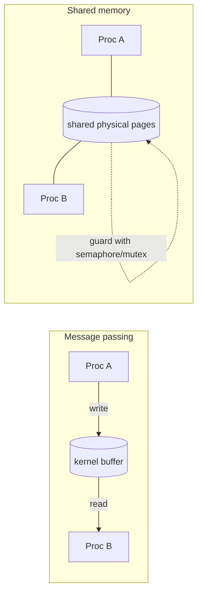

# Inter-Process Communication (IPC)

> Mechanisms that let isolated processes exchange data and coordinate — pipes, message
> queues, shared memory, sockets, and signals. Because processes *don't* share memory by
> default, IPC is how they cooperate.

## Problem
[Processes are isolated](../fundamentals/process-vs-thread.md): each has a private address
space, so they can't just read each other's variables (that's the whole point of
protection). But cooperating programs — a shell and the commands it pipes, a web server
and a worker pool, a client and a daemon — need to pass data and synchronize. IPC
provides safe, kernel-mediated channels to do exactly that.

## Core concepts

Two broad families: **message passing** (copy data through the kernel — simple, safe) and
**shared memory** (map the same physical pages — fast, but you must synchronize yourself).



| Mechanism | Kind | Scope | Notes |
| --- | --- | --- | --- |
| **Pipe** (`\|`) | Byte stream | Related procs (shared FD) | Unidirectional; the shell's `cmd1 \| cmd2` |
| **Named pipe (FIFO)** | Byte stream | Any procs on a host | A pipe with a filesystem name (`mkfifo`) |
| **Unix domain socket** | Stream/datagram | Same host | Fast local sockets; can pass FDs & credentials |
| **TCP/UDP socket** | Stream/datagram | Across machines | The network generalization of IPC |
| **Message queue** | Discrete messages | Same host | Priorities, message boundaries (POSIX `mq`) |
| **Shared memory** | Raw memory | Same host | Fastest (no copy); needs external sync |
| **Signal** | 1-bit async notify | Same host | Notification, not data transfer (`SIGTERM`) |
| **eventfd / futex** | Wakeup primitive | Same host | Lightweight notify/wait, basis of fast locks |

**Pipes are the Unix glue.** `ls | grep x` works because the shell creates a pipe, points
`ls`'s stdout (fd 1) at the write end and `grep`'s stdin (fd 0) at the read end. Each
program just reads/writes a file descriptor — it doesn't know it's talking to another process.

**Shared memory is fastest but unguarded.** Two processes `mmap` the same region and read/write
it directly — zero copies. But there's no built-in mutual exclusion, so you pair it with a
[semaphore or mutex](../concurrency/locks-semaphores.md) to avoid
[races](../concurrency/race-conditions.md).

**Signals** are interrupts for processes: a small fixed set of async notifications
(`SIGINT` from Ctrl-C, `SIGSEGV` on bad memory, `SIGTERM`/`SIGKILL` to stop). A handler
runs at an arbitrary point, so handlers must be tiny and async-signal-safe.

## Example
A pipe between two processes — the mechanism behind every shell pipeline:

```c
int fd[2]; pipe(fd);                 // fd[0]=read end, fd[1]=write end
if (fork() == 0) {                    // child: producer
    close(fd[0]);
    write(fd[1], "hello", 5);
} else {                              // parent: consumer
    close(fd[1]);
    char buf[8]; int n = read(fd[0], buf, 8);   // blocks until data arrives
    write(1, buf, n);                            // prints "hello"
}
```

The pipe's kernel buffer also synchronizes: `read` blocks until there's data, `write`
blocks when the buffer is full — backpressure for free.

## Common tools
| Tool | What it is | Use it for |
| --- | --- | --- |
| `mkfifo` | Make a named pipe | shell-level IPC between unrelated commands |
| `ipcs` / `ipcrm` | SysV IPC inspector | listing/removing shared mem, semaphores, queues |
| `socat` / `nc` | Socket plumbing | wiring up Unix/TCP sockets for testing |
| `kill` / `trap` | Signal send/handle | process control, graceful shutdown |
| `/dev/shm` | tmpfs | file-backed shared memory between processes |

## Trade-offs
- ✅ Lets isolated processes cooperate without giving up protection.
- ⚠️ Message passing copies data through the kernel (2 copies) — fine for control, costly
  for bulk; shared memory avoids copies but pushes synchronization onto you.
- ⚠️ Shared memory bugs are [race conditions](../concurrency/race-conditions.md) across
  processes — harder to debug than in-process ones.
- Signals carry almost no data and can interrupt anything → easy to misuse.

## Real-world examples
- **The shell** — pipes compose small tools into pipelines (the Unix philosophy).
- **PostgreSQL / Chrome** — shared memory for the buffer pool / cross-process buffers,
  guarded by semaphores.
- **D-Bus / gRPC over Unix sockets** — desktop and microservice IPC.
- **Databases & games** — `mmap` shared memory for the lowest-latency data exchange.

## References
- OSTEP — "Concurrency" (semaphores), Stevens *APUE* — IPC chapters
- `man 7 pipe`, `man 7 unix`, `man 7 signal`, `man 7 shm_overview`
