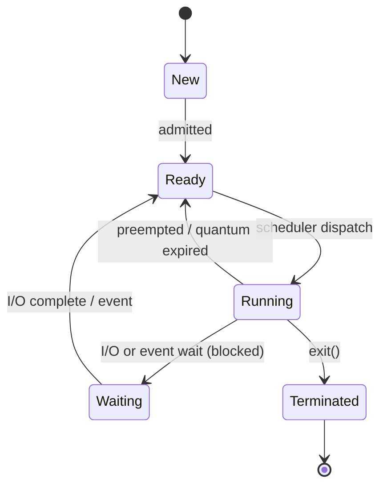

# Process Lifecycle & the PCB

> A process moves through a small set of states (new → ready → running → waiting →
> terminated), and the kernel tracks everything about it in a **Process Control Block**
> — the `task_struct` on Linux.

## Problem
The OS juggles hundreds of processes on a handful of CPUs. To switch between them, pause
one and resume another exactly where it left off, and decide who runs next, it must
record each process's complete state somewhere and model where each one is in its life.

## Core concepts

**Process states:**



- **Ready** — runnable, waiting only for a CPU (sits on the
  [scheduler's](./cpu-scheduling.md) run queue).
- **Running** — currently executing on a CPU.
- **Waiting/Blocked** — can't proceed until something happens (disk read, lock, signal).
  A blocked process consumes **no CPU**.
- **Terminated (zombie)** — finished, but its exit status lingers until the parent
  `wait()`s for it.

**The Process Control Block (PCB).** One per process; on Linux it's `struct task_struct`.
It holds: PID/PPID, state, **saved registers + program counter** (the heart of a
[context switch](./context-switching.md)), the
[memory map](../memory/virtual-memory.md) (`mm_struct`, page-table pointer), the open
**file-descriptor table**, scheduling info (priority, vruntime), credentials (uid/gid),
signal handlers, and accounting.

**The process tree.** Every process (except PID 1, [init/systemd](../fundamentals/boot-process.md))
has a parent. `fork()` creates a child; `exit()` ends it; `wait()` lets the parent reap it.

**Zombies and orphans:**
- **Zombie** — child exited but parent hasn't `wait()`ed; the PCB stays so the parent can
  read the exit code. Many zombies = a buggy parent leaking PCBs.
- **Orphan** — parent died first; the child is **re-parented to PID 1**, which reaps it.

## Example
The fork/exec/wait cycle that underlies every command you run (and the
[shell lab](../../3-practice/project-shell.md)):

```c
pid_t pid = fork();                 // duplicate this process
if (pid == 0) {                     // child
    execvp("ls", argv);            // replace image with `ls`; never returns on success
    _exit(127);                    // only reached if exec failed
} else {                            // parent
    int status;
    waitpid(pid, &status, 0);      // block until child exits, reap the zombie
    printf("child exited %d\n", WEXITSTATUS(status));
}
```

## Common tools
| Tool | What it is | Use it for |
| --- | --- | --- |
| `ps` / `top` / `htop` | Process viewers | state (R/S/D/Z), PID tree, CPU/mem per process |
| `/proc/<pid>/` | Kernel-exported process info | `status`, `fd/`, `maps`, `stat` for one process |
| `pstree` | Tree view | seeing parent/child relationships |
| `kill` / `pkill` | Signal senders | terminating, stopping, continuing processes |
| `strace -f` | Tracer | watching `fork`/`execve`/`wait` happen |

## Trade-offs
- ✅ A uniform PCB lets the kernel suspend/resume any process generically and account for
  resource use.
- ⚠️ PCBs cost memory; a fork bomb (`while(1) fork();`) exhausts the PID/PCB table →
  defended with `RLIMIT_NPROC` and cgroup `pids.max`.
- The `D` (uninterruptible sleep) state — a process stuck in a kernel I/O wait — can't even
  be killed, a classic "why won't this die" puzzle.

## Real-world examples
- **`init`/`systemd`** as PID 1 reaps all orphaned zombies system-wide.
- **Container runtimes** must run a proper init (or `--init`) inside the container, or
  zombies accumulate because the app PID 1 doesn't reap children.
- **`/proc`** is how `ps`, `top`, and monitoring agents read process state — it's the PCB
  made browsable.

## References
- OSTEP — "The Abstraction: The Process," "Process API"
- `man 2 fork`, `man 2 wait`, `man 5 proc`
