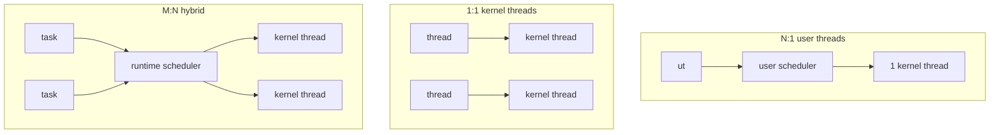

# Threads & Concurrency Models

> Threads let one process run multiple flows of control over shared memory. How they map
> onto CPUs — and onto each other — defines the concurrency model: kernel threads, user
> threads, M:N, event loops, and coroutines.

## Problem
A single thread can only use one core and stalls completely whenever it waits on I/O. To
exploit multicore hardware and to keep working while some operations block, we need
**concurrency**: multiple things in progress at once. The question is *how* to structure
and schedule them — and each model trades performance against complexity differently.

## Core concepts

**Concurrency vs parallelism.** *Concurrency* is dealing with many things at once
(structure); *parallelism* is doing many things at once (multiple cores executing
simultaneously). You can have concurrency on one core (interleaving) and need multiple
cores for true parallelism.

**Threading models — who schedules the threads:**



| Model | How | Pros | Cons |
| --- | --- | --- | --- |
| **1:1 (kernel)** | Each thread is a kernel thread | True parallelism; one blocking call doesn't stall others | Each thread costs kernel resources + a [context switch](./context-switching.md) |
| **N:1 (user)** | Many user threads on one kernel thread | Ultra-cheap switches (no kernel) | No parallelism; one blocking syscall stalls *all* |
| **M:N (hybrid)** | Runtime multiplexes M tasks onto N kernel threads | Cheap + parallel; millions of tasks | Complex runtime + scheduler |

Linux `pthreads` are **1:1**. **Go goroutines** and Erlang processes are **M:N** — the
runtime parks a blocked task and runs another on the same OS thread, so a goroutine costs
~KBs and you can have millions.

**Event loops (async I/O).** Instead of a thread per connection, one thread runs a loop:
register interest in many file descriptors ([`epoll`/`io_uring`](../storage-fs/io-systems.md)),
and react to whichever is ready. This is how **nginx**, **Node.js**, and **Redis** handle
tens of thousands of connections with a handful of threads — no per-connection thread
cost, but CPU-bound work or a blocking call freezes the loop.

**Coroutines / async-await** are language-level cooperative tasks that *yield* at `await`
points, letting one thread interleave many logical flows — the same idea as user threads,
made explicit in the language.

## Example
Why threads sharing memory need [synchronization](../concurrency/locks-semaphores.md):

```c
int counter = 0;                       // shared
void *worker(void *_) {
    for (int i = 0; i < 1000000; i++)
        counter++;                     // NOT atomic: load, add, store
    return NULL;
}
// Start 4 threads on worker(), join them.
// Expected 4,000,000 — you'll get LESS, because increments are lost to a
// race condition. Fix with a mutex or atomic. (See: race conditions.)
```

## Common tools
| Tool | What it is | Use it for |
| --- | --- | --- |
| `pthreads` (C) | 1:1 kernel threads | direct OS threading |
| Go goroutines / Erlang | M:N runtimes | massive cheap concurrency |
| `epoll` / `io_uring` / `kqueue` | Readiness/async I/O | event-loop servers |
| `ThreadSanitizer` (`-fsanitize=thread`) | Race detector | finding data races at runtime |
| `perf` / `pidstat -t` | Per-thread stats | spotting hot/blocked threads |

## Trade-offs
- ✅ Threads exploit multicore and hide I/O latency.
- ⚠️ Shared memory → [race conditions](../concurrency/race-conditions.md),
  [deadlocks](../concurrency/deadlock.md), and hard-to-reproduce bugs.
- ⚠️ Thread-per-request doesn't scale to massive connection counts (memory + switch cost)
  → event loops or M:N runtimes do.
- The **GIL** (Python, CPython) serializes threads, so threads help with I/O but not
  CPU parallelism there → use processes or other runtimes.

## Real-world examples
- **Go** — goroutines + channels; the runtime M:N-schedules millions onto a few threads.
- **nginx / Node.js / Redis** — event loops handle huge concurrency on few threads.
- **Java virtual threads (Project Loom)** — M:N green threads brought back to the JVM.

## References
- OSTEP — "Concurrency: An Introduction," "Threads"
- [The Go scheduler (M:N)](https://go.dev/src/runtime/proc.go)
- [epoll vs io_uring](https://unixism.net/loti/)
