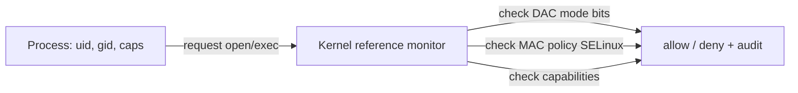

# Protection, Isolation & Access Control

> How the OS enforces *who can do what*: hardware-backed isolation between processes, the
> permission model on files and resources, privilege levels, and the principle of least
> privilege. Protection is the mechanism; security is the policy.

## Problem
A machine runs code from many sources — your apps, other users, downloaded programs, network
services — all sharing one kernel, memory, files, and devices. Without enforced boundaries,
any program could read your files, alter the kernel, or snoop on other processes. The OS must
guarantee, with **mechanisms the hardware enforces**, that each principal can touch only what
it's authorized to — and contain the damage when something is compromised.

## Core concepts

**Mechanism vs policy.** *Protection* is the enforcement machinery (page tables, rings,
permission checks); *security policy* is the rules (who may read this file). The OS provides
mechanisms flexible enough to express many policies.

**The isolation foundation** (covered elsewhere, the bedrock here):
- **Dual-mode + rings** — [user vs kernel space](../fundamentals/kernel-user-space.md) stops
  apps from running privileged instructions.
- **Virtual memory** — [per-process address spaces](../memory/virtual-memory.md) stop a
  process from reading another's RAM; the MMU enforces R/W/X per page (**NX/W^X** blocks code
  injection).
- **The [syscall](../fundamentals/system-calls.md) boundary** — the only, validated entry into
  privileged operations.

**Access control models:**
- **DAC (Discretionary)** — owners set permissions. Unix mode bits: **rwx** for
  **user/group/other**, plus **setuid/setgid/sticky**. ACLs extend this with per-user entries.
- **MAC (Mandatory)** — a system-wide policy the owner *can't* override (SELinux, AppArmor),
  used to confine even root.
- **RBAC / capabilities** — permissions by role, or fine-grained
  **[Linux capabilities](../fundamentals/kernel-user-space.md)** that split "root" into ~40
  discrete powers (`CAP_NET_BIND_SERVICE`, `CAP_SYS_ADMIN`…) so a service gets only what it needs.



**setuid — power and peril.** A `setuid root` binary (like `passwd`) runs with the *file
owner's* privileges, not the caller's — necessary (a user must edit `/etc/shadow` indirectly)
but a huge attack surface: any bug becomes privilege escalation. Modern systems prefer
**capabilities** over blanket setuid-root.

**Principle of least privilege.** Grant each component the *minimum* rights it needs, so a
compromise is contained. This drives sandboxing: **seccomp** (restrict
[syscalls](../fundamentals/system-calls.md)), **namespaces/cgroups**
([containers](../virtualization/containers.md)), capability dropping, chroot/jails, and
dedicated low-privilege service accounts.

**Defense in depth & the TCB.** The **Trusted Computing Base** is the code that *must* be
correct for security (kernel, firmware, hypervisor) — keep it small (the
[microkernel](../fundamentals/what-is-an-os.md) argument). Layer independent defenses (ASLR,
NX, stack canaries, MAC, sandboxing) so one failure isn't game over.

## Example
Unix permissions and least privilege in practice:

```bash
ls -l /etc/shadow              # -rw------- root root   → only root reads password hashes
ls -l $(which passwd)          # -rwsr-xr-x root root   → the 's' = setuid: runs as root
                              #   so a normal user can change THEIR entry, safely mediated

# Prefer a capability over setuid-root for a web server binding port 80:
sudo setcap 'cap_net_bind_service=+ep' ./myserver   # may bind <1024, but is NOT root
getcap ./myserver
```

The setuid bit and the capability both grant a *specific* power without handing over full root.

## Common tools
| Tool | What it is | Use it for |
| --- | --- | --- |
| `chmod` / `chown` / `umask` | DAC controls | file mode bits & default perms |
| `getfacl` / `setfacl` | POSIX ACLs | per-user/group fine-grained access |
| `getcap` / `setcap` | Capabilities | least-privilege instead of setuid-root |
| **SELinux / AppArmor** | MAC frameworks | confining services system-wide |
| **seccomp-bpf** | Syscall filter | sandboxing (Docker, Chrome, systemd) |
| `auditd`, `ausearch` | Audit logging | recording access decisions |

## Trade-offs
- ✅ Strong, hardware-backed isolation + flexible policy; least privilege limits blast radius.
- ⚠️ Usability vs security: strict MAC (SELinux) is powerful but notoriously hard to configure
  (→ people disable it, the worst outcome).
- ⚠️ setuid-root and a large TCB are big attack surfaces; coarse "all-or-nothing root" is why
  capabilities exist.
- ⚠️ Mechanisms can't fix bad policy, side channels (Spectre/Meltdown), or social engineering.

## Real-world examples
- **Linux capabilities + seccomp** underpin container and systemd service hardening
  (`NoNewPrivileges`, `ProtectSystem`).
- **SELinux** (Android, RHEL) confines apps/services via mandatory policy — Android sandboxes
  every app under its own UID + SELinux domain.
- **Meltdown/Spectre** broke the address-space isolation *assumption* via CPU side channels,
  forcing kernel page-table separation (KPTI).

## References
- OSTEP — "Security" / protection sections; Saltzer & Schroeder (1975), "The Protection of
  Information in Computer Systems" (least privilege, defense in depth)
- `man 7 capabilities`, [SELinux](https://selinuxproject.org/), [seccomp](https://man7.org/linux/man-pages/man2/seccomp.2.html)
