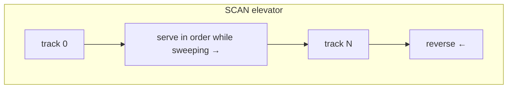

# Disk Scheduling

> When many I/O requests are pending, the OS reorders them to minimize mechanical movement
> (on spinning disks) or maximize parallelism and merging (on SSDs). The right order can be
> an order of magnitude faster.

## Problem
A hard disk's read/write head is **mechanical**: a **seek** (move the head to the right
track) plus **rotational latency** (wait for the sector to spin under it) dominates and
costs milliseconds — millions of CPU cycles. Requests arrive in random order. Serving them
first-come-first-served means the head thrashes back and forth across the platter. Reordering
requests to reduce total head travel is the job of the disk (I/O) scheduler.

## Core concepts

**The cost model (HDD):** `access time ≈ seek + rotational latency + transfer`. Seek and
rotation are positional, so **sequential** access is vastly faster than **random**. The
scheduler tries to serve nearby requests together.

**Classic algorithms** (positions = track numbers):

| Algorithm | Idea | Problem it solves / causes |
| --- | --- | --- |
| **FCFS** | Serve in arrival order | Fair but lots of seeking |
| **SSTF** | Shortest seek time first | Less seeking, but **starves** far requests |
| **SCAN (elevator)** | Sweep head one way, serving all, then reverse | No starvation; like an elevator |
| **C-SCAN** | Sweep one way only, then jump back to start | More uniform wait times than SCAN |
| **LOOK / C-LOOK** | Like SCAN/C-SCAN but only go as far as the last request | Less wasted travel |



**SSDs change everything.** No heads, no seeks — access is uniform and **parallel** across
flash chips. So minimizing seek distance is pointless; instead the scheduler focuses on
**merging** adjacent requests, fairness, and not getting in the way. Often the best SSD/NVMe
scheduler is **none** (`none`/`noop`) — let the device's deep queues and internal
parallelism do the work.

**Linux I/O schedulers (the `blk-mq` era):**
- **`none`** — no reordering; ideal for fast NVMe SSDs with many hardware queues.
- **`mq-deadline`** — imposes deadlines so no request starves; good general default,
  especially for HDDs.
- **`bfq`** (Budget Fair Queueing) — fairness & low latency for interactive desktop use,
  proportional shares per process/cgroup.
- **`kyber`** — lightweight, latency-targeted for fast multiqueue devices.

**Above the scheduler:** the **page cache** absorbs most reads (so they never hit disk) and
buffers writes (**write-back**), and the device itself reorders via **NCQ** (native command
queuing). The OS scheduler is one layer in a stack of reordering.

## Example
Pending requests at tracks `98, 183, 37, 122, 14, 124, 65, 67`, head at `53`:

```
FCFS  order: 53→98→183→37→122→14→124→65→67     total head travel ≈ 640 tracks
SSTF  order: 53→65→67→37→14→98→122→124→183     ≈ 236 (but 183 waited a long time)
C-LOOK order:53→65→67→98→122→124→183→14→37     ≈ 322, no starvation
```

SSTF moves least but risks starving the far request; SCAN-family bound the worst case.

## Common tools
| Tool | What it is | Use it for |
| --- | --- | --- |
| `cat /sys/block/<dev>/queue/scheduler` | Scheduler selector | view/set `none`/`mq-deadline`/`bfq`/`kyber` |
| `iostat -x 1` | Per-device I/O stats | `await`, `%util`, queue depth, r/w IOPS |
| `ioping` | Latency probe | per-request I/O latency |
| `fio` | I/O benchmark | random vs sequential, queue-depth sweeps |
| `blktrace` / `iotop` | I/O tracers | what's queued, which process is doing I/O |

## Trade-offs
- ✅ On HDDs, reordering slashes seek time and boosts throughput dramatically.
- ⚠️ Throughput-optimal ordering (SSTF/SCAN) can hurt *latency/fairness* for individual
  requests → deadline/BFQ schedulers rebalance.
- ⚠️ On NVMe SSDs, heavy scheduling is pure overhead — `none` often wins; the device knows
  best.
- Write-back caching boosts speed but risks data loss on power failure (hence `fsync`,
  journaling, and battery-backed caches).

## Real-world examples
- **`mq-deadline`** is the common default for HDD/SATA; **`none`** for NVMe in many distros.
- **`bfq`** ships as the desktop/Android choice for snappy interactivity under load.
- **Databases** issue large sequential writes and use `fdatasync` to control durability,
  partly bypassing OS reordering with `O_DIRECT`.

## References
- OSTEP — "Hard Disk Drives," "I/O Devices"
- [Linux block layer & multi-queue](https://docs.kernel.org/block/)
