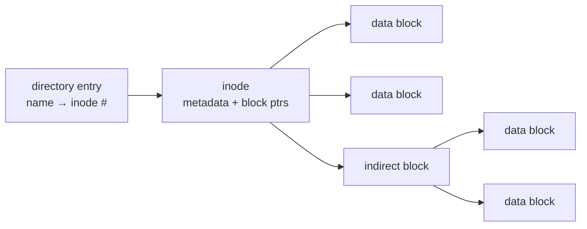

# File Systems: Inodes, Directories & Layout

> A file system turns a flat array of disk blocks into named files in a directory tree, with
> metadata, permissions, and crash consistency. The central abstraction on Unix is the
> **inode**.

## Problem
A disk (or SSD) is just a huge array of fixed-size blocks addressed by number. Humans and
programs want *files* — named, variable-length, organized in folders, with owners and
timestamps, that survive crashes. The file system is the on-disk data structure + code that
bridges that gap: it decides how to lay out files, find them by name, track free space, and
stay consistent when power is lost mid-write.

## Core concepts

**The inode (index node).** Each file is an **inode** holding its *metadata* — size, owner,
permissions, timestamps, link count — and **pointers to its data blocks**. Crucially, the
inode does **not** hold the file's name. Block pointers are structured for both small and
huge files: a handful of **direct** pointers, then **single / double / triple indirect**
pointer blocks (a tree), so tiny files stay cheap while huge files remain addressable.



**Directories are just files** whose contents are a table of **(name → inode number)**
entries. Looking up `/home/me/a.txt` means: read the root inode → find `home`'s inode → find
`me`'s inode → find `a.txt`'s inode. This indirection is what makes **hard links** possible:
two names pointing at the *same* inode (link count = 2). A **symlink** is different — a tiny
file whose contents are a *path string*.

**On-disk layout (classic):** a **superblock** (FS-wide metadata: size, block size, pointers
to the other regions), an **inode bitmap** + **data bitmap** (free/used tracking), the
**inode table**, then **data blocks**. ext-family groups these into **block groups** to keep
an inode near its data (reducing seeks).

**The VFS (Virtual File System).** The kernel exposes one API (`open`/`read`/`write`/`stat`)
over many file systems via an abstraction layer. ext4, XFS, Btrfs, NFS, even `/proc` all
implement the VFS interface, so applications don't care which FS backs a path.

**Crash consistency.** A single logical write may touch several blocks (data + inode +
bitmap). A crash in between leaves the FS inconsistent. Solutions: **journaling** (log
intent before applying — see [ext4 case study](../../2-case-studies/ext4-journaling.md)),
**copy-on-write** (never overwrite in place — Btrfs, ZFS), or `fsck` (scan & repair, slow).

## Example
Hard links vs symlinks — the inode model made visible:

```bash
echo hi > a.txt
ln a.txt hard.txt        # hard link: same inode, link count → 2
ln -s a.txt soft.txt     # symlink: a new inode holding the path "a.txt"
ls -li                   # same inode # for a.txt & hard.txt; different for soft.txt
rm a.txt                 # hard.txt still works (inode alive); soft.txt now dangles
stat hard.txt            # Links: 1 again after rm; data persists until link count 0
```

A file's data is freed only when its **link count hits 0 *and* no process has it open** —
which is why deleting a log a running process holds open doesn't free disk space until the
process exits.

## Common tools
| Tool | What it is | Use it for |
| --- | --- | --- |
| `stat`, `ls -li` | Metadata viewers | inode #, link count, perms, timestamps |
| `df` / `du` | Space usage | free space vs per-file usage |
| `df -i` | Inode usage | running out of *inodes* (many tiny files) |
| `fsck` | Consistency checker | repairing a damaged FS |
| `mkfs.ext4`, `tune2fs`, `dumpe2fs` | FS create/inspect | layout, block groups, features |

## Trade-offs
- ✅ Clean abstraction (named files, dirs, links, permissions) over raw blocks, with crash
  consistency.
- ⚠️ Metadata overhead and the small-file problem: millions of tiny files waste inodes and
  space (internal fragmentation per block) and seek a lot.
- ⚠️ Journaling/COW cost write amplification for safety; `fsck` on huge volumes is slow.
- Layout choices trade sequential throughput vs random access vs metadata speed.

## Real-world examples
- **ext4 / XFS** — journaling FSes; XFS excels at large files & parallel I/O.
- **Btrfs / ZFS** — copy-on-write with snapshots, checksums, and built-in RAID.
- **`/proc`, `/sys`, `tmpfs`** — virtual file systems exposing kernel state / RAM-backed
  files through the same VFS API.

## References
- OSTEP — "File System Implementation," "Locality and The Fast File System"
- *The Design and Implementation of the FFS* — McKusick et al.
- `man 7 inode`, `man 2 stat`
