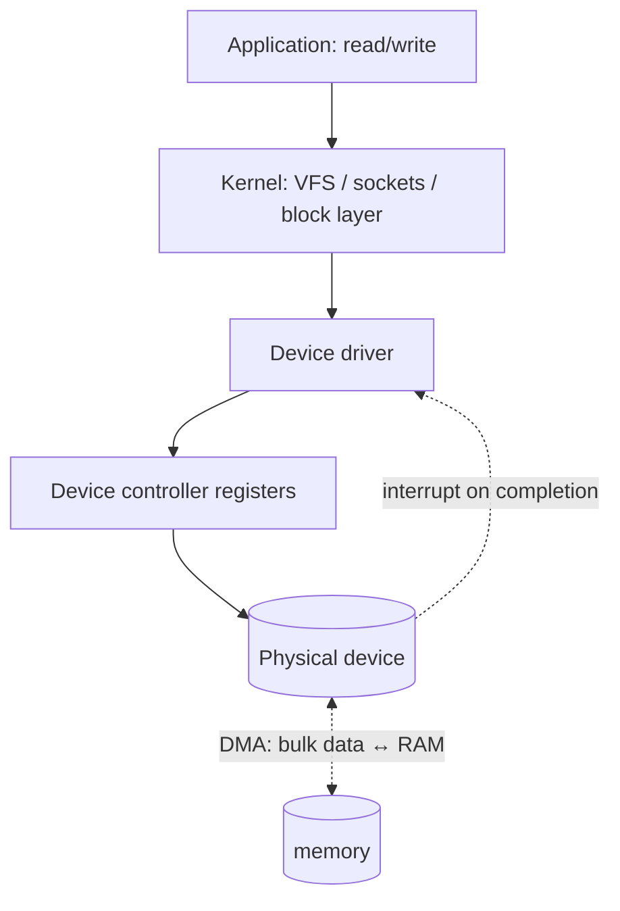

# I/O Systems & Device Drivers

> How the OS talks to hardware: a layered stack from the device controller up through
> drivers and the kernel to a uniform application API, using interrupts and DMA to move data
> efficiently.

## Problem
There are thousands of incompatible devices — disks, NICs, GPUs, keyboards, sensors — each
with its own registers and protocol. Applications must not need to know any of that, and the
CPU must not waste time babysitting slow data transfers. The OS provides a layered I/O
architecture: device-specific **drivers** at the bottom, a uniform **abstraction** at the
top, with **interrupts** and **DMA** making it efficient.

## Core concepts

**The I/O stack:**



**Three ways the CPU exchanges data with a device:**
1. **Programmed I/O (polling)** — CPU reads/writes device registers in a loop. Simple but
   burns the CPU; fine for tiny, fast transfers.
2. **Interrupt-driven** — CPU issues the request and moves on; the device raises an
   [interrupt](../fundamentals/interrupts-and-traps.md) when done. Efficient when events are
   infrequent.
3. **DMA (Direct Memory Access)** — a DMA engine transfers bulk data **directly between
   device and RAM** without the CPU copying each byte; the CPU is interrupted only when the
   whole transfer completes. Essential for disks, NICs, GPUs.

**How the CPU addresses devices:** **memory-mapped I/O** (device registers appear at
physical addresses; normal load/store reaches them) or **port I/O** (special `in`/`out`
instructions, x86 legacy).

**Device categories & the driver interface:**
- **Block devices** (disks, SSDs) — addressable in fixed blocks, buffered by the page cache,
  random-accessible. Go through the block layer & [I/O scheduler](./disk-scheduling.md).
- **Character devices** (terminals, serial, `/dev/random`) — byte streams.
- **Network devices** — packet queues, their own stack.

A **driver** implements a standard interface (`open`/`read`/`write`/`ioctl` for char
devices; `request` queues for block) so the kernel treats all devices of a class uniformly.
On Linux many devices appear as files under `/dev`, accessed with ordinary syscalls — "**
everything is a file**."

**Blocking, non-blocking, and async I/O.** A `read()` may **block** until data is ready;
**non-blocking** returns immediately with "not ready"; **readiness** APIs
([`epoll`/`select`](../processes-scheduling/threads.md)) wait on many FDs at once; **async**
APIs (`io_uring`, `aio`) submit operations and reap completions later — the basis of
high-throughput servers and databases.

## Example
DMA vs CPU copy — why bulk I/O doesn't peg the CPU:

```
Without DMA (programmed I/O): CPU executes a loop copying each word
   device reg → register → memory   ... for every byte of a 1 MB read (CPU 100% busy)

With DMA: driver programs the DMA engine (source=device, dest=RAM buffer, len=1MB),
   then sleeps. DMA moves all 1 MB while the CPU runs other processes.
   One interrupt fires at the end → driver wakes the waiting process.
```

This is why copying a large file barely uses the CPU — DMA does the moving.

## Common tools
| Tool | What it is | Use it for |
| --- | --- | --- |
| `lspci` / `lsusb` / `lsblk` | Device enumerators | what hardware exists, which driver bound |
| `lsmod` / `modprobe` | Kernel modules | loading/listing driver modules |
| `dmesg` | Kernel log | driver probe, device errors, DMA issues |
| `/dev`, `/sys` | Device file trees | the file interface to devices & attributes |
| `ethtool`, `hdparm`, `nvme` | Per-class tools | tuning/inspecting NICs, disks, NVMe |

## Trade-offs
- ✅ Uniform abstraction (files/sockets) + DMA = portable, CPU-efficient I/O across wildly
  different hardware.
- ⚠️ Drivers are the **#1 source of kernel bugs/crashes** — they run in ring 0, so a buggy
  driver can take down the system (a key argument for [microkernels](../fundamentals/what-is-an-os.md)).
- ⚠️ Polling wastes CPU; interrupts can storm under load → drivers blend both (NAPI).
- Copies between user/kernel/device buffers add latency → zero-copy (`sendfile`,
  `io_uring`, `mmap`) avoids them.

## Real-world examples
- **NVMe** — deep parallel queues + DMA + MSI-X interrupts give millions of IOPS.
- **DPDK / kernel-bypass** — networking that polls the NIC from user space, skipping the
  kernel stack entirely for line-rate packet processing.
- **`io_uring`** — async submission/completion rings cut syscall and copy overhead for
  databases and proxies.

## References
- OSTEP — "I/O Devices," "Hard Disk Drives"
- *Linux Device Drivers* (LDD3), [Linux driver model](https://docs.kernel.org/driver-api/)
