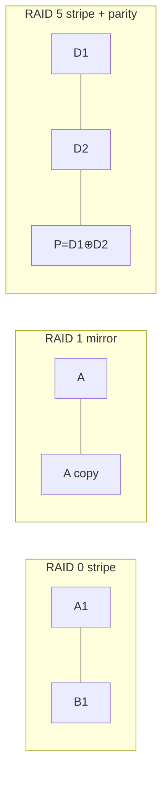

# RAID

> RAID (Redundant Array of Independent Disks) combines multiple disks into one logical
> volume to gain **performance** (striping), **redundancy** (mirroring/parity), or both.
> It trades capacity for speed and fault tolerance.

## Problem
A single disk is a bottleneck and a single point of failure: it caps throughput at one
device's speed, and when it dies, the data dies with it. Buying one giant, fast, ultra-
reliable disk is expensive or impossible. RAID instead combines many ordinary disks so the
*array* is faster and/or survives disk failures — turning commodity disks into a robust,
high-throughput volume.

## Core concepts

Three building-block techniques, combined into "levels":
- **Striping** — split data across disks so reads/writes happen in **parallel** → more
  throughput. No redundancy by itself.
- **Mirroring** — keep identical copies on multiple disks → survive failures, faster reads.
- **Parity** — store computed redundancy (XOR) so any one (or two) failed disks can be
  **reconstructed** → redundancy with less capacity cost than mirroring.



**The common levels:**
| Level | Technique | Min disks | Capacity | Fault tolerance | Use |
| --- | --- | --- | --- | --- | --- |
| **0** | Striping | 2 | 100% | **None** (worse than 1 disk!) | Scratch/throughput only |
| **1** | Mirroring | 2 | 50% | 1 disk (per pair) | Boot/OS, databases |
| **5** | Stripe + 1 parity | 3 | (N−1)/N | 1 disk | General, read-heavy |
| **6** | Stripe + 2 parity | 4 | (N−2)/N | **2 disks** | Large arrays (long rebuilds) |
| **10** | Mirror + stripe | 4 | 50% | 1 per mirror | Databases, write-heavy |

**The RAID 5 write penalty.** Updating one block requires read-old-data + read-old-parity +
write-new-data + write-new-parity = **4 I/Os per small write**. This makes RAID 5/6 poor for
random-write-heavy workloads → RAID 10 is preferred for databases despite the 50% capacity cost.

**The rebuild problem.** When a disk fails, the array runs **degraded** and must
**reconstruct** the lost disk onto a spare — reading *every* block of *every* surviving disk.
On large modern disks this takes hours/days, during which a *second* failure (more likely
under rebuild stress) means data loss. This drove adoption of **RAID 6** (survives two
failures) and the move toward erasure coding.

**RAID is not backup.** It protects against *disk* failure, not against deletion, corruption,
ransomware, or fire. You still need backups and, ideally, checksums (ZFS/Btrfs detect *silent*
corruption that RAID parity alone may not).

## Example
RAID 5 reconstruction is just XOR — recover a lost block from the survivors:

```
3-disk RAID 5, one stripe:  D1 = 0110,  D2 = 1011,  P = D1 ⊕ D2 = 1101
Disk holding D2 dies.
Reconstruct:  D2 = D1 ⊕ P = 0110 ⊕ 1101 = 1011   ✓ recovered
```

Every parity scheme is a variation on this: redundancy = XOR of the data; any one missing
piece is recoverable from the rest.

## Common tools
| Tool | What it is | Use it for |
| --- | --- | --- |
| `mdadm` | Linux software RAID | create/manage/monitor `md` arrays |
| `/proc/mdstat` | Array status | rebuild progress, degraded state |
| **LVM** | Logical volume manager | flexible volumes, some RAID levels |
| **ZFS / Btrfs** | CoW filesystems w/ RAID | RAID-Z, checksums, self-healing, snapshots |
| hardware RAID controllers | Dedicated cards | offload + battery-backed write cache |

## Trade-offs
- ✅ Higher throughput (striping), survives disk failure (mirror/parity), built from cheap disks.
- ⚠️ RAID 0 *increases* failure risk; RAID 5/6 suffer the write penalty and scary long rebuilds.
- ⚠️ Mirroring (1/10) costs 50% capacity; parity (5/6) costs CPU and small-write performance.
- ⚠️ Not a substitute for backups; doesn't catch silent corruption without checksums.

## Real-world examples
- **RAID 10** is the standard for OLTP databases (write-heavy, needs redundancy + speed).
- **ZFS RAID-Z / Btrfs** add end-to-end checksums and self-healing, addressing silent
  corruption RAID can't.
- **Erasure coding** (a generalization of parity) is how cloud object stores
  ([S3-style](../../../system-design/1-knowledge/data-storage/object-storage.md)) get
  11-nines durability across many nodes instead of within one array.

## References
- OSTEP — "RAID"
- Patterson, Gibson & Katz (1988) — the original RAID paper
- `man 8 mdadm`, [ZFS RAID-Z](https://openzfs.github.io/openzfs-docs/)
