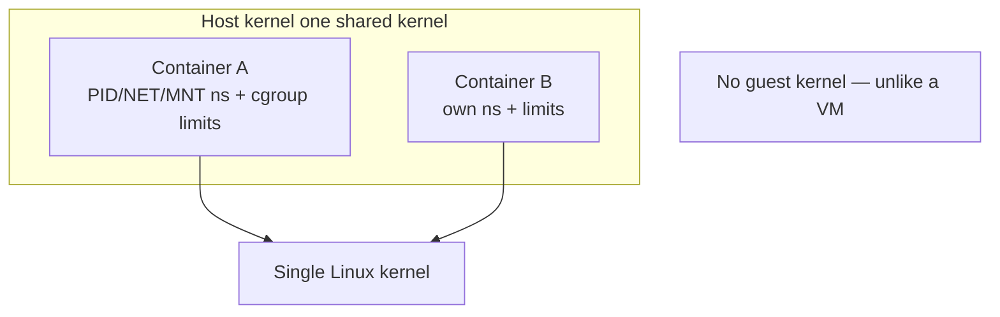

# Containers: Namespaces & cgroups

> A container is a process (or group) that *thinks* it has its own machine, achieved not by
> [virtualizing hardware](./virtual-machines.md) but by Linux kernel features that **isolate
> what a process sees** (namespaces) and **limit what it can use** (cgroups).

## Problem
[VMs](./virtual-machines.md) give strong isolation but are heavy — a full guest kernel, GBs
of image, seconds to boot. We often just want to **package an app with its dependencies** and
run many isolated instances densely and instantly, sharing one kernel. The insight: you don't
need a second kernel — you need the *one* kernel to give each process group its own private
*view* of the system and a *cap* on its resources. That's a container.

## Core concepts

A container is **not a thing the kernel knows about** — it's a normal process wrapped in two
kernel mechanisms (plus a packaged filesystem):

**1. Namespaces — isolate what a process *sees*.** Each namespace virtualizes one kind of
global resource so the process sees only its own slice:
| Namespace | Isolates | Effect |
| --- | --- | --- |
| **PID** | Process IDs | container's first process is PID 1; can't see host processes |
| **MNT** | Mount points | its own filesystem tree (with `pivot_root`) |
| **NET** | Network stack | own interfaces, IPs, routes, ports |
| **UTS** | Hostname | its own hostname |
| **IPC** | SysV IPC / queues | isolated [IPC](../processes-scheduling/ipc.md) |
| **USER** | UID/GID mapping | root *inside* maps to unprivileged *outside* |
| **CGROUP** | cgroup view | hides the host cgroup hierarchy |

**2. cgroups (control groups) — limit what it can *use*.** Hierarchically cap and account
CPU, memory, block I/O, PIDs, etc. `memory.max` triggers the OOM killer at the limit;
`cpu.max` throttles [CPU time](../processes-scheduling/cpu-scheduling.md); `pids.max` stops
fork bombs. Isolation (namespaces) + resource control (cgroups) = a container.

**3. The image / root filesystem.** A **union/overlay filesystem** (overlayfs) stacks
read-only image **layers** with a thin writable layer on top. Layers are shared and cached,
so launching 100 containers from one image costs almost nothing extra. `pivot_root` makes
that tree the container's `/`.



**Security hardening.** Because containers share the host kernel, a kernel exploit can escape.
So runtimes layer on **seccomp** (filter dangerous [syscalls](../fundamentals/system-calls.md)),
**capabilities** (drop most root powers), **user namespaces** (root-in-container ≠ root-on-host),
**AppArmor/SELinux**, and read-only mounts. For untrusted code, wrap containers in
lightweight VMs (gVisor, Kata, Firecracker).

## Example
You can build a container by hand — that's all Docker does (see the
[lab](../../3-practice/project-container-from-scratch.md)):

```bash
# New UTS+PID+mount+net namespaces, then run a shell as "PID 1" inside:
sudo unshare --pid --net --mount --uts --fork --mount-proc bash
hostname container1            # changing hostname doesn't affect the host (UTS ns)
ps aux                         # only sees processes in THIS pid namespace
# Cap memory via a cgroup (v2):
sudo mkdir /sys/fs/cgroup/demo
echo 50M | sudo tee /sys/fs/cgroup/demo/memory.max
echo $$  | sudo tee /sys/fs/cgroup/demo/cgroup.procs   # this shell now capped at 50M
```

That's the whole trick: namespaces for the view, a cgroup for the limit, an overlay rootfs for
the files.

## Common tools
| Tool | What it is | Use it for |
| --- | --- | --- |
| **Docker / Podman** | Container engines | build/run images, the everyday UX |
| **containerd / CRI-O** | Container runtimes | the daemon under Docker/Kubernetes |
| **runc / crun** | Low-level OCI runtimes | actually call `clone()` + set up ns/cgroups |
| `unshare`, `nsenter`, `lsns` | Namespace tools | create/enter/list namespaces by hand |
| **Kubernetes** | Orchestrator | scheduling containers across a cluster |
| **gVisor / Kata** | Sandboxed runtimes | extra isolation for untrusted workloads |

## Trade-offs
- ✅ Lightweight (MBs, ms to start), dense, fast, reproducible packaging; share the host
  kernel → near-native performance.
- ⚠️ **Weaker isolation than VMs** — one shared kernel means a kernel bug can be an escape;
  needs seccomp/userns/etc. hardening.
- ⚠️ Can't run a different kernel/OS (Linux containers need a Linux kernel; "Docker on Mac/
  Windows" runs a hidden Linux VM).
- ⚠️ Footguns: running as root, missing init → [zombies](../processes-scheduling/process-lifecycle.md),
  unbounded resources without cgroup limits.

## Real-world examples
- **Docker** popularized the UX; under it, **containerd** + **runc** do the namespace/cgroup work.
- **Kubernetes** schedules billions of containers; pods share some namespaces (net) between
  containers.
- **AWS Lambda / Fargate** run containers inside **Firecracker** microVMs to combine container
  ergonomics with [VM](./virtual-machines.md) isolation. Deep-dive:
  [container internals case study](../../2-case-studies/container-internals.md).

## References
- [man 7 namespaces](https://man7.org/linux/man-pages/man7/namespaces.7.html),
  [man 7 cgroups](https://man7.org/linux/man-pages/man7/cgroups.7.html)
- [OCI Runtime Spec](https://github.com/opencontainers/runtime-spec)
- Liz Rice, *Container Security*; "Containers from Scratch" talks
