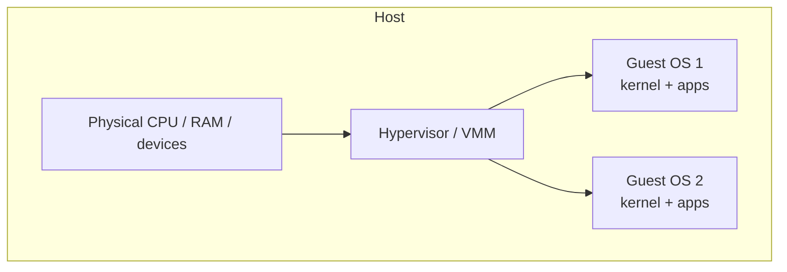

# Virtual Machines & Hypervisors

> A **hypervisor** runs multiple complete operating systems on one physical machine, each in
> an isolated **virtual machine** with virtualized CPU, memory, and devices. It's the
> foundation of cloud computing.

## Problem
Servers were chronically underused — one OS per physical box, mostly idle, yet you couldn't
safely run untrusted or incompatible workloads together. We want to **consolidate** many
workloads onto one machine with strong isolation, run **different OSes** side by side,
**snapshot/migrate** running systems, and rent compute by the slice. The hypervisor delivers
this by virtualizing the hardware itself, so each guest believes it owns a whole machine.

## Core concepts

**The hypervisor (VMM)** sits below the guest OSes and does for *whole operating systems*
what an OS does for processes: multiplexes the CPU, partitions memory, and mediates I/O —
but the thing being scheduled is an entire guest kernel.



**Type 1 vs Type 2:**
- **Type 1 (bare-metal)** — the hypervisor runs directly on hardware (ESXi, Xen, Hyper-V,
  KVM*). Lower overhead; the cloud standard.
- **Type 2 (hosted)** — runs as an app on a host OS (VirtualBox, VMware Workstation).
  Convenient for desktops.
- *KVM turns the Linux kernel itself into a Type 1 hypervisor.*

**The hard part: virtualizing the CPU.** A guest kernel expects to run privileged
instructions in ring 0, but it can't be trusted with the real hardware. Approaches:
- **Trap-and-emulate** — run the guest deprivileged; privileged instructions trap to the
  hypervisor, which emulates them. (Classic, but x86 had non-trapping privileged ops.)
- **Binary translation** — rewrite problematic guest instructions on the fly (early VMware).
- **Paravirtualization** — modify the guest to call the hypervisor explicitly (Xen).
- **Hardware-assisted** (Intel **VT-x**, AMD-V) — a CPU "guest mode" that traps the right
  things automatically. The modern default; fast and unmodified-guest-friendly.

**Virtualizing memory.** The guest has its *own* [page tables](../memory/paging.md) mapping
guest-virtual → guest-physical, but guest-physical isn't real RAM. Hardware **nested/extended
page tables (EPT/NPT)** add a second translation guest-physical → host-physical, so the MMU
does both walks without the hypervisor trapping every page-table change.

**Virtualizing I/O.** Either **emulate** familiar devices (slow), use **paravirtual** drivers
(**virtio** — guest cooperates for near-native speed), or **pass through** a real device to a
guest (**SR-IOV**, GPU passthrough) for bare-metal performance.

**VMs vs [containers](./containers.md).** A VM virtualizes *hardware* and runs a full guest
kernel → strong isolation, heavier (GBs, seconds to boot). A container virtualizes the *OS*
(shares the host kernel) → lightweight (MBs, ms to start), weaker isolation. Modern clouds
combine them: lightweight VMs (Firecracker) wrapping containers for both speed and isolation.

## Example
KVM exposes virtualization as a device; the typical stack:

```
QEMU (device model + I/O)  ──ioctl──▶  /dev/kvm (in-kernel hypervisor)  ──▶  VT-x/AMD-V
   └ emulates disks/NICs (or virtio)          └ runs guest in CPU "guest mode"

# Launch a VM (libvirt/QEMU), with virtio for fast disk/net:
qemu-system-x86_64 -enable-kvm -m 4G -smp 4 \
   -drive file=guest.qcow2,if=virtio -netdev user,id=n -device virtio-net,netdev=n
```

`-enable-kvm` uses hardware assist (fast); without it QEMU *emulates* the CPU (slow but
runs other architectures).

## Common tools
| Tool | What it is | Use it for |
| --- | --- | --- |
| **KVM + QEMU** | Linux hypervisor + emulator | the open-source cloud virtualization stack |
| **libvirt** / `virsh` | Management API | defining, starting, snapshotting VMs |
| **VMware ESXi / Xen / Hyper-V** | Type-1 hypervisors | enterprise & cloud hosts |
| **virtio** | Paravirtual drivers | fast guest disk/network/balloon |
| **Firecracker** | microVM monitor | fast, minimal VMs for serverless (AWS Lambda) |

## Trade-offs
- ✅ Strong isolation (separate kernels), run any OS, consolidate hardware, snapshot &
  **live-migrate** running VMs, the basis of IaaS clouds.
- ⚠️ Overhead vs bare metal (CPU/memory/I/O virtualization cost — small with HW assist +
  virtio) and heavier footprint than containers.
- ⚠️ "Noisy neighbor" contention; nested page-table walks; device emulation latency.
- Security: strong but not perfect — side-channel and VM-escape vulnerabilities exist.

## Real-world examples
- **AWS EC2 / GCP / Azure** — sell VMs; AWS's **Nitro** offloads virtualization to dedicated
  hardware for near-bare-metal performance.
- **AWS Lambda / Fargate** — **Firecracker** microVMs boot in ~125 ms, giving VM isolation at
  container speed.
- **Live migration** — VMware vMotion / KVM moves running VMs between hosts with no downtime.

## References
- OSTEP — "Virtual Machine Monitors"
- Popek & Goldberg (1974) — formal virtualization requirements
- [KVM](https://www.linux-kvm.org/), [Firecracker](https://firecracker-microvm.github.io/)
