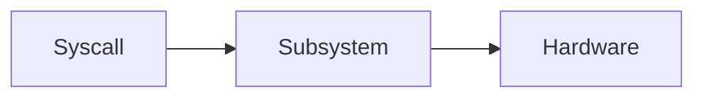

# Case Study: <Subsystem / Kernel>

> One-line description of what we're dissecting.

## 1. What it has to solve
The requirements and constraints this subsystem faces (workloads, hardware,
goals like fairness, throughput, latency, durability).

## 2. Design goals & constraints
What the designers optimized for, and the hardware/compat limits they worked under.

## 3. Architecture

## 4. Key data structures
The structs/tables at the heart of it (e.g. `task_struct`, red-black tree, inode).

## 5. Deep dives
The hard parts — the algorithm, the locking, the edge cases, how it evolved.

## 6. Trade-offs & limitations
What it gives up, where it struggles, how it has changed over versions.

## 7. References
- ...
