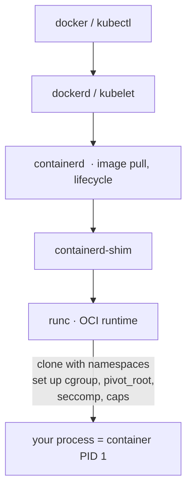

# Case Study: Container Internals — Namespaces + cgroups

> What actually happens when you `docker run` — there is no "container" object in the kernel,
> just an ordinary process wrapped in namespaces, cgroups, and an overlay filesystem.

## 1. What it has to solve
Package an app with its dependencies and run many isolated instances **densely** and
**instantly**, sharing one host kernel (unlike [VMs](../1-knowledge/virtualization/virtual-machines.md)),
while bounding each instance's resources and limiting the blast radius if one is compromised.
The challenge: deliver the *illusion* of a private machine without a second kernel. The
building blocks are covered in [containers](../1-knowledge/virtualization/containers.md);
here we trace the full stack.

## 2. Design goals & constraints
- **Lightweight & fast** — MBs and milliseconds, not GBs and seconds.
- **Reproducible** — the same image runs identically anywhere there's a compatible kernel.
- **Isolated enough** — separate process/network/filesystem views + resource caps.
- **Composable & standardized** — image and runtime formats (OCI) so tools interoperate.

## 3. Architecture — the runtime stack

The high-level engine (Docker/Kubernetes) handles UX and images; **containerd** manages
lifecycle; **runc** does the actual kernel calls and then `exec`s your program. After setup,
the "container" is just that process.

## 4. Key mechanisms (the "data structures" here are kernel features)
- **Namespaces** — isolate *what the process sees*: PID, MNT, NET, UTS, IPC, USER, CGROUP,
  TIME. (`clone(... CLONE_NEWPID | CLONE_NEWNET | ...)`.)
- **cgroups v2** — limit *what it can use*: `memory.max`, `cpu.max`, `pids.max`, `io.max`.
- **Overlay filesystem** — stack read-only image layers + a writable layer = the root FS.
- **Capabilities, seccomp, LSM** — shrink the process's privileges and allowed
  [syscalls](../1-knowledge/fundamentals/system-calls.md).

## 5. Deep dives

**Step by step, what `runc` does to start a container:**
1. **`clone()`** a child with new namespaces — instantly the child has its own PID space (it's
   PID 1 inside), its own network stack, its own mount table, hostname, IPC.
2. **Set up the root filesystem** — mount the **overlay** (image layers + writable upper),
   then **`pivot_root`** so the container sees that as `/` and can't reach the host tree.
   Mount a fresh `/proc` (reflecting the PID namespace), `/sys`, `/dev`.
3. **Join a cgroup** — write the PID into a cgroup with the configured limits; now the kernel
   enforces CPU/memory/PID/IO caps and accounts usage.
4. **Drop privileges** — apply the **seccomp** profile (Docker's default blocks ~44 dangerous
   syscalls), drop **capabilities** (keep a minimal set), set the UID (ideally via a **user
   namespace** so root-in-container ≠ root-on-host), apply AppArmor/SELinux.
5. **`execve()`** the target program — it becomes the container's main process.

**Networking.** The NET namespace starts with only `lo`. The engine creates a **veth pair**:
one end inside the namespace (`eth0`), one on the host attached to a **bridge** (`docker0`),
with NAT/iptables for outbound and port-forwarding for inbound. Kubernetes replaces this with
a **CNI** plugin for pod-to-pod routing across nodes.

**Images & layers.** An image is an ordered stack of **content-addressed** (SHA-256) layers.
Overlayfs presents them as one tree; the writable upper layer captures changes via
**copy-up** (modifying a file copies it up from a lower layer). Shared lower layers mean 100
containers from one image share the read-only bytes — tiny marginal cost and fast startup.

**Why isolation is weaker than a VM.** All containers share **one kernel**. A kernel
vulnerability (or a misconfigured `--privileged` container, a mounted Docker socket, a leaked
capability) can become a host escape. Defenses: user namespaces, seccomp, read-only rootfs,
dropping `CAP_SYS_ADMIN`, and for untrusted workloads a sandboxed runtime — **gVisor**
(intercepts syscalls in a userspace kernel) or **Kata/Firecracker** (a real lightweight
[VM](../1-knowledge/virtualization/virtual-machines.md) per container).

**Common footguns.** Running as root inside; no init to reap
[zombies](../1-knowledge/processes-scheduling/process-lifecycle.md) (use `--init`); no cgroup
memory limit (one container OOMs the host); thinking containers are a security boundary as
strong as VMs.

## 6. Trade-offs & limitations
- ✅ Near-native performance, dense, instant, reproducible; the whole cloud-native stack.
- ⚠️ Shared-kernel isolation is weaker than VMs → needs layered hardening or microVM wrapping.
- ⚠️ Linux-kernel-bound: "Docker on Mac/Windows" secretly runs a Linux VM.
- ⚠️ Easy to misconfigure into insecure or unbounded states.

Build one by hand — exactly these steps — in the
[container-from-scratch lab](../3-practice/project-container-from-scratch.md).

## 7. References
- [man 7 namespaces](https://man7.org/linux/man-pages/man7/namespaces.7.html),
  [man 7 cgroups](https://man7.org/linux/man-pages/man7/cgroups.7.html)
- [OCI Runtime Spec](https://github.com/opencontainers/runtime-spec), [runc](https://github.com/opencontainers/runc)
- Liz Rice, *Container Security* / "Containers from Scratch"
