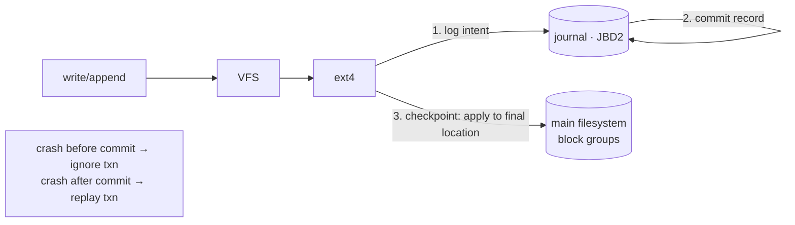

# Case Study: ext4 & Journaling File Systems

> How Linux's default file system stays **consistent across crashes** — the journal that
> turns "many block writes" into an all-or-nothing transaction, plus the extents and
> allocation tricks that make it fast.

## 1. What it has to solve
A single logical operation — "append to a file" — touches several on-disk structures: the
data block, the [inode](../1-knowledge/storage-fs/file-systems.md) (size, mtime, block
pointers), and the free-space bitmaps. If power fails *between* those writes, the file system
is **inconsistent**: an inode pointing at a block the bitmap thinks is free, or a file whose
size doesn't match its blocks. ext4 must guarantee that after a crash the FS comes back
**consistent** in seconds — not after an hours-long `fsck`.

## 2. Design goals & constraints
- **Crash consistency** without full-disk `fsck` on every boot.
- **Backward compatibility** — ext4 can mount ext2/ext3 volumes; an evolution, not a rewrite.
- **Performance** — large files, big volumes, fast allocation, low fragmentation.
- **Durability semantics** — honor `fsync` so databases can guarantee persistence.

## 3. Architecture

## 4. Key data structures
- **Block groups** — the volume is split into groups, each with its own inode table, bitmaps,
  and data blocks, so an inode sits near its data (fewer seeks).
- **Inode with extents** — instead of ext2/3's block-pointer lists, ext4 uses **extents**:
  `(start_block, length)` ranges. One extent can map thousands of contiguous blocks →
  compact metadata and fast sequential I/O for large files.
- **The journal (JBD2)** — a circular on-disk log (usually inside the FS) recording
  transactions before they hit their final location.
- **Superblock + group descriptors** — global geometry and per-group summaries.

## 5. Deep dives

**Journaling = write-ahead logging for the file system.** Before modifying the real
structures, ext4 writes the intended changes to the journal, then a **commit** record. Only
later does it **checkpoint** (apply them to their home locations). Crash recovery on mount is
simple: **replay** committed transactions, **discard** uncommitted ones. Either the whole
operation happened or none of it did — no half-states. (Same idea as a database WAL or
[CQRS event log](../../system-design/1-knowledge/patterns/cqrs-event-sourcing.md).)

**Three journaling modes** — the metadata-vs-data trade-off:
| Mode | Journals | Guarantee | Cost |
| --- | --- | --- | --- |
| `journal` | Metadata **and** data | Strongest; data never half-written | Slowest (everything written twice) |
| `ordered` (default) | Metadata only, but **data written before** the metadata commit | No metadata points at stale/garbage data | Good balance |
| `writeback` | Metadata only, no ordering | Fastest; metadata consistent but a file may show **stale** bytes after a crash | Risky |

The default **`ordered`** is the key insight: you don't need to journal *data* (expensive)
if you simply force data blocks to disk *before* committing the metadata that references
them — so a recovered inode never points at uninitialized blocks.

**Why journaling isn't double the cost in practice.** The journal write is **sequential**
(fast, even on HDD), batches many operations per commit, and metadata is small. Checkpointing
happens lazily in the background. So `ordered` mode adds modest overhead for a huge safety win.

**Performance features:**
- **Extents** + **delayed allocation** (decide block placement at writeback, when the full
  size is known) → large contiguous runs, less fragmentation.
- **Multiblock allocator** + **block groups** keep related data together.
- **`fsync` semantics** — ext4 forces a file's data + metadata to durable storage so
  databases can promise durability; getting this right (and the famous 2009 ext4 "rename +
  delayed-alloc data loss" debate) shaped how apps must `fsync` before `rename`.

**Beyond journaling — copy-on-write FSes.** Btrfs/ZFS take a different route: never overwrite
in place; write new blocks and atomically switch a pointer (so the old version is always
intact). That gives snapshots and checksums for free, at the cost of more fragmentation and
write amplification — a different point on the [consistency](../1-knowledge/storage-fs/file-systems.md)
spectrum.

## 6. Trade-offs & limitations
- ✅ Fast crash recovery (seconds), mature, stable, great general-purpose performance.
- ⚠️ Journaling adds write overhead and (in `data=journal`) doubles data writes.
- ⚠️ Default `ordered` protects *metadata* consistency, not *application* atomicity — apps
  still need `fsync`+atomic `rename` for their own crash safety.
- ⚠️ No data checksums (can't detect silent bit-rot) — that's a Btrfs/ZFS feature.
- ⚠️ `fsck` on a huge ext4 volume is still slow if the journal can't help (deep corruption).

## 7. References
- [ext4 documentation](https://docs.kernel.org/filesystems/ext4/)
- OSTEP — "Crash Consistency: FSCK and Journaling"
- *The Linux Programming Interface* — Kerrisk (file I/O & `fsync`)
