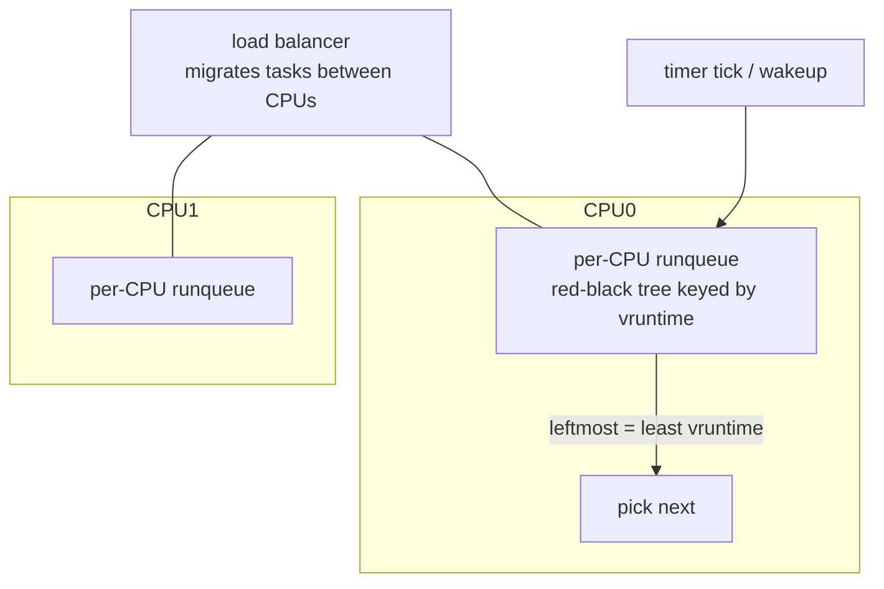

# Case Study: The Linux CPU Scheduler (CFS → EEVDF)

> How Linux decides which task runs next on each CPU — the Completely Fair Scheduler that
> ruled 2007–2023, and **EEVDF** which replaced it in kernel 6.6.

## 1. What it has to solve
One scheduler must serve wildly different workloads on the same machine: a video call that
needs **low latency**, a kernel build that wants **throughput**, hundreds of mostly-idle
daemons, and all of it across **many CPUs** without becoming a bottleneck itself. It must be
**fair** (no task starves), honor **priorities** (`nice`), and make the scheduling decision
in **O(log n)** even with thousands of runnable tasks — thousands of times per second. See
the theory in [CPU scheduling](../1-knowledge/processes-scheduling/cpu-scheduling.md).

## 2. Design goals & constraints
- **Fairness** — each task gets a CPU share proportional to its weight (from `nice`).
- **No tunable timeslices** — earlier O(1) scheduler had fragile heuristics to detect
  "interactive" tasks; CFS aimed to drop heuristics for a principled model.
- **Scalability** — **per-CPU run queues** (no global lock); cheap "pick next."
- **Good interactivity** — I/O-bound tasks that sleep a lot should preempt CPU hogs naturally.

## 3. Architecture

Each CPU has its own runqueue; a periodic **load balancer** migrates tasks to keep CPUs
evenly loaded (respecting cache/NUMA locality via *scheduling domains*).

## 4. Key data structures
- **`task_struct`** — the [PCB](../1-knowledge/processes-scheduling/process-lifecycle.md);
  its `sched_entity` holds scheduling state.
- **`vruntime`** (virtual runtime) — accumulated CPU time, **scaled by the task's weight**.
  A low-priority task's vruntime advances *faster* (so it's picked less); a high-priority
  task's advances slower.
- **Red-black tree** — runnable tasks ordered by `vruntime`. The **leftmost node** is the
  task that has received the least fair-share time → run it next. Insert/remove/pick are all
  **O(log n)**.

## 5. Deep dives

**CFS in one sentence:** *always run the task with the smallest `vruntime`.* Because
vruntime is weighted by `nice`, this automatically delivers proportional fairness — a
task at `nice -5` accrues vruntime slower and so gets a bigger slice.

**Why interactive tasks feel snappy.** A task that sleeps (waiting on I/O) isn't accruing
vruntime, so when it wakes its vruntime is *low* relative to CPU hogs → it becomes leftmost
→ it preempts and runs immediately. No "interactive heuristic" needed; it falls out of the
math. (A small floor prevents a long-sleeping task from monopolizing the CPU on wakeup.)

**Granularity vs overhead.** Instead of fixed quanta, CFS computes a dynamic slice from a
target *scheduling latency* divided among runnable tasks (with a floor,
`sched_min_granularity`, so slices don't shrink to uselessness under load — which would
cause excessive [context switching](../1-knowledge/processes-scheduling/context-switching.md)).

**Group scheduling & cgroups.** CFS schedules *hierarchically*: a [cgroup](../1-knowledge/virtualization/containers.md)
gets a fair share first, then tasks within it share that. This is how containers get CPU
limits (`cpu.max`) and weights (`cpu.weight`) — essential for multi-tenant fairness.

**Why EEVDF replaced CFS (6.6, 2023).** Pure "least vruntime" optimizes throughput-fairness
but has no notion of *deadlines* — a latency-sensitive task couldn't say "I need to run
soon, even if briefly." **EEVDF** (Earliest Eligible Virtual Deadline First) adds:
- **Lag** — how far ahead/behind fair share each task is (positive lag = owed time).
- A per-task **virtual deadline**; among *eligible* tasks (non-negative lag), run the one
  with the **earliest deadline**. A `latency-nice`/`sched_attr` hint lets tasks request
  shorter slices for responsiveness without changing their CPU *share*.
This cleanly separates "how much CPU" (weight) from "how soon" (latency) — something CFS
conflated.

## 6. Trade-offs & limitations
- ✅ Principled, heuristic-free fairness; O(log n) scalable; per-CPU queues; cgroup-aware.
- ⚠️ Fairness ≠ latency: CFS needed `latency-nice` bolt-ons; EEVDF addresses this directly.
- ⚠️ Not for *hard* real-time — use `SCHED_FIFO`/`SCHED_RR`/`SCHED_DEADLINE` (separate
  classes that always preempt CFS).
- ⚠️ Load balancing across NUMA is heuristic; misplaced tasks suffer cache/memory penalties.
- The scheduler is a *policy* layer over the [context-switch](../1-knowledge/processes-scheduling/context-switching.md)
  mechanism — its decisions are only as good as the timer tick / wakeup events that drive it.

## 7. References
- [CFS design](https://docs.kernel.org/scheduler/sched-design-CFS.html)
- [An EEVDF CPU scheduler for Linux (LWN)](https://lwn.net/Articles/925371/)
- OSTEP — "Scheduling," "Proportional-Share"
