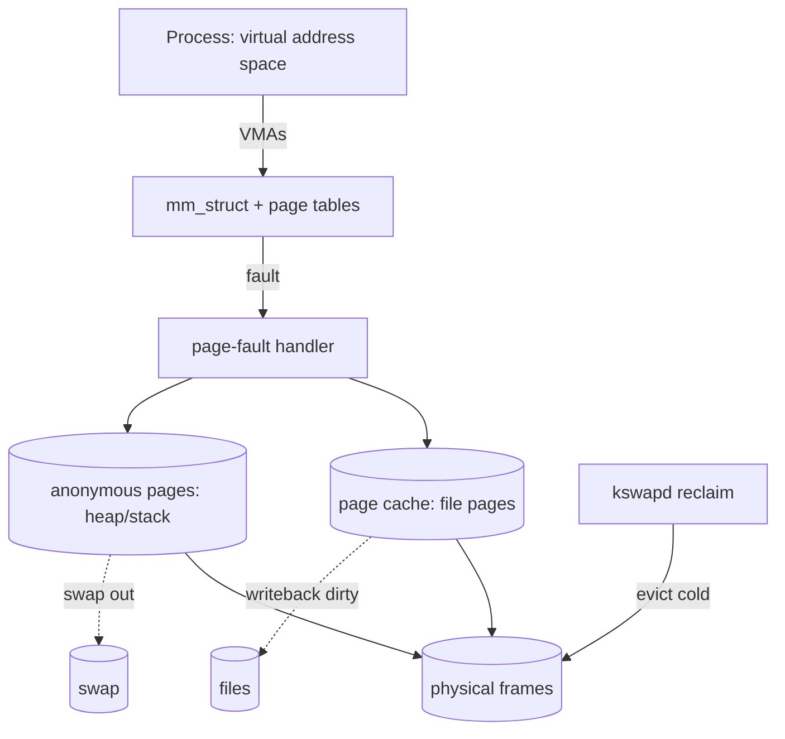

# Case Study: Linux Virtual Memory & the Page Cache

> How Linux manages every process's address space and turns free RAM into a giant cache for
> the file system — the machinery behind `mmap`, `fork`, swap, and "why is my RAM full?"

## 1. What it has to solve
Give each process a private [virtual address space](../1-knowledge/memory/virtual-memory.md),
back it lazily with physical frames, share frames where possible (libraries, COW), cache
file data so disk is touched rarely, and reclaim memory gracefully under pressure — all while
keeping the [TLB](../1-knowledge/memory/paging.md) hot and avoiding thrashing. It must do
this for thousands of processes on hardware from phones to 1000-core servers.

## 2. Design goals & constraints
- **Lazy everything** — allocate frames only on first touch (demand paging); copy only on
  write (COW).
- **Use all free RAM** — idle RAM is wasted RAM, so cache file contents aggressively, but
  give it back instantly when processes need it.
- **Unified** — file cache and process memory draw from one frame pool with one reclaim policy.
- **Scalable reclaim** — find cold pages cheaply without scanning everything.

## 3. Architecture

## 4. Key data structures
- **`mm_struct`** — one per process: the page-table root + the list/tree of **VMAs**.
- **VMA (`vm_area_struct`)** — a contiguous region with uniform permissions (a mapped file,
  the heap, a library). A fault consults the VMA to decide how to service it.
- **`struct page` / `folio`** — one descriptor per physical frame (recent kernels group them
  into **folios** to cut per-page overhead).
- **Page cache (address_space + xarray)** — maps `(file, offset) → cached frame`.
- **Reverse mapping (rmap)** — given a frame, find every page table mapping it (needed to
  unmap on eviction).

## 5. Deep dives

**The fault is the engine.** Almost everything is lazy and driven by the
[page-fault handler](../1-knowledge/fundamentals/interrupts-and-traps.md):
- **Anonymous fault** (heap/stack first touch) → grab a zeroed frame, map it.
- **File fault** (`mmap`'d or executed) → if the page is in the **page cache**, just map it
  (a *minor* fault); else read from disk (a *major* fault), cache it, map it.
- **COW fault** (write to a [`fork`](../1-knowledge/fundamentals/process-vs-thread.md)-shared,
  read-only page) → copy that one frame, remap writable.

**The page cache is the star.** Every file read/write goes through it: `read()` copies from
cached frames (or faults them in); `write()` dirties cached frames flushed later by
**writeback**. This is why `free` shows little "free" RAM but lots of "buff/cache" — that
memory is *available*, instantly reclaimable. `mmap`'ing a file just exposes its page-cache
pages directly in your address space (zero-copy).

**Reclaim & the two-list LRU.** When frames run low, **`kswapd`** (and direct reclaim)
approximates [LRU](../1-knowledge/memory/page-replacement.md) with **active** and
**inactive** lists. New/referenced pages live on active; pages age to inactive; cold inactive
pages are evicted — clean file pages dropped for free, dirty pages written back, anonymous
pages pushed to **swap**. The two-list design resists a big sequential scan blowing away the
hot working set (scan resistance). `vm.swappiness` biases anon-vs-file eviction.

**Over-commit & the OOM killer.** Because of lazy allocation and COW, Linux hands out more
virtual memory than it has RAM+swap (`vm.overcommit_memory`). When promises are actually
demanded and reclaim can't keep up, the **OOM killer** picks a victim by `oom_score`
(roughly: biggest memory hog, adjustable per-process/cgroup).

**Huge pages & TLB.** THP (transparent huge pages) and hugetlbfs back big regions with
2 MiB/1 GiB pages so each TLB entry covers more — big wins for databases/JVMs, at the cost of
compaction work and occasional latency spikes.

**cgroup memory control.** `memory.max`/`memory.high` bound a
[container's](../1-knowledge/virtualization/containers.md) footprint and trigger
per-cgroup reclaim or a scoped OOM kill — multi-tenant memory isolation.

## 6. Trade-offs & limitations
- ✅ Lazy, shared, cache-everything design maximizes throughput and RAM utilization.
- ⚠️ Over-commit means failures surface late, as OOM kills rather than `malloc` returning NULL.
- ⚠️ Reclaim is heuristic; pathological scans or memory pressure cause latency spikes/thrash.
- ⚠️ THP can cause tail-latency jitter (some DBs disable it).
- "Why is my RAM full?" is usually the page cache doing its job — a feature, not a leak.

## 7. References
- [Linux memory management docs](https://docs.kernel.org/admin-guide/mm/)
- *Understanding the Linux Virtual Memory Manager* — Mel Gorman
- OSTEP — "Beyond Physical Memory: Policies"
