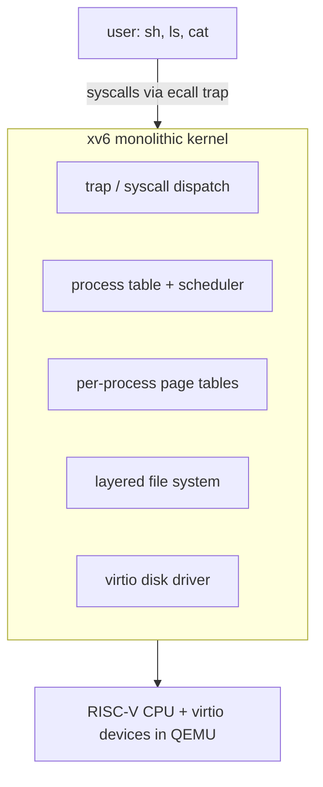

# Case Study: xv6 — a Clean Teaching Unix

> xv6 is a tiny, readable re-implementation of Unix v6 (MIT 6.1810) — small enough to read
> end-to-end in a weekend, complete enough to show how *every* OS concept fits together in
> real code.

## 1. What it has to solve
Real kernels (Linux is ~30M lines) are impossible to learn from directly. xv6's goal is
**pedagogy**: implement the genuine Unix abstractions — processes, `fork`/`exec`, a
scheduler, virtual memory, a file system, system calls — in ~9,000 lines of clean C you can
actually read, on a simple platform (RISC-V), so the concepts from the
[Knowledge section](../1-knowledge/) appear as concrete, working code.

## 2. Design goals & constraints
- **Readability over performance** — simple algorithms, no clever optimizations.
- **Authenticity** — the same *abstractions* and syscall shapes as real Unix, so lessons transfer.
- **Completeness** — boots, runs a shell, multitasks, has a crash-consistent FS.
- **Small** — fits in a textbook; a student can modify any part.

## 3. Architecture

A classic **monolithic** kernel (like [Linux's shape](../1-knowledge/fundamentals/what-is-an-os.md)),
run under QEMU so no real hardware is needed.

## 4. Key data structures
- **`struct proc`** — the [PCB](../1-knowledge/processes-scheduling/process-lifecycle.md):
  state, page table, trapframe (saved registers), kernel stack, open files, parent pointer.
- **`struct context`** — the registers swapped on a
  [context switch](../1-knowledge/processes-scheduling/context-switching.md) (`swtch.S`).
- **Page tables** — RISC-V Sv39 3-level [page tables](../1-knowledge/memory/paging.md);
  every process has its own, plus a kernel page table.
- **The file system layers** — `inode`, the log (journal), `buf` cache, `file`/`fd` tables.

## 5. Deep dives — concepts made concrete

**`fork`/`exec`/`wait` in real code.** `fork()` allocates a `proc`, copies the parent's page
table (xv6 copies eagerly; real Linux uses [COW](../1-knowledge/memory/virtual-memory.md)),
duplicates the file-descriptor table, and returns twice. `exec()` builds a brand-new address
space from an ELF binary and switches to it. `wait()`/`exit()` implement the
parent/child/[zombie](../1-knowledge/processes-scheduling/process-lifecycle.md) lifecycle.
Reading these ~200 lines makes [process vs thread](../1-knowledge/fundamentals/process-vs-thread.md)
click instantly.

**The trap path.** A [syscall](../1-knowledge/fundamentals/system-calls.md) (`ecall`), a timer
[interrupt](../1-knowledge/fundamentals/interrupts-and-traps.md), or a fault all funnel
through one assembly trampoline that saves the trapframe, switches to the kernel page table,
and calls C dispatch — the single chokepoint between user and kernel you read about in
[kernel vs user space](../1-knowledge/fundamentals/kernel-user-space.md), here in 50 lines.

**The scheduler.** A dead-simple **round-robin** over the process table: each CPU's
`scheduler()` loops, finds a RUNNABLE proc, `swtch`es to it; the timer interrupt yields back.
No vruntime, no red-black tree — the bare mechanism, so you understand what
[CFS](./linux-cfs-scheduler.md) elaborates.

**Virtual memory you can trace.** Page tables are built by hand (`mappages`, `walk`); you can
see exactly how a virtual address becomes physical, how the kernel maps itself, and how each
process gets an isolated space — the [paging](../1-knowledge/memory/paging.md) theory as
executable code. (Recent xv6 adds COW-fork and lazy-allocation labs.)

**A real journaling file system.** xv6's FS is layered: disk → buffer cache → **logging**
(a mini [journal](./ext4-journaling.md) for crash consistency) → inodes → directories → path
names → file descriptors. It implements *write-ahead logging* in a form small enough to read,
showing how [file systems](../1-knowledge/storage-fs/file-systems.md) and crash consistency
actually work.

**The labs.** 6.1810 ships assignments — add a syscall, implement COW fork, a user-level
thread switch, a copy-on-write allocator, `mmap`, a faster FS — each forcing you to *modify*
the kernel, the fastest way to truly learn OS internals.

## 6. Trade-offs & limitations
- ✅ Unmatched clarity; the whole OS is legible; concepts ↔ code map directly; great labs.
- ⚠️ Not production: eager fork-copy, round-robin scheduler, single-threaded-ish locking, no
  paging-to-disk, tiny FS — deliberately simple, so don't mistake it for how Linux *performs*.
- ⚠️ RISC-V + QEMU only; omits SMP scaling, modern security, device variety.
- The point is the *shape* of a Unix, not its speed — read it to understand, then read Linux
  to see what scale demands.

## 7. References
- [xv6: a simple, Unix-like teaching operating system (book + source)](https://pdos.csail.mit.edu/6.828/2023/xv6.html)
- MIT 6.1810 (formerly 6.828) course materials & labs
- Lions' *Commentary on UNIX 6th Edition* — the spiritual ancestor
