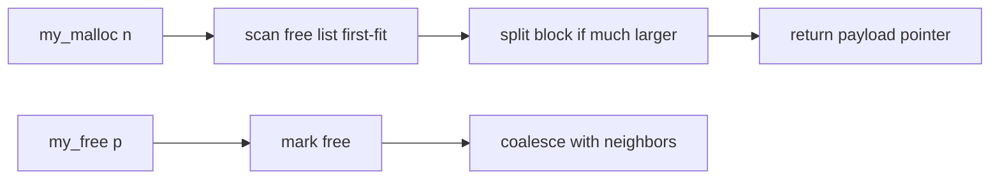

# Project: Write a `malloc` Allocator

> Implement your own heap allocator over a raw memory region. Building `malloc`/`free` makes
> [fragmentation, splitting, and coalescing](../1-knowledge/memory/segmentation-fragmentation.md)
> tangible — you'll see exactly where memory goes and why it gets wasted.

⏱️ ~60 min · 💰 free · 🐧 Linux/macOS · 🔧 C

## What you'll build
A first-fit, free-list allocator backed by one big `mmap`'d arena, with block **splitting** on
allocation and **coalescing** on free.



## Concepts you exercise
- [Allocation, free lists, splitting & coalescing](../1-knowledge/memory/segmentation-fragmentation.md)
- [Internal vs external fragmentation](../1-knowledge/memory/segmentation-fragmentation.md)
- [Virtual memory & `mmap`](../1-knowledge/memory/virtual-memory.md) — where the heap comes from
- Alignment — why allocators round up

## Build it
**`myalloc.c`** — a compact but real allocator (boundary tags + free list):
```c
#include <stdio.h>
#include <stddef.h>
#include <sys/mman.h>

typedef struct Block {
    size_t size;            // payload size
    int free;
    struct Block *next, *prev;   // address-ordered list of ALL blocks
} Block;

#define HDR sizeof(Block)
#define ALIGN(n) (((n) + 15) & ~((size_t)15))   // 16-byte alignment

static Block *base = NULL;
static size_t ARENA = 1 << 20;                   // 1 MiB heap

static void init(void) {
    base = mmap(NULL, ARENA, PROT_READ|PROT_WRITE, MAP_PRIVATE|MAP_ANONYMOUS, -1, 0);
    base->size = ARENA - HDR; base->free = 1; base->next = base->prev = NULL;
}

void *my_malloc(size_t want) {
    if (!base) init();
    want = ALIGN(want);
    for (Block *b = base; b; b = b->next) {
        if (b->free && b->size >= want) {
            if (b->size >= want + HDR + 16) {            // SPLIT: enough left for a new block
                Block *nb = (Block*)((char*)(b+1) + want);
                nb->size = b->size - want - HDR; nb->free = 1;
                nb->next = b->next; nb->prev = b;
                if (b->next) b->next->prev = nb;
                b->next = nb; b->size = want;
            }
            b->free = 0;
            return b + 1;                                // payload starts after header
        }
    }
    return NULL;                                         // arena exhausted
}

void my_free(void *p) {
    if (!p) return;
    Block *b = (Block*)p - 1;
    b->free = 1;
    if (b->next && b->next->free) {                      // COALESCE forward
        b->size += HDR + b->next->size;
        b->next = b->next->next;
        if (b->next) b->next->prev = b;
    }
    if (b->prev && b->prev->free) {                      // COALESCE backward
        b->prev->size += HDR + b->size;
        b->prev->next = b->next;
        if (b->next) b->next->prev = b->prev;
    }
}

void dump(void) {                                        // visualize the heap
    for (Block *b = base; b; b = b->next)
        printf("[%s %zu] ", b->free ? "free" : "used", b->size);
    printf("\n");
}

int main(void) {
    char *a = my_malloc(100); dump();      // [used 112][free ...]
    char *b = my_malloc(100); dump();
    char *c = my_malloc(100); dump();
    my_free(a); dump();                    // a free, not adjacent to other frees
    my_free(c); dump();
    my_free(b); dump();                    // now b coalesces with a AND c → one big free block
    (void)a;(void)b;(void)c;
    return 0;
}
```

## Run it
```bash
cc -O2 -o myalloc myalloc.c
./myalloc
# Watch the [used/free size] map change: splits on malloc, merges on free.
```

## What to observe & why
- **Splitting**: the first `malloc(100)` carves a 112-byte block off the front of the 1 MiB
  arena, leaving the remainder free. The allocator hands out *pieces* of big regions.
- **Coalescing is essential**: free `a` and `c` (non-adjacent) → you have two holes but
  `my_malloc(250)` would fail despite enough *total* free space — that's
  **[external fragmentation](../1-knowledge/memory/segmentation-fragmentation.md)**. Freeing
  `b` merges all three into one block → the big request now succeeds. This is *why* `free`
  coalesces.
- **Internal fragmentation**: ask for 100 bytes, get 112 (after 16-byte alignment) plus a
  header — the rounding waste you can't avoid with fixed alignment.
- **The heap is just `mmap`'d [virtual memory](../1-knowledge/memory/virtual-memory.md)** —
  pages aren't real RAM until you touch them (demand paging).

## Break it
- Remove coalescing → run a malloc/free loop with mixed sizes and watch the free list shatter
  into unusable slivers (fragmentation creep) until allocation fails.
- Write past the end of a payload → you'll corrupt the *next* block's header and crash on the
  next `free` — exactly how heap-overflow bugs work.

## Extend it
- **Free-list only** (skip used blocks) for faster allocation; or **segregated lists** per
  size class (how [jemalloc/tcmalloc](../1-knowledge/memory/segmentation-fragmentation.md) work).
- **Best-fit** vs first-fit — compare fragmentation on the same workload.
- Grow the arena with more `mmap` when full; add `realloc`.
- Override the real `malloc` (`LD_PRELOAD`) and run a real program on your allocator.
