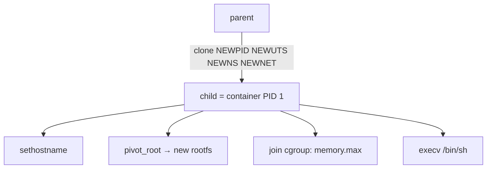

# Project: A Container from Scratch

> Build a container with raw Linux syscalls — `clone()` with namespaces, a cgroup limit, and
> `pivot_root`. After this you'll *know* there's no magic: a container is just a process, and
> [Docker](../2-case-studies/container-internals.md) does exactly these steps.

⏱️ ~60 min · 💰 free · 🐧 **Linux only** (needs root / sudo) · 🔧 C or shell

## What you'll build
A program that isolates a child's PID/UTS/mount/network view, caps its memory via a cgroup,
swaps its root filesystem, and runs a shell inside — a minimal `docker run`.



## Concepts you exercise
- [Containers: namespaces + cgroups](../1-knowledge/virtualization/containers.md)
- [Container internals (the full stack)](../2-case-studies/container-internals.md)
- [Process creation / clone](../1-knowledge/fundamentals/process-vs-thread.md)
- [Protection & least privilege](../1-knowledge/security/protection-access-control.md)

## The quick version (shell, to feel it first)
```bash
# New PID + UTS + mount + net namespaces; run bash as "PID 1" inside:
sudo unshare --pid --uts --mount --net --fork --mount-proc bash

# Inside the new namespaces:
hostname container1          # UTS ns: doesn't change the host's hostname
echo $$                     # you're PID 1 (or low) in the new PID namespace
ps aux                      # PID ns: you see ONLY processes in this namespace
ip link                     # NET ns: only 'lo' (DOWN) — fully isolated network
exit
```

## The real version (C — what `runc` does)
**`container.c`:**
```c
#define _GNU_SOURCE
#include <sched.h>
#include <stdio.h>
#include <stdlib.h>
#include <string.h>
#include <unistd.h>
#include <sys/mount.h>
#include <sys/syscall.h>
#include <sys/stat.h>
#include <sys/wait.h>

static char child_stack[1024 * 1024];

static int child(void *arg) {
    char *rootfs = arg;
    sethostname("container", 9);                       // UTS namespace

    // --- new mount namespace: make mounts private, then pivot into rootfs ---
    mount(NULL, "/", NULL, MS_REC | MS_PRIVATE, NULL); // don't leak mounts to host
    chdir(rootfs);
    mount(rootfs, rootfs, NULL, MS_BIND | MS_REC, NULL); // rootfs must be a mount point
    mkdir("oldroot", 0777);
    syscall(SYS_pivot_root, ".", "oldroot");           // make rootfs the new /
    chdir("/");
    umount2("/oldroot", MNT_DETACH);                    // unmount the old root
    mount("proc", "/proc", "proc", 0, NULL);           // fresh /proc for THIS pid ns

    char *argv[] = { "/bin/sh", NULL };
    execv("/bin/sh", argv);                             // become the container's main process
    perror("execv"); return 1;
}

int main(int argc, char **argv) {
    if (argc < 2) { fprintf(stderr, "usage: %s <rootfs-dir>\n", argv[0]); return 1; }
    int flags = CLONE_NEWPID | CLONE_NEWUTS | CLONE_NEWNS | CLONE_NEWNET | SIGCHLD;
    pid_t pid = clone(child, child_stack + sizeof child_stack, flags, argv[1]);
    if (pid < 0) { perror("clone"); return 1; }
    printf("container started as host PID %d\n", pid);
    waitpid(pid, NULL, 0);
    return 0;
}
```

**Add a memory cap with a cgroup v2** (before/around launch):
```bash
sudo mkdir /sys/fs/cgroup/mycontainer
echo 50M | sudo tee /sys/fs/cgroup/mycontainer/memory.max
# put the container's host PID into the cgroup:
echo <PID> | sudo tee /sys/fs/cgroup/mycontainer/cgroup.procs
```

## Run it
```bash
# Get a minimal rootfs (e.g. from an alpine image export, or busybox):
mkdir -p rootfs && docker export $(docker create alpine) | tar -C rootfs -xf -   # one easy way

cc -O2 -o container container.c
sudo ./container ./rootfs
# you're now in a shell that:
/ # hostname            # -> container
/ # ps aux              # -> only this shell (PID 1) — host processes invisible
/ # ls /                # -> the alpine rootfs, NOT the host's filesystem
/ # ip link             # -> isolated network (only lo)
```

## What to observe & why
- **You are PID 1 inside** — the PID namespace renumbers; the container can't see or signal
  host processes. (This is also why a container needs an init to reap
  [zombies](../1-knowledge/processes-scheduling/process-lifecycle.md).)
- **`pivot_root` swaps `/`** — the mount namespace gives a private mount table, so changing
  the root doesn't affect the host. The "image" is just a directory tree.
- **A fresh `/proc`** reflects the new PID namespace — that's why `ps` inside shows only
  container processes (it reads `/proc`).
- **The cgroup enforces `memory.max`** — run a memory hog inside and the kernel OOM-kills it at
  50 MB without touching the host. Isolation (namespaces) + limits (cgroups) = a container.
- **It's all one kernel** — `uname -r` inside shows the *host* kernel. No guest OS, unlike a
  [VM](../1-knowledge/virtualization/virtual-machines.md). That's the speed *and* the weaker
  isolation.

## Break it / harden it
- Skip `CLONE_NEWNS`/`pivot_root` → the container sees the host's `/` — no filesystem
  isolation (shows why image rootfs matters).
- Run `--privileged`-style (no capability drops) and notice you're root with host-equivalent
  power — exactly the [misconfiguration](../1-knowledge/security/protection-access-control.md)
  that enables container escapes.
- Add **`CLONE_NEWUSER`** so root-in-container maps to an unprivileged host UID (user
  namespaces — the real security boost).

## Extend it
- Drop [capabilities](../1-knowledge/security/protection-access-control.md) + apply a
  **seccomp** filter (what Docker does by default).
- Set up a **veth pair + bridge** to give the container real networking.
- Compare your binary's behavior to `runc` running an OCI bundle — they do the same syscalls.
